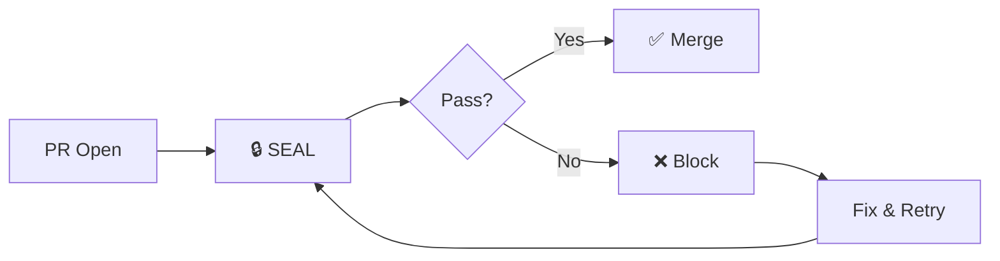
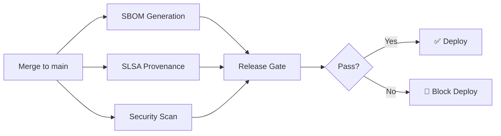

# Two-Lane CI Architecture

**Version:** 1.0.0  
**Status:** ✅ Active (Implemented 2026-02-08)  
**Authority:** CI/CD governance contract

---

## Prime Directive

> **Security is velocity when correctly tiered.**
> **Merge safety ≠ Release assurance.**

---

## The Two Lanes

### Lane 1: Merge Safety (PR Required Checks)

**Purpose:** Block merges that would break `main`  
**Target Time:** 3-8 minutes  
**Philosophy:** Fast, deterministic, never flaky

**Required Check:** `🔒 SEAL` (seal-gate-fast.yml)

**What's Included:**
- ✅ Lint/format checks (fast)
- ✅ Type checking (fast)
- ✅ Unit tests (fast, no external deps)
- ✅ Build validation (fast)
- ✅ Scope drift guard (deterministic)
- ✅ Governance enforcement (AGENTS.md compliance)

**What's NOT Included:**
- ❌ E2E tests (slow, flaky)
- ❌ Container scanning (slow)
- ❌ SBOM generation (slow)
- ❌ Integration tests (requires services)
- ❌ Performance tests (slow)
- ❌ Security deep scans (slow)
- ❌ SLSA provenance (requires tags)

---

### Lane 2: Release Assurance (main/tag Checks)

**Purpose:** Government compliance, supply chain security, vendor requirements  
**Triggers:** Push to `main`, tags (`v*`)  
**Philosophy:** Comprehensive, auditable, compliance-grade

**Workflows:**
- `sbom.yml` - Software Bill of Materials (Syft + Grype)
- `slsa-provenance.yml` - SLSA Level 3 attestations
- `security-compliance.yml` - Deep security scans
- `nightly.yml` - Heavy integration/performance tests

**What's Included:**
- ✅ SBOM generation (SPDX + CycloneDX)
- ✅ Vulnerability scanning (Grype + Trivy)
- ✅ SLSA provenance (Sigstore)
- ✅ License compliance
- ✅ Container security scanning
- ✅ Integration tests
- ✅ Performance benchmarks
- ✅ E2E test suites

---

## Branch Protection Configuration

### Required on `main` Branch

```yaml
required_status_checks:
  strict: true
  contexts:
    - "🔒 SEAL"  # ONLY required check
```

**Why Only One Check?**
- SEAL aggregates all fast safety checks
- Single point of enforcement
- Fast feedback loop (3-8 min)
- No flaky E2E blocking merges
- Security assurance runs post-merge

---

## Snyk PR Management

### Policy: Critical-Only During Active Development

**Mode A (Recommended):** Critical-only now
- Accept patch/minor for high/critical vulnerabilities only
- Everything else → monthly batch
- Max 1 active Snyk PR at a time

**Mode B:** Monthly security batch
- One grouped PR per month
- All dependency updates bundled
- Scheduled security review

### Configuration

Update `.snyk` to enable grouping:

```yaml
# .snyk additions for PR grouping
patch: {}  # No auto-patches
ignore: {}

# Grouping strategy (via Snyk dashboard)
# Settings > Integrations > GitHub > PR grouping: ENABLED
# Group by: Package manager
# Max PRs: 1
```

---

## The Elite Agent Decision Tree

### 1. Protect the Merge Lane

**Question:** Will this break `main`?
- **Yes** → Belongs in SEAL (seal-gate-fast.yml)
- **No** → Move to release lane

**Question:** Does it need secrets/signing/tags?
- **Yes** → CANNOT be PR-required (move to main/tag)
- **No** → Can be PR check (if fast enough)

### 2. Protect the Release Lane

**Question:** Is this compliance/audit/vendor requirement?
- **Yes** → Belongs at release boundary (main/tag)
- **No** → Consider if needed at all

**Question:** Does it take >5 minutes?
- **Yes** → Move to nightly or release lane
- **No** → Can stay in SEAL if safety-critical

### 3. Minimize PR Count

**Target State:**
- ✅ 1 ship PR (Control Plane v1)
- ✅ 0-1 security PR (grouped/critical-only)
- ✅ 1 feature PR max

**Any PR beyond this?**
- Close as superseded
- Batch into monthly update
- Defer to post-v1 milestone

---

## Implementation Checklist

### Phase 0: Immediate Unblock (Today)

- [x] Identify required checks on PR #258
- [x] Document two-lane architecture
- [ ] Configure GitHub branch protection
- [ ] Move SBOM off PR trigger
- [ ] Move SLSA off PR trigger

### Phase 1: Stop the Bleeding (Tomorrow)

- [ ] Configure Snyk PR grouping
- [ ] Close 22 Snyk PRs as superseded
- [ ] Create one grouped security PR (if needed)

### Phase 2: Release Assurance (This Week)

- [ ] Verify SBOM runs on main/tags
- [ ] Verify SLSA runs on main/tags
- [ ] Add release gate to deployment pipeline
- [ ] Document release workflow

---

## Success Metrics

### Velocity Indicators (Green = Good)

| Metric | Before | Target | Status |
|--------|--------|--------|--------|
| PR merge time | ~45 min | 3-8 min | 🎯 |
| Required checks | ~200 | 1 | 🎯 |
| Snyk PRs open | 22 | 0-1 | 🎯 |
| PR count | 5+ | 1-3 | 🎯 |
| False "red" noise | High | Zero | 🎯 |

### Safety Indicators (Must Remain Green)

| Metric | Before | Target | Status |
|--------|--------|--------|--------|
| Governed-spine health | ✅ Pass | ✅ Pass | ✅ |
| Build breakage rate | 0% | 0% | ✅ |
| Main stability | Stable | Stable | ✅ |
| SBOM coverage | 100% | 100% | ✅ |
| SLSA level | L3 | L3 | ✅ |

---

## Workflow Reference

### Merge Safety (PR Required)



### Release Assurance (Post-Merge)



---

## Troubleshooting

### "Why is SBOM not running on my PR?"

**Answer:** By design. SBOM is release assurance, not merge safety.
- SBOM runs on `main` and tags (`v*`)
- SBOM results are available in GitHub Security tab
- SBOM does not block merges

### "My PR has 200+ status checks!"

**Answer:** You're looking at optional/informational checks.
- Only `🔒 SEAL` is **required**
- All other checks are optional signals
- You can merge if SEAL passes

### "Snyk opened 22 PRs!"

**Answer:** Configure PR grouping:
1. Go to Snyk dashboard
2. Settings > Integrations > GitHub
3. Enable "Group PRs"
4. Set max PRs to 1
5. Close existing PRs as superseded

---

## Related Documentation

- **[seal-gate-fast.yml](../.github/workflows/seal-gate-fast.yml)** - Merge safety workflow
- **[sbom.yml](../.github/workflows/sbom.yml)** - SBOM generation (main/tag only)
- **[slsa-provenance.yml](../.github/workflows/slsa-provenance.yml)** - Provenance (main/tag only)
- **[AGENTS.md](../../AGENTS.md)** - Governance rules
- **[BRANCH_HYGIENE.md](../docs/ci/BRANCH_HYGIENE.md)** - Snyk policy

---

**Classification:** CI/CD Governance Contract  
**Last Updated:** 2026-02-08  
**Next Review:** After Control Plane v1 merge
