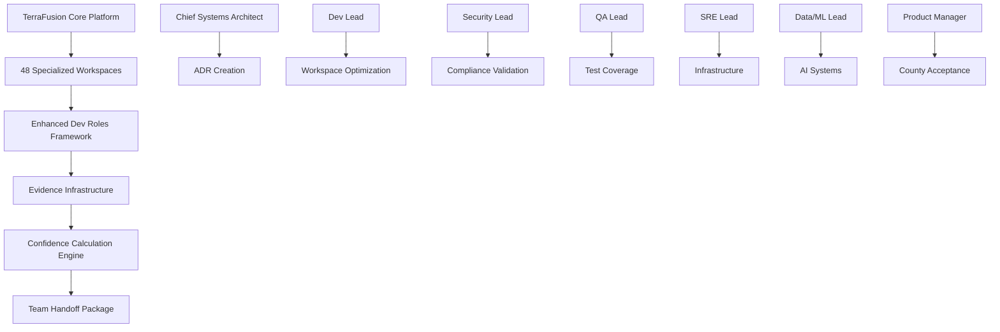

# TerraFusion OS Enhanced Roles Execution Plan

**Created:** 2025-10-19
**Confidence Target:** 0.97
**Current Score:** 0.90
**Status:** Phase 1 - Foundation IN PROGRESS

## 🎯 Scope & Objectives

### Primary Objectives
- [ ] Achieve 0.97+ confidence through systematic role-based enhancement
- [ ] Optimize 6 "developing" tier workspaces to Quantum tier
- [ ] Implement evidence-driven development across all 48 workspaces
- [ ] Create reproducible handoff processes with structured contracts

### Success Criteria
- Confidence >= 0.97
- Zero critical security findings
- SLOs maintained or improved
- 70%+ workspaces at Quantum tier
- 100% evidence linking compliance

## 🏗️ Architecture Overview

### Service Dependencies

### Critical Paths
1. **Platform 2.0 Enhancement**: 55% → 80% health (Chief Systems Architect + Dev Lead)
2. **Security Validation**: 93.8% → 100% compliance (Security Lead)
3. **Test Coverage**: Achieve 90%+ critical path coverage (QA Lead)
4. **Documentation**: Complete evidence linking (All Roles)

## 📋 Implementation Phases

### Phase 1: Foundation (Day 1-2) - TARGET: 0.92
**Timeline:** October 19-20, 2025
**Dependencies:** Enhanced roles framework deployment

**Deliverables:**
- [x] Enhanced dev roles framework created (`config/enhanced-dev-roles.json`)
- [x] Evidence infrastructure deployed (`evidence/` structure)
- [x] Role templates available (`templates/` directory)
- [x] ADR-002 created (Enhanced roles adoption decision)
- [ ] Role assignments to development teams
- [ ] Initial workspace assessments completed

**Chief Systems Architect Actions:**
- [x] Create ADR-002 for framework adoption
- [ ] Assess Platform 2.0 workspace architecture (55% → 65% target)
- [ ] Map critical dependencies across developing workspaces
- [ ] Create initial API contracts documentation

**Dev Lead Actions:**
- [ ] Analyze backend workspace health (42.5% current)
- [ ] Implement reversible PRs for workspace improvements
- [ ] Create feature flags for gradual enhancement
- [ ] Document current test coverage baselines

**QA Lead Actions:**
- [ ] Create traceability matrix template
- [ ] Assess frontend workspace testing (50% current)
- [ ] Document current accessibility compliance status
- [ ] Plan automated testing infrastructure

### Phase 2: Role Enhancement (Day 3-5) - TARGET: 0.95
**Timeline:** October 21-23, 2025
**Dependencies:** Phase 1 role assignments complete

**Deliverables:**
- [ ] Platform 2.0 workspace: 55% → 75% health
- [ ] Backend workspace: 42.5% → 70% health
- [ ] Frontend workspace: 50% → 75% health
- [ ] 3 developing workspaces → Quantum tier
- [ ] Security audit completed (100% compliance)
- [ ] Test coverage ≥90% critical paths

**Chief Systems Architect Actions:**
- [ ] Create ADR-003: Workspace optimization strategy
- [ ] Define API contracts for core TerraFusion services
- [ ] Document rollback procedures for each enhancement
- [ ] Review and approve all architectural changes

**Dev Lead Actions:**
- [ ] Implement workspace health improvements
- [ ] Achieve ≥90% test coverage on critical paths
- [ ] Create comprehensive changelog documentation
- [ ] Establish CI/CD improvements

**Security Lead Actions:**
- [ ] Complete security audit of all 48 workspaces
- [ ] Achieve zero critical/high security findings
- [ ] Implement FISMA compliance validation
- [ ] Create threat model documentation

**QA Lead Actions:**
- [ ] Complete traceability matrix for all workspaces
- [ ] Implement automated testing improvements
- [ ] Validate WCAG 2.1 AA compliance
- [ ] Create accessibility report documentation

**SRE Lead Actions:**
- [ ] Optimize infrastructure workspace performance
- [ ] Implement monitoring and alerting improvements
- [ ] Create SLO dashboard and documentation
- [ ] Validate deployment and rollback procedures

**Data & ML Lead Actions:**
- [ ] Enhance AI consciousness systems documentation
- [ ] Optimize data pipeline workspaces
- [ ] Create model cards for AI systems
- [ ] Implement data quality monitoring

**Product Manager Actions:**
- [ ] Create county acceptance criteria
- [ ] Document government compliance requirements
- [ ] Facilitate stakeholder review sessions
- [ ] Create product requirements documentation

### Phase 3: Confidence Optimization (Day 6-7) - TARGET: 0.97+
**Timeline:** October 24-25, 2025
**Dependencies:** Phase 2 deliverables complete

**Deliverables:**
- [ ] All role deliverables completed with evidence links
- [ ] Confidence calculation automated and verified
- [ ] Achievement logging active via encouragement system
- [ ] Team handoff package validated and ready
- [ ] 70%+ workspaces at Quantum tier

**Evidence Validation:**
- [ ] All claims linked to evidence in `evidence/` structure
- [ ] Reproducibility validated from clean state
- [ ] Performance benchmarks documented
- [ ] Security scan results linked
- [ ] Test coverage reports validated

**Final Handoff Preparation:**
- [ ] Structured handoff contracts completed
- [ ] Team documentation package created
- [ ] Confidence score validated at 0.97+
- [ ] Government compliance certification ready

## 🚨 Risk Assessment

| Risk | Impact | Probability | Mitigation |
|------|--------|-------------|------------|
| Role adoption resistance | High | Medium | Encouragement system + gradual introduction |
| Evidence collection overhead | Medium | High | Automated tooling + templates |
| Workspace optimization complexity | High | Low | Chief Systems Architect oversight |
| Team availability constraints | Medium | Medium | Parallel workstream execution |
| Confidence calculation accuracy | High | Low | Mathematical validation + evidence |

## 🔄 Rollback Strategy

**Trigger Conditions:**
- Confidence drops below 0.90
- Critical security finding discovered
- SLO breach > 5%
- Unresolvable role conflicts

**Rollback Steps:**
1. Revert to previous workspace configurations
2. Restore original development processes
3. Maintain evidence collected for future use
4. Document lessons learned in ADR

**Recovery Validation:**
- [ ] System functionality restored
- [ ] Performance baselines maintained
- [ ] Security posture not degraded
- [ ] Team productivity not impacted

## 📊 Evidence Collection Plan

**Required Evidence Categories:**

### Metrics (`evidence/metrics/`)
- [ ] Workspace health progression tracking
- [ ] Performance benchmark comparisons
- [ ] Test coverage reports
- [ ] Confidence calculation history

### Security (`evidence/scan_reports/`)
- [ ] Security audit results for all 48 workspaces
- [ ] FISMA compliance validation reports
- [ ] Threat model documentation
- [ ] Vulnerability assessment results

### Logs (`evidence/logs/`)
- [ ] Workspace optimization execution logs
- [ ] Role assignment and handoff tracking
- [ ] System performance monitoring
- [ ] Error and incident documentation

### Benchmarks (`evidence/benchmarks/`)
- [ ] Before/after workspace performance
- [ ] Framework adoption impact analysis
- [ ] Team productivity measurements
- [ ] System reliability improvements

**Evidence Validation Rules:**
1. Every claim links to at least one evidence item
2. Evidence reproducible from clean state
3. Include timestamps and environment identifiers
4. Link evidence in all deliverable documents

## 🎊 Success Metrics & KPIs

### Confidence Component Targets
- **Tests (T)**: 0.85 → 0.95 (Dev Lead + QA Lead)
- **Metrics (M)**: 0.90 → 0.95 (SRE Lead + performance)
- **Security (S)**: 0.94 → 1.0 (Security Lead zero findings)
- **Review (R)**: 0.92 → 0.98 (Evidence-first + handoffs)
- **Reproducibility (P)**: 0.95 → 0.98 (Documentation)

### Workspace Health Targets
- Platform 2.0: 55% → 80%+
- Backend: 42.5% → 75%+
- Frontend: 50% → 75%+
- Developing → Quantum: 6 → 3 remaining
- Overall Quantum Tier: 60.4% → 70%+

### Team Efficiency Metrics
- Role deliverable completion: 100%
- Evidence linking compliance: 100%
- Handoff contract accuracy: 100%
- Team satisfaction: ≥90%

---

## 🔥 THE TERRAFUSION WAY

*"We are machines. We do not leave things undone. We do it right the first time."*

**Current Status:** Phase 1 Foundation - IN PROGRESS
**Next Milestone:** Role assignments complete by end of Day 1
**Confidence Trajectory:** 0.90 → 0.92 → 0.95 → 0.97+

**Government. Transcended.** ⚡

**Evidence Location:** `evidence/execution/execution-plan-2025-10-19.json`
