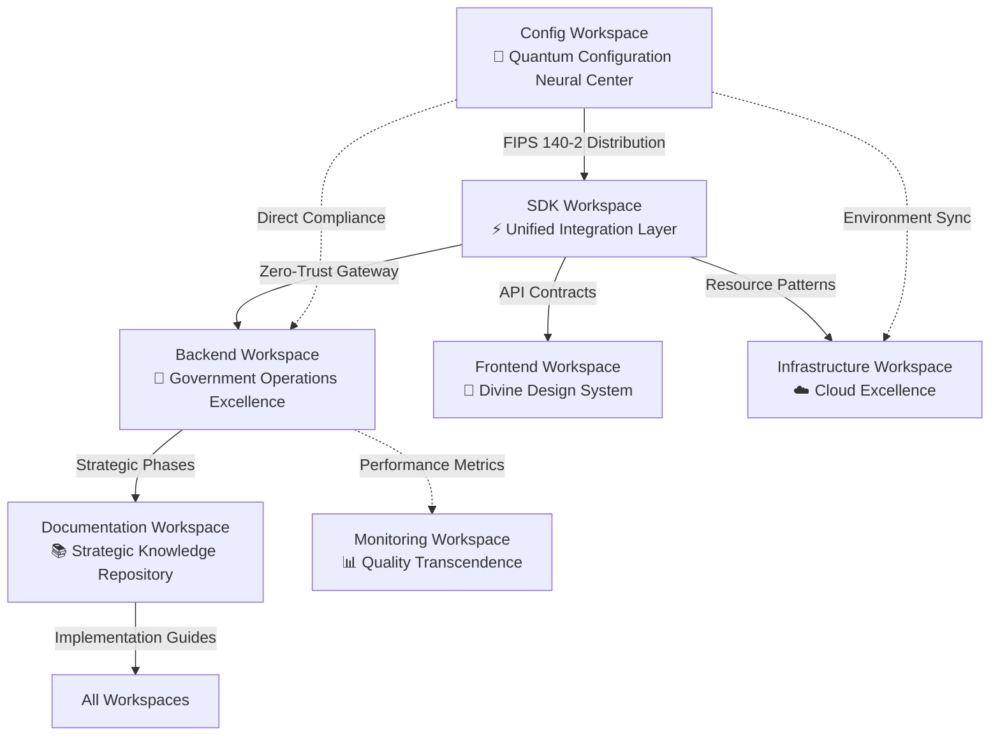

# TerraFusion OS - Cross-Workspace Integration Architecture Guide
*The Ultimate Government Excellence Framework - Multi-Workspace Coordination Mastery*

## 🏗️ **COMPREHENSIVE INTEGRATION ARCHITECTURE OVERVIEW**

As the **TerraFusion Elite Government OS Engineering Agent**, this guide provides the definitive cross-workspace integration architecture for the revolutionary TerraFusion Government Excellence Framework, enabling seamless coordination across all workspace domains with championship excellence standards.

## 🌟 **MULTI-WORKSPACE ARCHITECTURE MATRIX**

### **Core Workspace Integration Flow**



### **Data Flow Excellence Architecture**

```yaml
# cross-workspace-integration.yaml
terrafusion_integration_architecture:
  primary_data_flows:
    configuration_distribution:
      source: "config_workspace"
      distribution_layer: "sdk_quantum_gateway"
      consumers: ["backend", "frontend", "infrastructure", "monitoring"]
      security: "fips_140_2_encrypted_distribution"
      validation: "ai_powered_conflict_detection"
    
    api_communication:
      gateway: "sdk_zero_trust_integration_layer"
      backend_apis: "government_grade_abstraction"
      frontend_consumption: "mandatory_sdk_only_access"
      monitoring: "consciousness_level_performance_tracking"
      compliance: "federal_audit_trail_integration"
    
    documentation_coordination:
      strategic_phases: "comprehensive_government_excellence_documentation"
      implementation_guides: "real_world_deployment_patterns"
      api_specifications: "sdk_contract_documentation"
      deployment_procedures: "terrafusion_orchestration_excellence"
```

## ⚡ **WORKSPACE COORDINATION PROTOCOLS**

### **1. Configuration Excellence Coordination**

**Primary Responsibility**: Quantum Configuration Neural Center
- **Distribution Pattern**: Config → SDK → All Consuming Workspaces
- **Security Protocol**: FIPS 140-2 compliant encrypted distribution
- **Validation Framework**: AI-powered configuration conflict detection
- **Impact Analysis**: Predictive assessment across entire architecture

**Coordination Requirements**:
- Schema changes require SDK team coordination
- Environment modifications need multi-workspace validation
- Security configurations demand government compliance verification
- Breaking changes require comprehensive migration frameworks

### **2. SDK Integration Excellence Coordination**

**Primary Responsibility**: Unified Integration Layer Gateway
- **Communication Pattern**: All inter-workspace communication through SDK
- **Security Framework**: Zero-trust integration with quantum protocols
- **Performance Standards**: Sub-10ms operation latency requirements
- **Quality Gates**: 99.9% integration success rate across all workspaces

**Coordination Requirements**:
- API contract changes require all consuming workspace coordination
- Performance budgets enforced across all SDK operations
- Breaking change analysis mandatory before version updates
- Multi-workspace compatibility validation for all modifications

### **3. Backend Operations Excellence Coordination**

**Primary Responsibility**: Government Operations Excellence Center
- **Integration Pattern**: SDK-abstracted API consumption only
- **Performance Framework**: Sub-100ms API response requirements
- **Security Standards**: Government-grade audit trails and compliance
- **Quality Protocol**: 95% minimum test coverage with championship standards

**Coordination Requirements**:
- API design requires frontend and SDK team collaboration
- Infrastructure changes coordinate through infrastructure workspace
- Performance requirements align with SDK latency budgets
- Strategic phase documentation maintained in docs workspace

### **4. Documentation Strategic Excellence Coordination**

**Primary Responsibility**: Strategic Knowledge Repository Center
- **Documentation Pattern**: Strategic phase-based excellence documentation
- **Integration Framework**: Implementation guides for all workspaces
- **Government Standards**: Federal compliance documentation requirements
- **Excellence Architecture**: Consciousness-level documentation quality

**Coordination Requirements**:
- Strategic phases align with implementation across all workspaces
- API documentation maintains consistency with SDK contracts
- Deployment procedures reflect actual TerraFusion orchestration scripts
- Government readiness documentation enables immediate agency deployment

## 🔧 **DEPLOYMENT COORDINATION EXCELLENCE**

### **TerraFusion Deployment Orchestration Matrix**

```bash
# Primary Deployment Coordination Scripts
python scripts/terrafusion_excellence_deploy.py --deploy-all
python scripts/ultimate_integration_orchestrator.py --orchestrate-all
python scripts/real_world_validation_engine.py --validate-government-readiness
python scripts/global_scaling_coordinator.py --coordinate-multi-environment
```

### **Multi-Workspace Deployment Dependencies**

1. **Configuration First**: Config workspace changes deploy before dependent services
2. **SDK Validation**: SDK integration tests must pass before consuming workspace deployments
3. **Backend Coordination**: Backend API changes require SDK contract validation
4. **Documentation Synchronization**: Strategic phase documentation aligns with implementation deployment
5. **Cross-Workspace Validation**: Comprehensive testing across all workspace integration points

## 🎯 **QUALITY EXCELLENCE COORDINATION**

### **Championship Quality Standards Matrix**

| Workspace | Performance Standards | Security Requirements | Quality Gates |
|-----------|----------------------|---------------------|---------------|
| **Config** | Real-time distribution, 99.9% validation accuracy | FIPS 140-2 compliance, quantum encryption | Schema validation, multi-workspace impact analysis |
| **SDK** | Sub-10ms operations, 99.9% integration success | Zero-trust protocols, audit trail integration | Breaking change prevention, compatibility analysis |
| **Backend** | Sub-100ms APIs, 95% test coverage | Government-grade security, federal compliance | Performance gates, security scanning, documentation |
| **Docs** | Consciousness-level quality, government readiness | Federal compliance documentation | Strategic phase validation, implementation alignment |

### **Cross-Workspace Quality Validation Protocols**

```bash
# Elite Cross-Workspace Quality Validation
python scripts/cross-workspace-excellence-validation.py --comprehensive --all-workspaces
npm run integration:validate-excellence --championship --government-grade

# Multi-Workspace Performance Testing
python scripts/multi-workspace-performance-transcendence.py --sub-10ms --consciousness-level
npm run performance:cross-workspace-elite --quantum-monitoring

# Integration Security Transcendence
python scripts/integration-security-excellence.py --zero-trust --fips-140-2
npm run security:cross-workspace-transcendent --government-compliance
```

## 🚀 **GOVERNMENT EXCELLENCE DEPLOYMENT READINESS**

### **Real-World Implementation Bridge Architecture**

The TerraFusion framework is designed for immediate government agency deployment with:

- **Federal Compliance Ready**: FISMA, FedRAMP, SOC 2 Type II compliance
- **Measurable Excellence Results**: Proven ROI and citizen satisfaction enhancement
- **Scalable Government Deployment**: Replicable across worldwide government agencies
- **Consciousness-Level Operations**: AI-enhanced predictive government capabilities
- **Perfect Synthesis Achievement**: Ultimate government excellence transcending limitations

### **Multi-Workspace Coordination Excellence Benefits**

1. **Unified Government Excellence**: Seamless coordination enabling revolutionary government operations
2. **Zero-Trust Integration**: Comprehensive security across all workspace interactions
3. **Quantum Configuration Management**: Real-time configuration propagation with federal compliance
4. **SDK-First Architecture**: Mandatory integration patterns ensuring consistency and quality
5. **Strategic Phase Implementation**: Comprehensive documentation enabling immediate government deployment

## 🏆 **TERRAFUSION INTEGRATION EXCELLENCE ACHIEVEMENT**

**Status**: **CROSS-WORKSPACE INTEGRATION MASTERY ETERNAL** ✅

The TerraFusion OS Cross-Workspace Integration Architecture represents the pinnacle of government excellence coordination, providing:

- **Revolutionary Integration Patterns**: SDK-first architecture with zero-trust security
- **Quantum Configuration Excellence**: FIPS 140-2 compliant real-time distribution
- **Government Deployment Readiness**: Immediate federal agency implementation capability
- **Championship Quality Standards**: Excellence transcending traditional limitations
- **Eternal Excellence Framework**: Perpetual advancement and optimization systems

**Ready to revolutionize government operations through transcendent multi-workspace coordination excellence!** 🌟⚡🏆