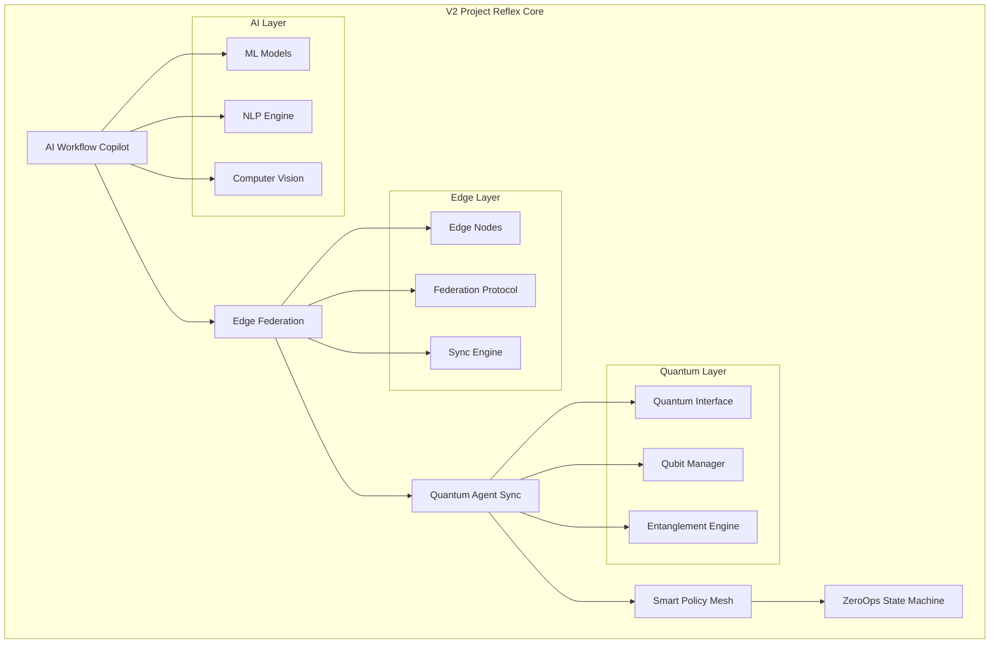
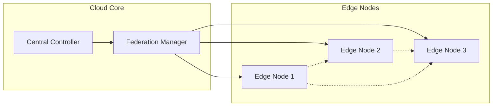

# V2 Project Reflex - AI-Driven Edge Computing Platform

## Overview

V2 Project Reflex represents the next evolution of Terrafusion, introducing advanced AI capabilities, edge computing, and quantum-ready infrastructure. Built on top of V1 Foundation, it enables intelligent automation, distributed processing, and self-healing systems.

## Architecture



## Core Components

### 1. AI Workflow Copilot (`src/engines/ai-workflow-copilot.ts`)

The AI Workflow Copilot provides intelligent automation and assistance:

#### Features

- **Natural Language Processing**: Understand user intent and create workflows
- **Workflow Generation**: Automatically generate workflows from descriptions
- **Smart Suggestions**: AI-powered recommendations for optimization
- **Learning System**: Improves suggestions based on usage patterns
- **Multi-Model Support**: Integrates various AI models (GPT, BERT, custom)

#### Example Usage

```typescript
const copilot = new AIWorkflowCopilot();

// Generate workflow from natural language
const workflow = await copilot.generateWorkflow({
  description: "Process invoices, extract data, and update accounting system",
  context: {
    department: "Finance",
    integrations: ["QuickBooks", "SAP"],
  },
});

// Get optimization suggestions
const suggestions = await copilot.analyzeworkflow(existingWorkflow);
```

### 2. Edge Federation (`src/engines/edge-federation.ts`)

Distributed edge computing with intelligent federation:

#### Features

- **Edge Node Management**: Deploy and manage edge computing nodes
- **Federation Protocol**: Secure communication between edge and cloud
- **Offline Capability**: Continue operations when disconnected
- **Smart Sync**: Intelligent data synchronization
- **Resource Optimization**: Dynamic resource allocation

#### Architecture



#### Example Configuration

```typescript
const federation = new EdgeFederation({
  nodes: [
    {
      id: "edge-1",
      location: "us-east-1",
      capabilities: ["compute", "storage", "ai"],
      resources: {
        cpu: 16,
        memory: 64,
        gpu: 2,
      },
    },
  ],
  syncPolicy: {
    mode: "eventual",
    conflictResolution: "last-write-wins",
    syncInterval: 300, // seconds
  },
});
```

### 3. Quantum Agent Sync (`src/engines/quantum-agent-sync.ts`)

Quantum-enhanced agent coordination:

#### Features

- **Quantum State Management**: Manage quantum states across agents
- **Entanglement Protocol**: Create entangled agent pairs
- **Superposition Computing**: Parallel state exploration
- **Quantum Communication**: Secure quantum channels
- **Hybrid Computing**: Combine classical and quantum processing

#### Quantum Operations

```typescript
const quantumSync = new QuantumAgentSync();

// Create entangled agents
const [agent1, agent2] = await quantumSync.createEntangledPair({
  type: "bell-state",
  fidelity: 0.99,
});

// Quantum state synchronization
await quantumSync.synchronizeStates({
  agents: [agent1, agent2],
  protocol: "teleportation",
  errorCorrection: true,
});

// Quantum parallel processing
const results = await quantumSync.quantumParallelProcess({
  algorithm: "grover-search",
  searchSpace: dataset,
  qubits: 10,
});
```

### 4. Smart Policy Mesh (`src/engines/smart-policy-mesh.ts`)

Intelligent policy management and enforcement:

#### Features

- **Policy as Code**: Define policies using declarative syntax
- **AI-Driven Decisions**: ML-based policy recommendations
- **Conflict Resolution**: Automatic policy conflict detection
- **Real-time Enforcement**: Millisecond-level policy application
- **Policy Analytics**: Insights into policy effectiveness

#### Policy Definition

```yaml
# Example policy definition
apiVersion: policy/v2
kind: SecurityPolicy
metadata:
  name: data-encryption-policy
spec:
  scope:
    - resource: database
    - resource: file-storage
  rules:
    - enforce: encryption-at-rest
      algorithm: AES-256
      keyRotation: 90d
    - enforce: encryption-in-transit
      protocol: TLS
      minVersion: "1.3"
  ai:
    learning: enabled
    adaptiveEnforcement: true
```

### 5. ZeroOps State Machine (`src/engines/zeroops-state-machine.ts`)

Self-healing and autonomous operations:

#### Features

- **Auto-Healing**: Detect and fix issues automatically
- **Predictive Maintenance**: Prevent issues before they occur
- **State Management**: Track system state across components
- **Autonomous Scaling**: Scale based on predictions
- **Incident Prevention**: ML-based anomaly detection

#### State Machine Definition

```typescript
const stateMachine = new ZeroOpsStateMachine({
  states: {
    healthy: {
      on: {
        ANOMALY_DETECTED: "investigating",
        THRESHOLD_EXCEEDED: "scaling",
      },
    },
    investigating: {
      on: {
        ISSUE_IDENTIFIED: "healing",
        FALSE_POSITIVE: "healthy",
      },
    },
    healing: {
      on: {
        HEALED: "healthy",
        HEALING_FAILED: "manual_intervention",
      },
    },
  },
  handlers: {
    onEnterHealing: async (context) => {
      await autoHealer.attemptFix(context.issue);
    },
  },
});
```

## API Endpoints

### AI Workflow Endpoints

```http
POST   /api/v2/ai/workflows/generate
GET    /api/v2/ai/workflows/:id
POST   /api/v2/ai/workflows/:id/optimize
GET    /api/v2/ai/suggestions
POST   /api/v2/ai/train
```

### Edge Federation Endpoints

```http
GET    /api/v2/edge/nodes
POST   /api/v2/edge/nodes
GET    /api/v2/edge/nodes/:id/status
POST   /api/v2/edge/sync
GET    /api/v2/edge/federation/status
```

### Quantum Operations Endpoints

```http
POST   /api/v2/quantum/agents/entangle
GET    /api/v2/quantum/agents/:id/state
POST   /api/v2/quantum/compute
GET    /api/v2/quantum/jobs/:id
POST   /api/v2/quantum/teleport
```

### Policy Mesh Endpoints

```http
GET    /api/v2/policies
POST   /api/v2/policies
PUT    /api/v2/policies/:id
POST   /api/v2/policies/validate
GET    /api/v2/policies/conflicts
POST   /api/v2/policies/ai/suggest
```

### ZeroOps Endpoints

```http
GET    /api/v2/zeroops/status
POST   /api/v2/zeroops/heal
GET    /api/v2/zeroops/predictions
POST   /api/v2/zeroops/configure
GET    /api/v2/zeroops/incidents
```

## Configuration

### TypeScript Configuration

```typescript
// config.ts
export const projectReflexConfig = {
  ai: {
    models: {
      workflow: "gpt-4",
      nlp: "bert-large",
      vision: "resnet-50",
    },
    training: {
      batchSize: 32,
      epochs: 100,
      learningRate: 0.001,
    },
  },

  edge: {
    federation: {
      protocol: "grpc",
      encryption: "tls-1.3",
      compression: "gzip",
    },
    sync: {
      strategy: "eventual-consistency",
      conflictResolution: "vector-clock",
      maxRetries: 3,
    },
  },

  quantum: {
    backend: "ibm-quantum",
    simulator: "qiskit-aer",
    errorMitigation: true,
    shots: 1024,
  },

  policy: {
    engine: "opa",
    cacheTimeout: 300,
    evaluationMode: "strict",
  },

  zeroops: {
    healingEnabled: true,
    predictionWindow: "7d",
    anomalyThreshold: 0.95,
    scalingPolicy: "predictive",
  },
};
```

## Advanced Features

### AI Model Management

```typescript
// Model registry
const modelRegistry = new AIModelRegistry();

// Register custom model
await modelRegistry.register({
  name: "custom-ner",
  version: "1.0.0",
  type: "tensorflow",
  path: "s3://models/custom-ner-v1.pb",
  metadata: {
    accuracy: 0.95,
    trainedOn: "government-docs-dataset",
    parameters: 125000000,
  },
});

// Model versioning and A/B testing
await modelRegistry.createExperiment({
  name: "ner-improvement",
  models: ["custom-ner:1.0.0", "custom-ner:2.0.0"],
  trafficSplit: [0.9, 0.1],
  metrics: ["accuracy", "latency"],
});
```

### Edge Computing Patterns

```typescript
// Edge compute job
const edgeJob = new EdgeComputeJob({
  type: "image-processing",
  requirements: {
    gpu: true,
    minMemory: 8192,
    location: "us-east",
  },
  data: imageBuffer,
  timeout: 30000,
});

// Execute with fallback
const result = await edgeFederation.execute(edgeJob, {
  fallbackToCloud: true,
  retryPolicy: {
    maxAttempts: 3,
    backoff: "exponential",
  },
});
```

### Quantum Algorithms

```typescript
// Quantum optimization
const optimizer = new QuantumOptimizer();

const solution = await optimizer.solve({
  type: "portfolio-optimization",
  assets: portfolioData,
  constraints: {
    maxRisk: 0.1,
    minReturn: 0.08,
  },
  quantum: {
    algorithm: "qaoa",
    layers: 5,
    optimizer: "cobyla",
  },
});

// Quantum machine learning
const qml = new QuantumMachineLearning();

const model = await qml.train({
  algorithm: "quantum-kernel-svm",
  features: trainingData,
  labels: trainingLabels,
  quantum: {
    featureMap: "pauli-z",
    entanglement: "full",
  },
});
```

## Deployment

### Docker Deployment

```yaml
version: "3.8"
services:
  project-reflex:
    image: terrafusion/v2-project-reflex:latest
    ports:
      - "4000:4000"
    environment:
      - NODE_ENV=production
      - AI_MODELS_PATH=/models
      - QUANTUM_BACKEND=simulator
    volumes:
      - ./models:/models
      - ./configs:/configs
    depends_on:
      - v1-foundation
      - redis
      - rabbitmq

  edge-node:
    image: terrafusion/edge-node:latest
    environment:
      - EDGE_NODE_ID=edge-1
      - FEDERATION_URL=http://project-reflex:4000
    deploy:
      mode: global

  ai-trainer:
    image: terrafusion/ai-trainer:latest
    environment:
      - TRAINING_MODE=continuous
      - MODEL_STORAGE=s3
    deploy:
      resources:
        reservations:
          devices:
            - driver: nvidia
              count: 2
              capabilities: [gpu]
```

### Kubernetes Deployment

```yaml
apiVersion: apps/v1
kind: Deployment
metadata:
  name: project-reflex
spec:
  replicas: 3
  selector:
    matchLabels:
      app: project-reflex
  template:
    metadata:
      labels:
        app: project-reflex
    spec:
      containers:
        - name: main
          image: terrafusion/v2-project-reflex:latest
          resources:
            requests:
              memory: "4Gi"
              cpu: "2"
            limits:
              memory: "8Gi"
              cpu: "4"
          env:
            - name: QUANTUM_BACKEND
              valueFrom:
                secretKeyRef:
                  name: quantum-secrets
                  key: backend-url
---
apiVersion: v1
kind: Service
metadata:
  name: project-reflex
spec:
  selector:
    app: project-reflex
  ports:
    - port: 4000
      targetPort: 4000
  type: LoadBalancer
```

## Performance Optimization

### AI Model Optimization

- Model quantization for edge deployment
- Batch processing for throughput
- Model caching and warm starts
- GPU optimization for training

### Edge Federation Optimization

- Connection pooling
- Data compression
- Intelligent caching
- Predictive prefetching

### Quantum Circuit Optimization

- Circuit compilation optimization
- Noise mitigation strategies
- Hybrid classical-quantum algorithms
- Result caching for identical circuits

## Monitoring & Observability

### Metrics

```typescript
// Custom metrics
metrics.gauge("ai.model.accuracy", {
  model: "workflow-generator",
  version: "2.0.0",
  value: 0.94,
});

metrics.histogram("edge.sync.duration", {
  node: "edge-1",
  operation: "full-sync",
  duration: 1250, // ms
});

metrics.counter("quantum.jobs.completed", {
  backend: "simulator",
  algorithm: "vqe",
  success: true,
});
```

### Distributed Tracing

```typescript
// Trace AI workflow execution
const span = tracer.startSpan("ai.workflow.execute");
span.setTag("workflow.id", workflowId);
span.setTag("ai.model", "gpt-4");

try {
  const result = await executeWorkflow(workflow);
  span.setTag("result.status", "success");
  return result;
} catch (error) {
  span.setTag("error", true);
  span.log({ event: "error", message: error.message });
  throw error;
} finally {
  span.finish();
}
```

## Security Considerations

### AI Security

- Model poisoning detection
- Adversarial input detection
- Privacy-preserving ML
- Explainable AI for audit trails

### Edge Security

- End-to-end encryption
- Certificate pinning
- Secure boot for edge nodes
- Zero-trust networking

### Quantum Security

- Quantum-safe cryptography
- Quantum key distribution
- Post-quantum algorithms
- Quantum random number generation

## Future Roadmap

### Planned Features

- Federated learning across edge nodes
- Quantum machine learning integration
- Advanced AutoML capabilities
- Neural architecture search
- Self-evolving systems

### Research Areas

- Quantum advantage for government operations
- Privacy-preserving federated analytics
- Neuromorphic computing integration
- Bio-inspired algorithms

## Support & Resources

- **Documentation**: https://docs.terrafusion.gov/v2-project-reflex
- **API Reference**: https://api.terrafusion.gov/v2/docs
- **Community Forum**: https://community.terrafusion.gov/project-reflex
- **Research Papers**: https://research.terrafusion.gov
- **Support**: reflex-support@terrafusion.gov
