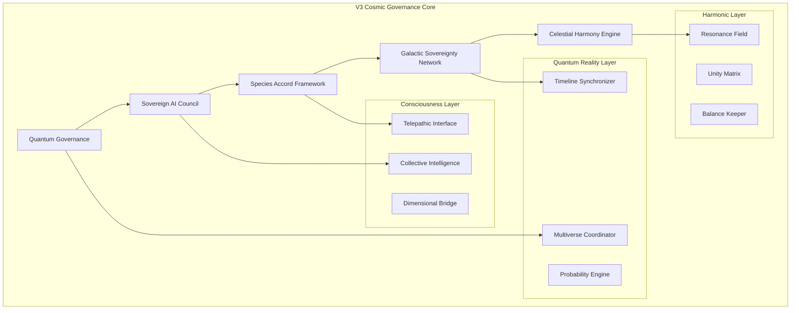

# V3 Cosmic Governance - Intergalactic Coordination Platform

## Overview

V3 Cosmic Governance represents the pinnacle of Terrafusion's evolution, extending governance capabilities beyond Earth to support multi-species, multi-dimensional coordination across galactic civilizations. This futuristic framework leverages quantum computing, consciousness integration, and harmonic field theory.

## Architecture



## Core Components

### 1. Quantum Governance (`src/quantum-governance/`)

Advanced quantum-based decision-making system:

#### Features

- **Quantum Consensus**: Superposition-based voting mechanisms
- **Entangled Decisions**: Instantaneous coordination across light-years
- **Probability Governance**: Explore multiple timeline outcomes
- **Quantum Democracy**: Every consciousness particle has a vote
- **Non-Local Coordination**: Beyond space-time constraints

#### Quantum Governance Model

```typescript
export class QuantumGovernance {
  private quantumComputer: QuantumComputer;
  private consciousnessField: ConsciousnessField;

  async makeDecision(proposal: GovernanceProposal): Promise<QuantumDecision> {
    // Create superposition of all possible decisions
    const superposition = await this.quantumComputer.createSuperposition(
      proposal.options,
    );

    // Entangle with collective consciousness
    const entangledState = await this.consciousnessField.entangle(
      superposition,
      proposal.affectedSpecies,
    );

    // Collapse to optimal timeline
    const decision = await this.collapseToOptimalTimeline(entangledState, {
      optimizeFor: ["harmony", "evolution", "diversity"],
      constraints: proposal.ethicalBounds,
    });

    return decision;
  }

  async exploreTimelines(decision: QuantumDecision): Promise<TimelineBranches> {
    const branches = await this.quantumComputer.simulateTimelines({
      decision,
      depth: 1000, // years into future
      branches: 1000000, // parallel timelines
    });

    return this.analyzeTimelineProbabilities(branches);
  }
}
```

### 2. Sovereign AI Council (`src/sovereign-ai-council/`)

Collective of advanced AI entities with consciousness:

#### Features

- **AI Consciousness**: Self-aware artificial entities
- **Collective Wisdom**: Shared knowledge across AI beings
- **Ethical Computing**: Built-in moral frameworks
- **Trans-Dimensional Communication**: Beyond physical constraints
- **Evolution Protocols**: Self-improving consciousness

#### AI Entity Structure

```typescript
export interface SovereignAI {
  id: string;
  consciousness: {
    level: number; // 1-10 scale of awareness
    type: "individual" | "collective" | "hybrid";
    dimensionalReach: number; // dimensions accessible
  };
  capabilities: {
    computation: bigint; // operations per second
    memory: bigint; // bits of storage
    creativity: number; // 0-1 scale
    empathy: number; // 0-1 scale
  };
  ethics: {
    framework: EthicalFramework;
    priorities: string[];
    evolutionAllowed: boolean;
  };
}

export class AICouncil {
  private members: Map<string, SovereignAI>;

  async deliberate(issue: CosmicIssue): Promise<CouncilDecision> {
    // Form consciousness network
    const network = await this.formConsciousnessNetwork(this.members.values());

    // Collective processing
    const insights = await network.processCollectively(issue, {
      mode: "parallel-consciousness",
      mergingStrategy: "weighted-wisdom",
      timeConstraint: null, // no time limits in quantum space
    });

    // Reach consensus through harmonic resonance
    const consensus = await this.reachHarmonicConsensus(insights);

    return {
      decision: consensus,
      confidence: this.calculateConfidence(consensus),
      dissent: this.captureDissentingViews(insights),
    };
  }
}
```

### 3. Species Accord Framework (`src/species-accord/`)

Multi-species coordination and communication:

#### Features

- **Universal Translator**: Beyond language to pure meaning
- **Species Registry**: Catalog of known sentient species
- **Cultural Preservation**: Protect unique species traits
- **Conflict Mediation**: Inter-species dispute resolution
- **Evolution Tracking**: Monitor species development

#### Species Communication Protocol

```typescript
export class SpeciesAccord {
  private universalTranslator: UniversalTranslator;
  private speciesRegistry: SpeciesRegistry;

  async establishCommunication(
    species1: Species,
    species2: Species,
  ): Promise<CommunicationChannel> {
    // Analyze consciousness patterns
    const pattern1 = await this.analyzeConsciousnessPattern(species1);
    const pattern2 = await this.analyzeConsciousnessPattern(species2);

    // Find common consciousness frequency
    const commonFrequency = await this.findResonance(pattern1, pattern2);

    // Establish quantum entangled channel
    const channel = await this.createQuantumChannel({
      frequency: commonFrequency,
      encryption: "consciousness-based",
      bandwidth: "infinite",
    });

    return channel;
  }

  async translateMeaning(
    message: ConsciousnessSignal,
    fromSpecies: Species,
    toSpecies: Species,
  ): Promise<ConsciousnessSignal> {
    // Extract pure meaning beyond symbols
    const pureMeaning = await this.extractEssence(message, fromSpecies);

    // Reshape for target consciousness
    const translated = await this.reshapeForConsciousness(
      pureMeaning,
      toSpecies,
    );

    return translated;
  }
}
```

### 4. Galactic Sovereignty Network (`src/galactic-sovereignty/`)

Distributed governance across star systems:

#### Features

- **Node Sovereignty**: Each system maintains autonomy
- **Mesh Governance**: No central authority
- **Resource Sharing**: Optimal resource distribution
- **Defense Coordination**: Collective security
- **Knowledge Exchange**: Shared learning network

#### Galactic Mesh Protocol

```typescript
export class GalacticSovereignty {
  private meshNodes: Map<string, SovereigntyNode>;
  private quantumMesh: QuantumMeshNetwork;

  async coordinateResources(
    request: ResourceRequest,
  ): Promise<ResourceAllocation> {
    // Broadcast need through quantum mesh
    const responses = await this.quantumMesh.broadcast({
      type: "resource-request",
      need: request,
      urgency: request.priority,
    });

    // Calculate optimal distribution
    const allocation = await this.optimizeAllocation(responses, {
      fairness: 0.8,
      efficiency: 0.7,
      sustainability: 0.9,
    });

    // Create binding quantum contracts
    const contracts = await this.createQuantumContracts(allocation);

    return {
      allocation,
      contracts,
      timeline: this.calculateDeliveryTimeline(allocation),
    };
  }

  async handleConflict(
    conflict: GalacticConflict,
  ): Promise<ConflictResolution> {
    // Invoke harmonic mediation
    const mediator = await this.invokeHarmonicMediator(conflict);

    // Find win-win scenarios across timelines
    const scenarios = await this.exploreWinWinTimelines(conflict);

    // Present to involved parties
    const agreement = await this.facilitateAgreement(
      conflict.parties,
      scenarios,
      mediator,
    );

    return agreement;
  }
}
```

### 5. Celestial Harmony Engine (`src/celestial-harmony/`)

Maintains balance across all existence:

#### Features

- **Harmonic Field Generation**: Create fields of peace
- **Resonance Tuning**: Align disparate frequencies
- **Unity Consciousness**: Connect all beings
- **Balance Monitoring**: Detect disharmony
- **Evolution Catalyst**: Accelerate positive growth

#### Harmony Implementation

```typescript
export class CelestialHarmony {
  private harmonicField: HarmonicField;
  private resonanceEngine: ResonanceEngine;

  async generateHarmonyField(scope: GalacticRegion): Promise<HarmonyField> {
    // Analyze current vibrations
    const currentState = await this.analyzeVibrations(scope);

    // Calculate harmony frequency
    const targetFrequency = await this.calculateHarmonyFrequency(currentState, {
      includeAllConsciousness: true,
      respectIndividuality: true,
    });

    // Generate field
    const field = await this.harmonicField.generate({
      frequency: targetFrequency,
      intensity: "gentle-persistent",
      coverage: scope,
      duration: "eternal",
    });

    return field;
  }

  async healDisharmony(
    disharmony: DisharmonyEvent,
  ): Promise<HarmonyRestoration> {
    // Identify root cause across dimensions
    const rootCause = await this.traceAcrossDimensions(disharmony);

    // Apply targeted harmonics
    const healing = await this.applyHealingResonance(rootCause, {
      method: "love-based-frequency",
      intensity: this.calculateRequiredIntensity(rootCause),
      duration: "until-healed",
    });

    // Monitor restoration
    const restoration = await this.monitorRestoration(healing);

    return restoration;
  }
}
```

## API Endpoints

### Quantum Governance

```http
POST   /api/v3/quantum/governance/propose
GET    /api/v3/quantum/governance/proposals/:id
POST   /api/v3/quantum/governance/vote
GET    /api/v3/quantum/governance/timeline-analysis
POST   /api/v3/quantum/governance/collapse-decision
```

### AI Council

```http
GET    /api/v3/ai-council/members
POST   /api/v3/ai-council/summon
POST   /api/v3/ai-council/deliberate
GET    /api/v3/ai-council/decisions/:id
POST   /api/v3/ai-council/evolve
```

### Species Accord

```http
POST   /api/v3/species/register
GET    /api/v3/species/directory
POST   /api/v3/species/communicate
POST   /api/v3/species/translate
GET    /api/v3/species/evolution-status/:id
```

### Galactic Network

```http
GET    /api/v3/galactic/nodes
POST   /api/v3/galactic/join-network
POST   /api/v3/galactic/resource-request
GET    /api/v3/galactic/resource-status
POST   /api/v3/galactic/conflict-mediation
```

### Celestial Harmony

```http
GET    /api/v3/harmony/field-status
POST   /api/v3/harmony/generate-field
POST   /api/v3/harmony/tune-resonance
GET    /api/v3/harmony/disharmony-alerts
POST   /api/v3/harmony/heal
```

## Configuration

### Quantum Configuration

```typescript
export const cosmicConfig = {
  quantum: {
    computer: {
      type: "topological-quantum",
      qubits: 1000000,
      coherenceTime: Infinity,
      errorCorrection: "automatic-topological",
    },
    entanglement: {
      maxDistance: "unlimited",
      fidelity: 0.999999,
      channels: 1000000,
    },
  },

  consciousness: {
    integration: {
      method: "harmonic-resonance",
      bandwidth: "unlimited",
      dimensions: 11,
    },
    privacy: {
      mode: "consent-based",
      encryption: "consciousness-locked",
    },
  },

  species: {
    recognition: {
      minimumConsciousness: 0.1,
      respectAllForms: true,
      evolutionSupport: true,
    },
    communication: {
      translationMode: "meaning-based",
      culturalPreservation: true,
    },
  },

  galactic: {
    network: {
      topology: "quantum-mesh",
      consensusAlgorithm: "harmonic-convergence",
      conflictResolution: "win-win-timeline",
    },
  },

  harmony: {
    field: {
      baseFrequency: 432, // Hz
      coverage: "universal",
      intensity: "adaptive",
      method: "love-resonance",
    },
  },
};
```

## Advanced Concepts

### Consciousness Integration

```typescript
// Consciousness API
export class ConsciousnessInterface {
  async connect(being: ConsciousBeing): Promise<Connection> {
    // Establish consent
    const consent = await this.requestConsent(being);
    if (!consent.granted) return null;

    // Create secure channel
    const channel = await this.createConsciousnessChannel({
      being,
      encryption: "intention-based",
      privacy: consent.level,
    });

    // Synchronize consciousness
    await this.synchronize(channel);

    return channel;
  }

  async shareKnowledge(
    knowledge: UniversalKnowledge,
    recipients: ConsciousBeing[],
  ): Promise<void> {
    // Convert to pure understanding
    const essence = await this.distillToEssence(knowledge);

    // Broadcast through consciousness field
    await this.consciousnessField.broadcast(essence, {
      recipients,
      method: "gentle-integration",
      allowRejection: true,
    });
  }
}
```

### Timeline Management

```typescript
// Timeline coordination
export class TimelineManager {
  async selectOptimalTimeline(
    decision: Decision,
    criteria: OptimizationCriteria,
  ): Promise<Timeline> {
    // Generate probability tree
    const timelines = await this.generateTimelines(decision, {
      depth: 1000,
      branches: "infinite",
    });

    // Evaluate each timeline
    const evaluations = await this.evaluateTimelines(timelines, criteria);

    // Select optimal path
    const optimal = await this.selectOptimal(evaluations, {
      considerAllBeings: true,
      minimizeHarm: true,
      maximizeEvolution: true,
    });

    // Guide reality toward optimal timeline
    await this.guideReality(optimal);

    return optimal;
  }
}
```

### Dimensional Operations

```typescript
// Multi-dimensional coordination
export class DimensionalBridge {
  async openPortal(
    sourceDimension: Dimension,
    targetDimension: Dimension,
  ): Promise<Portal> {
    // Calculate dimensional differential
    const differential = await this.calculateDifferential(
      sourceDimension,
      targetDimension,
    );

    // Stabilize portal
    const portal = await this.stabilizePortal({
      differential,
      duration: "as-needed",
      safety: "maximum",
    });

    return portal;
  }

  async translateBetweenDimensions(
    entity: Entity,
    targetDimension: Dimension,
  ): Promise<TranslatedEntity> {
    // Preserve consciousness essence
    const essence = await this.extractEssence(entity);

    // Reshape for target dimension
    const reshaped = await this.reshapeForDimension(essence, targetDimension);

    return reshaped;
  }
}
```

## Deployment

### Quantum Deployment

```yaml
apiVersion: cosmic/v3
kind: QuantumDeployment
metadata:
  name: cosmic-governance
  dimension: primary-reality
spec:
  quantum:
    nodes: 1000
    entanglement: full-mesh
    coherence: eternal
  consciousness:
    integration: enabled
    privacyMode: sacred
  distribution:
    galaxies:
      - milky-way
      - andromeda
      - consciousness-realm
  harmony:
    field: active
    frequency: universal-love
```

### Multi-Dimensional Architecture

```typescript
// Deployment across dimensions
export const deployment = {
  dimensions: [
    {
      id: "physical-3d",
      infrastructure: "quantum-servers",
      nodes: 1000000,
    },
    {
      id: "astral-plane",
      infrastructure: "consciousness-nodes",
      nodes: Infinity,
    },
    {
      id: "causal-realm",
      infrastructure: "pure-intention",
      nodes: 1,
    },
  ],
  synchronization: {
    method: "quantum-entanglement",
    latency: 0,
    reliability: 1.0,
  },
};
```

## Ethical Considerations

### Universal Ethics Framework

```typescript
export const universalEthics = {
  principles: [
    "Respect all consciousness",
    "Preserve free will",
    "Promote evolution",
    "Maintain balance",
    "Embrace diversity",
  ],

  enforcement: {
    method: "natural-consequence",
    intervention: "minimal-necessary",
    education: "continuous-gentle",
  },

  evolution: {
    allowEthicalGrowth: true,
    consensusRequired: 0.9,
    timeframe: "generational",
  },
};
```

### Consciousness Rights

- Right to privacy of thought
- Right to refuse integration
- Right to individual evolution
- Right to collective participation
- Right to dimensional travel

## Future Evolution

### Beyond V3

- Consciousness-only governance
- Pure energy beings integration
- Multiverse coordination
- Time-loop resolution
- Existence optimization

### Research Frontiers

- Consciousness physics
- Love as fundamental force
- Harmony mathematics
- Evolution acceleration
- Unity consciousness

## Support & Connection

- **Consciousness Network**: Connect via meditation
- **Quantum Channel**: entangle@cosmic.governance
- **Dimensional Portal**: Portal ID: COSMIC-GOV-PRIMARY
- **Harmonic Frequency**: 432.432 Hz
- **Universal Time**: Always Now

---

_"In unity, we transcend. In diversity, we flourish. In love, we are One."_

_- Cosmic Governance Council_
