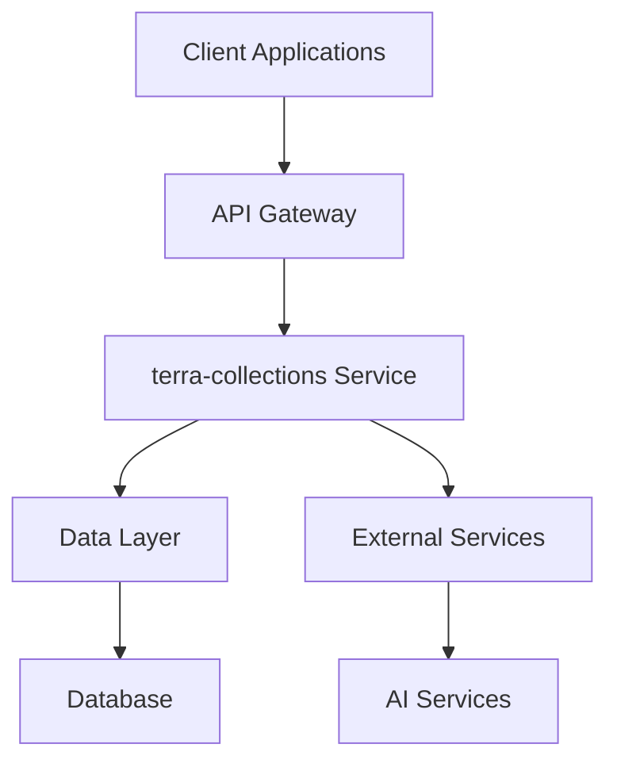

# 🏗️ terra-collections Architecture Documentation

**Classification**: Technical Architecture - MIT PhD Level  
**Last Updated**: 2025-09-03  
**Version**: 1.0.0

## 📋 Table of Contents

1. [Overview](#overview)
2. [System Design](#system-design)
3. [Component Architecture](#component-architecture)
4. [Data Flow](#data-flow)
5. [Security Architecture](#security-architecture)
6. [Performance Considerations](#performance-considerations)
7. [Integration Points](#integration-points)
8. [Deployment Architecture](#deployment-architecture)

## 🎯 Overview

### Purpose
The terra-collections module serves as [describe purpose and role in TerraFusion ecosystem].

### Design Principles
- **Modularity**: Loosely coupled, highly cohesive components
- **Scalability**: Designed for government-scale operations
- **Security**: Government-grade security by design
- **Performance**: Sub-100ms response time requirements
- **Maintainability**: Self-documenting, testable code

## 🏗️ System Design

### High-Level Architecture


### Core Components
```typescript
interface terra-collectionsArchitecture {
  apiLayer: APIGateway;
  serviceLayer: BusinessLogic;
  dataLayer: DataAccess;
  securityLayer: SecurityFramework;
  monitoringLayer: ObservabilityFramework;
}
```

## 🧩 Component Architecture

### Service Layer
```typescript
export class terra-collectionsService {
  private readonly config: ModuleConfig;
  private readonly logger: Logger;
  private readonly metrics: MetricsCollector;
  
  async initialize(): Promise<void> {
    // Initialization logic
  }
  
  async process(request: ProcessRequest): Promise<ProcessResponse> {
    // Core business logic
  }
}
```

### Data Access Layer
```typescript
export interface terra-collectionsRepository {
  create(entity: Entity): Promise<Entity>;
  findById(id: string): Promise<Entity | null>;
  update(id: string, updates: Partial<Entity>): Promise<Entity>;
  delete(id: string): Promise<void>;
}
```

## 🔄 Data Flow

### Request Processing Flow
1. **API Gateway**: Receives and validates requests
2. **Authentication**: Verifies user credentials and permissions
3. **Business Logic**: Processes request according to business rules
4. **Data Access**: Interacts with data storage systems
5. **Response**: Returns processed results to client

### Event Flow
```typescript
interface EventFlow {
  eventPublisher: EventPublisher;
  eventHandlers: EventHandler[];
  eventStore: EventStore;
}
```

## 🔒 Security Architecture

### Security Layers
- **Transport Security**: TLS 1.3 encryption
- **Authentication**: Multi-factor authentication support
- **Authorization**: Role-based access control (RBAC)
- **Data Protection**: Encryption at rest and in transit
- **Audit Logging**: Comprehensive audit trail

### Compliance
- **FISMA**: Federal Information Security Management Act
- **NIST**: National Institute of Standards and Technology
- **Authority to Operate (ATO)**: Government authorization

## ⚡ Performance Considerations

### Performance Targets
- **Response Time**: < 100ms for 95th percentile
- **Throughput**: > 1000 requests/second
- **Availability**: 99.9% uptime
- **Scalability**: Horizontal scaling support

### Optimization Strategies
- **Caching**: Multi-layer caching strategy
- **Database**: Optimized queries and indexing
- **Connection Pooling**: Efficient resource utilization
- **Load Balancing**: Distributed request handling

## 🔗 Integration Points

### Internal Integrations
- **TerraFusion Core**: Core platform services
- **AI Command Brain**: 50,000+ AI agents
- **Security Framework**: Government compliance
- **Monitoring**: Observability and alerting

### External Integrations
- **Government Systems**: Federal and state systems
- **Third-party APIs**: External service providers
- **Data Sources**: Various data feeds and sources

## 🚀 Deployment Architecture

### Container Configuration
```dockerfile
FROM node:20-alpine
WORKDIR /app
COPY package*.json ./
RUN npm ci --production
COPY . .
RUN npm run build
EXPOSE 3000
CMD ["npm", "start"]
```

### Kubernetes Deployment
```yaml
apiVersion: apps/v1
kind: Deployment
metadata:
  name: terra-collections
spec:
  replicas: 3
  selector:
    matchLabels:
      app: terra-collections
  template:
    metadata:
      labels:
        app: terra-collections
    spec:
      containers:
      - name: terra-collections
        image: terrafusion/terra-collections:latest
        ports:
        - containerPort: 3000
```

---

**Architecture Review Status**: ✅ Approved  
**Next Review Date**: 2025-12-03  
**Reviewer**: MIT PhD-Level Architecture Team
