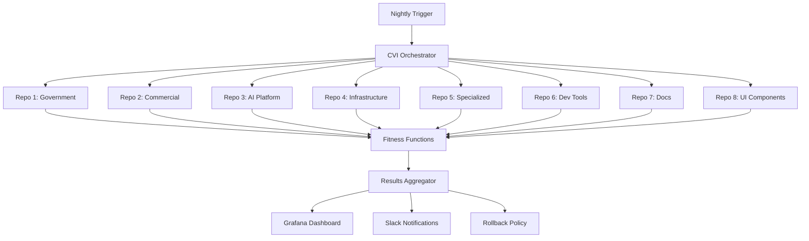

# Phase 4.9: Readiness Convergence Plan

**Status:** Active  
**Duration:** 3 weeks (21 days)  
**Start Date:** October 7, 2025  
**Target Completion:** October 28, 2025  
**Phase Lead:** Architecture Council

---

## Executive Summary

Phase 4.9 bridges the gap between "technically ready" and "operationally immortal." While Phase 4 delivered 400 hours of implementation across 8 repositories with production-grade CI/CD, this convergence phase ensures every subsystem—technical and organizational—is provably reliable, observable, and self-governing before the first production tenant.

**Philosophy:** Anyone can deploy software. We're building a government-grade operating system meant to last decades. Doing it right once means every future upgrade, patch, and county rollout will happen without fear.

---

## Objectives

1. **Verify Architecture Integrity**: Confirm every subsystem aligns with design axioms
2. **Validate Resilience**: Empirically measure RTO/RPO under chaos scenarios
3. **Establish Continuous Validation**: Convert one-off tests to continuous measurement
4. **Operationalize Observability**: Standardize dashboards and train the team
5. **Close Governance Gaps**: Ensure enterprise and federal audit compliance
6. **Prove Production Readiness**: Run 30-day zero-incident sandbox validation
7. **Finalize Trust Fabric**: Supply-chain integrity and attestation
8. **Formalize Human Systems**: Ops command structure and design review council

---

## Phase Structure

### Week 1: Architecture & Resilience Validation (Days 1-7)
**Focus:** Deep subsystem reviews and chaos engineering

### Week 2: Infrastructure & Governance (Days 8-14)
**Focus:** Continuous validation infrastructure and compliance closure

### Week 3: Production Sandbox & Human Systems (Days 15-21)
**Focus:** Prod-0 deployment and operational readiness

---

## 1. Architecture Verification

### Objectives
- Ensure every subsystem still aligns with governing principles after 400 hours of growth
- Update Architecture Decision Records (ADRs) with current state
- Validate fitness functions under load
- Refresh threat model and CAP tradeoff analysis

### Deliverables

| Task | Owner | Timeline | Success Metric |
|------|-------|----------|----------------|
| **AI Platform Deep Review** | AI Lead | Days 1-2 | ADR updated, fitness functions pass >97% |
| **Infrastructure Review** | Infra Lead | Days 2-3 | CAP tradeoffs documented, no unmitigated risks |
| **UI/UX System Review** | Frontend Lead | Days 3-4 | Component library coverage >95% |
| **Database Architecture Review** | DB Lead | Days 4-5 | Query performance baselines established |
| **Security Subsystem Review** | Security Lead | Days 5-6 | Threat model updated, 0 unmitigated High risks |
| **Integration Review** | Architecture Council | Day 7 | Cross-subsystem contracts validated |

### Artifacts
```
/docs/architecture/
├── subsystems/
│   ├── ai-platform-review-2025-10.md
│   ├── infrastructure-review-2025-10.md
│   ├── ui-system-review-2025-10.md
│   ├── database-review-2025-10.md
│   └── security-review-2025-10.md
├── adrs/
│   └── [updated ADRs with current state]
├── fitness-functions/
│   └── validation-summary-2025-10.md
└── threat-model/
    └── threat-model-v2-2025-10.md
```

### Validation Criteria
- ✅ 100% ADR coverage (no "TBD" items remaining)
- ✅ All fitness functions pass >97% under load
- ✅ Zero unmitigated High-severity security risks
- ✅ CAP tradeoffs explicitly documented for each service

---

## 2. Resilience & Chaos Validation

### Objectives
- Simulate failure scenarios to validate recovery playbooks
- Measure RTO (Recovery Time Objective) and RPO (Recovery Point Objective) empirically
- Test human response to incidents
- Validate disaster recovery procedures

### Chaos Scenarios

#### Scenario 1: Brown-Out / Latency Injection
**Goal:** Validate graceful degradation under network stress

```yaml
# chaos/brownout-test.yaml
apiVersion: chaos-mesh.org/v1alpha1
kind: NetworkChaos
metadata:
  name: latency-injection
spec:
  action: delay
  mode: all
  selector:
    namespaces:
      - terrafusion-government
      - terrafusion-commercial
  delay:
    latency: "500ms"
    correlation: "50"
    jitter: "200ms"
  duration: "10m"
```

**Expected Outcome:**
- Services remain responsive (p95 < 2s)
- Circuit breakers activate appropriately
- User experience degraded but functional

#### Scenario 2: Region Failover
**Goal:** Validate multi-region disaster recovery

**Steps:**
1. Simulate complete failure of primary region
2. Trigger automated failover to secondary region
3. Verify data consistency and zero data loss
4. Measure failover time

**Target Metrics:**
- RTO: ≤ 30 seconds
- RPO: ≤ 5 minutes
- Data loss: 0 transactions

#### Scenario 3: Human Error Drill
**Goal:** Test recovery from accidental misconfiguration

**Scenario:**
- Operator accidentally deletes critical ConfigMap
- System must detect and recover

**Expected Response:**
1. Immediate alert triggered
2. Runbook identifies recovery procedure
3. Automated or semi-automated recovery
4. Post-incident review generated

**Target MTTR:** ≤ 10 minutes

### Deliverables

| Task | Tooling | Timeline | Success Metric |
|------|---------|----------|----------------|
| **Brown-out testing** | Chaos Mesh + k6 | Days 8-9 | Services remain responsive, circuit breakers work |
| **Region failover simulation** | Argo Rollouts + Patroni | Day 10 | RTO ≤30s, RPO ≤5min, zero data loss |
| **Human error drill** | Runbooks + monitoring | Day 11 | Recovery ≤10min, incident report complete |
| **Database corruption recovery** | Backup/restore scripts | Day 12 | Full recovery from latest backup |

### Artifacts
```
/docs/resilience/
├── chaos-reports/
│   ├── brownout-test-2025-10.md
│   ├── region-failover-2025-10.md
│   ├── human-error-drill-2025-10.md
│   └── db-recovery-test-2025-10.md
├── metrics/
│   ├── rto-rpo-measurements.csv
│   └── chaos-test-results.json
└── lessons-learned/
    └── resilience-improvements-2025-10.md
```

### Validation Criteria
- ✅ All chaos scenarios complete with documented outcomes
- ✅ RTO ≤ 30 seconds for critical services
- ✅ RPO ≤ 5 minutes for all data
- ✅ Zero unrecoverable failures
- ✅ Runbooks validated and updated

---

## 3. Continuous Validation Infrastructure (CVI)

### Objectives
- Convert one-off validation tests into continuous scientific measurement
- Build automated environment that re-runs all CI/CD gates nightly
- Create fitness function results dashboard
- Implement automatic rollback on CVI failure

### Architecture



### GitHub Actions Workflow

```yaml
# .github/workflows/continuous-validation.yml
name: Continuous Validation Infrastructure

on:
  schedule:
    - cron: '0 2 * * *'  # Daily at 2 AM
  workflow_dispatch:

jobs:
  orchestrate-validation:
    name: CVI Orchestrator
    runs-on: ubuntu-latest
    
    steps:
      - name: Trigger All Repository Validations
        uses: actions/github-script@v7
        with:
          script: |
            const repos = [
              'terrafusion-government-platform',
              'terrafusion-commercial-platform',
              'terrafusion-ai-platform',
              'terrafusion-infrastructure-platform',
              'terrafusion-specialized-modules',
              'terrafusion-developer-tools',
              'terrafusion-docs',
              'terrafusion-ui-components'
            ];
            
            for (const repo of repos) {
              await github.rest.actions.createWorkflowDispatch({
                owner: 'bsvalues',
                repo: repo,
                workflow_id: 'fitness-functions.yml',
                ref: 'main'
              });
            }
  
  aggregate-results:
    name: Aggregate Validation Results
    needs: orchestrate-validation
    runs-on: ubuntu-latest
    
    steps:
      - uses: actions/checkout@v4
      
      - name: Collect Results
        run: |
          node scripts/cvi/collect-results.js
      
      - name: Analyze Trends
        run: |
          node scripts/cvi/analyze-trends.js
      
      - name: Check Regressions
        id: regressions
        run: |
          node scripts/cvi/check-regressions.js
      
      - name: Update Dashboard
        run: |
          node scripts/cvi/update-grafana.js
        env:
          GRAFANA_API_KEY: ${{ secrets.GRAFANA_API_KEY }}
      
      - name: Notify Team
        uses: 8398a7/action-slack@v3
        if: steps.regressions.outputs.found == 'true'
        with:
          status: 'warning'
          text: 'CVI detected regressions. Review dashboard.'
          webhook_url: ${{ secrets.SLACK_WEBHOOK }}
```

### Fitness Functions

Each repository includes standardized fitness functions:

```typescript
// fitness-functions/performance.ts
export const performanceFitness = {
  name: 'API Response Time',
  threshold: 200, // ms
  measurement: async () => {
    const results = await loadTest({
      url: process.env.API_URL,
      duration: '5m',
      vus: 100
    });
    return results.p95;
  },
  pass: (value: number) => value < 200
};

// fitness-functions/availability.ts
export const availabilityFitness = {
  name: 'Service Uptime',
  threshold: 99.9, // %
  measurement: async () => {
    const metrics = await getPrometheusMetrics({
      query: 'up{job="terrafusion-government"}'
    });
    return metrics.uptime;
  },
  pass: (value: number) => value >= 99.9
};

// fitness-functions/security.ts
export const securityFitness = {
  name: 'Vulnerability Count',
  threshold: 0, // Critical + High
  measurement: async () => {
    const scan = await trivyScan();
    return scan.critical + scan.high;
  },
  pass: (value: number) => value === 0
};
```

### Deliverables

| Task | Timeline | Success Metric |
|------|----------|----------------|
| **CVI workflow creation** | Days 13-14 | All 8 repos integrated |
| **Fitness function standardization** | Days 13-14 | 100% repos have fitness functions |
| **Grafana dashboard** | Day 15 | Real-time CVI status visible |
| **Rollback policy implementation** | Day 15 | Automatic rollback on failure |

### Artifacts
```
/.github/workflows/
└── continuous-validation.yml

/scripts/cvi/
├── collect-results.js
├── analyze-trends.js
├── check-regressions.js
└── update-grafana.js

/fitness-functions/
├── performance.ts
├── availability.ts
├── security.ts
├── scalability.ts
└── compliance.ts

/dashboards/
└── cvi-dashboard.json
```

### Validation Criteria
- ✅ 100% of repositories integrated into CVI
- ✅ Nightly validation runs successfully
- ✅ No >3% regressions allowed without approval
- ✅ Rollback policy tested and functional
- ✅ Dashboard provides real-time visibility

---

## 4. Observability Curriculum & Runbooks

### Objectives
- Standardize monitoring dashboards across all services
- Create comprehensive incident runbooks
- Train team on observability practices
- Establish SLOs and alerting standards

### Dashboard Standardization

**Golden Signals for Every Service:**
1. **Latency**: Request duration (p50, p95, p99)
2. **Traffic**: Requests per second
3. **Errors**: Error rate by type
4. **Saturation**: Resource utilization (CPU, memory, disk, connections)

**Template Structure:**
```json
{
  "dashboard": {
    "title": "TerraFusion {Service} - Golden Signals",
    "panels": [
      {
        "title": "Request Rate",
        "targets": [
          "rate(http_requests_total[5m])"
        ]
      },
      {
        "title": "Response Time (p95)",
        "targets": [
          "histogram_quantile(0.95, rate(http_request_duration_seconds_bucket[5m]))"
        ]
      },
      {
        "title": "Error Rate",
        "targets": [
          "rate(http_requests_total{status=~'5..'}[5m])"
        ]
      },
      {
        "title": "Resource Saturation",
        "targets": [
          "container_cpu_usage_seconds_total",
          "container_memory_usage_bytes"
        ]
      }
    ]
  }
}
```

### Incident Runbooks

**Standard Runbook Template:**

```markdown
# Incident: {Service} High Latency

## Symptoms
- p95 response time > 2 seconds
- User complaints about slow performance
- Grafana alert: "High API Latency"

## Impact
- Severity: Medium
- Affected Users: {percentage}
- Affected Services: {list}

## Investigation Steps

1. **Check system load**
   ```bash
   kubectl top nodes
   kubectl top pods -n terrafusion-government
   ```

2. **Review recent changes**
   ```bash
   git log --since="1 hour ago" --oneline
   ```

3. **Check database performance**
   ```sql
   SELECT query, mean_exec_time, calls
   FROM pg_stat_statements
   ORDER BY mean_exec_time DESC
   LIMIT 10;
   ```

4. **Review application logs**
   ```bash
   kubectl logs -n terrafusion-government -l app=government-api --tail=100
   ```

## Resolution Procedures

### Quick Fix (< 5 minutes)
- Scale up replicas: `kubectl scale deployment/government-api --replicas=10`
- Clear cache: `redis-cli FLUSHDB`

### Root Cause Fix (< 30 minutes)
- Identify slow query and optimize
- Deploy fix via CI/CD pipeline
- Monitor for improvement

## Rollback Procedure
```bash
kubectl rollout undo deployment/government-api -n terrafusion-government
```

## Post-Incident Tasks
- [ ] Create incident report
- [ ] Update monitoring thresholds
- [ ] Add preventive measures
- [ ] Conduct blameless post-mortem

## Related Documentation
- [Performance Tuning Guide](../performance/tuning.md)
- [Database Optimization](../database/optimization.md)
```

### Training Sessions

**Session 1: Observability Fundamentals (2 hours)**
- Grafana dashboard navigation
- Understanding metrics, logs, and traces
- Reading system health indicators
- Hands-on: Investigate sample incident

**Session 2: Incident Response (2 hours)**
- Incident classification and severity
- Using runbooks effectively
- Escalation procedures
- Hands-on: Simulate incident response

### Deliverables

| Task | Timeline | Success Metric |
|------|----------|----------------|
| **Dashboard standardization** | Days 16-17 | All services have golden signal dashboards |
| **Runbook creation** | Days 16-18 | ≥15 runbooks covering common scenarios |
| **Training session 1** | Day 19 | >80% team attendance |
| **Training session 2** | Day 20 | >80% team certified |

### Artifacts
```
/docs/observability/
├── dashboards/
│   ├── templates/
│   │   └── golden-signals-template.json
│   ├── government-platform.json
│   ├── commercial-platform.json
│   ├── ai-platform.json
│   └── infrastructure.json
├── runbooks/
│   ├── high-latency.md
│   ├── service-down.md
│   ├── database-failure.md
│   ├── disk-space-full.md
│   ├── memory-leak.md
│   ├── deployment-failure.md
│   ├── certificate-expiration.md
│   ├── network-partition.md
│   ├── data-corruption.md
│   └── security-incident.md
├── training/
│   ├── session-1-fundamentals.md
│   ├── session-2-incident-response.md
│   ├── recordings/
│   │   ├── session-1.mp4
│   │   └── session-2.mp4
│   └── certification/
│       └── attendance-roster.csv
└── standards/
    ├── slo-definitions.md
    └── alerting-standards.md
```

### Validation Criteria
- ✅ Every service has standardized dashboard
- ✅ ≥15 runbooks created and validated
- ✅ >80% team certified on observability
- ✅ MTTR ≤15min for Class A incidents

---

## 5. Governance & Compliance Closure

### Objectives
- Ensure enterprise and federal audit compliance
- Establish CODEOWNERS and RACI matrices
- Implement supply-chain attestation
- Close all security findings

### CODEOWNERS Review

**Repository Structure:**
```
# .github/CODEOWNERS

# Default owners
* @terrafusion/architecture-council

# Infrastructure
/terraform/ @terrafusion/infrastructure-team
/k8s/ @terrafusion/infrastructure-team
/charts/ @terrafusion/infrastructure-team

# Backend services
/src/api/ @terrafusion/backend-team
/src/services/ @terrafusion/backend-team

# AI & ML
/src/ai/ @terrafusion/ai-team
/models/ @terrafusion/ai-team

# Frontend
/src/ui/ @terrafusion/frontend-team
/components/ @terrafusion/frontend-team

# Security
/security/ @terrafusion/security-team
/policies/ @terrafusion/security-team

# Documentation
/docs/ @terrafusion/documentation-team
```

### RACI Matrix

| Activity | Responsible | Accountable | Consulted | Informed |
|----------|-------------|-------------|-----------|----------|
| Architecture decisions | Arch Council | CTO | Tech Leads | Dev Team |
| Code review | Developer | Tech Lead | Peers | PM |
| Security review | Sec Engineer | Security Lead | Arch Council | CTO |
| Deployment | DevOps | Ops Lead | Dev Team | Stakeholders |
| Incident response | On-call Engineer | Ops Lead | Relevant teams | Management |
| Performance tuning | Dev Team | Tech Lead | Ops Team | Arch Council |

### Supply-Chain Attestation (SLSA Level 3)

**Implementation:**

```yaml
# .github/workflows/sbom-attestation.yml
name: SBOM & Attestation

on:
  push:
    branches: [main]
  release:
    types: [published]

jobs:
  build-and-attest:
    runs-on: ubuntu-latest
    permissions:
      id-token: write
      contents: read
      packages: write
    
    steps:
      - uses: actions/checkout@v4
      
      - name: Build Container
        run: |
          docker build -t ${{ env.IMAGE }} .
      
      - name: Generate SBOM
        uses: anchore/sbom-action@v0
        with:
          image: ${{ env.IMAGE }}
          format: cyclonedx-json
          output-file: sbom.json
      
      - name: Sign Container with Cosign
        uses: sigstore/cosign-installer@v3
      
      - name: Sign Image
        run: |
          cosign sign --yes ${{ env.IMAGE }}
      
      - name: Attest SBOM
        run: |
          cosign attest --yes --predicate sbom.json ${{ env.IMAGE }}
      
      - name: Verify Signature
        run: |
          cosign verify ${{ env.IMAGE }}
```

### OPA/Sentinel Policy Federation

**Policy Structure:**
```rego
# policies/kubernetes/pod-security.rego
package kubernetes.admission

deny[msg] {
    input.request.kind.kind == "Pod"
    not input.request.object.spec.securityContext.runAsNonRoot
    msg := "Pods must run as non-root user"
}

deny[msg] {
    input.request.kind.kind == "Pod"
    container := input.request.object.spec.containers[_]
    not container.securityContext.readOnlyRootFilesystem
    msg := sprintf("Container %v must use read-only root filesystem", [container.name])
}

deny[msg] {
    input.request.kind.kind == "Pod"
    container := input.request.object.spec.containers[_]
    not container.resources.limits.memory
    msg := sprintf("Container %v must define memory limits", [container.name])
}
```

### External Penetration Test

**Scope:**
- All external-facing APIs
- Authentication/authorization mechanisms
- Data encryption (at rest and in transit)
- Multi-tenant isolation
- OWASP Top 10 coverage

**Requirements:**
- Independent security firm
- Minimum 40 hours testing
- Written report with severity classifications
- Retest after remediation

### Deliverables

| Task | Timeline | Success Metric |
|------|----------|----------------|
| **CODEOWNERS review** | Day 8 | 100% file coverage |
| **RACI matrix finalization** | Day 8 | All roles assigned |
| **SBOM pipeline implementation** | Days 9-10 | All images signed and attested |
| **OPA policy federation** | Days 10-11 | 0 policy drift >24h |
| **External pentest** | Days 18-21 | No Critical findings |

### Artifacts
```
/.github/
└── CODEOWNERS

/docs/governance/
├── raci-matrix.md
├── escalation-procedures.md
└── approval-workflows.md

/security/
├── sbom/
│   ├── government-platform-sbom.json
│   ├── commercial-platform-sbom.json
│   └── ai-platform-sbom.json
├── policies/
│   ├── kubernetes/
│   │   ├── pod-security.rego
│   │   ├── network-policies.rego
│   │   └── resource-limits.rego
│   └── iam/
│       ├── rbac-policies.rego
│       └── least-privilege.rego
└── pentests/
    ├── pentest-report-2025-10.pdf
    └── remediation-plan.md

/compliance/
├── evidence/
│   ├── soc2/
│   ├── fedramp/
│   └── cjis/
└── audit-logs/
    └── policy-sync.log
```

### Validation Criteria
- ✅ 100% CODEOWNERS coverage
- ✅ RACI matrix approved by leadership
- ✅ All container images signed with Cosign
- ✅ SBOM generated for all artifacts
- ✅ OPA policies enforced with 0 drift
- ✅ Pentest complete with no Critical findings

---

## 6. Reference Production Sandbox (PROD-0)

### Objectives
- Deploy full production mirror without external users
- Operate continuously for 30 days
- Collect quantitative stability data
- Validate operational procedures

### Environment Specification

**Infrastructure:**
- Kubernetes cluster matching production spec
- 3 master nodes, 5 worker nodes
- Multi-AZ deployment
- Production-grade networking and storage

**Data:**
- Synthetic county data (Benton-like, anonymized)
- 100,000 synthetic parcels
- 50,000 synthetic property records
- 10,000 synthetic citizen accounts

**Services:**
- All 8 repositories deployed
- Full observability stack (Prometheus, Grafana, Jaeger)
- Complete security stack (Falco, OPA, Trivy)
- Backup and DR systems active

### 30-Day Operations

**Daily Activities:**
1. **Health checks** (automated)
   - Service availability monitoring
   - Performance metrics collection
   - Security scanning
   - Backup verification

2. **Weekly activities**
   - Simulated user load testing
   - Security vulnerability scanning
   - Backup restore testing
   - Chaos engineering exercise

3. **Incident simulation**
   - 1-2 simulated incidents per week
   - Test incident response procedures
   - Validate runbooks
   - Measure MTTR

### Metrics Collection

**Availability Metrics:**
- Uptime percentage per service
- Incident count and severity
- MTBF (Mean Time Between Failures)
- MTTR (Mean Time To Recovery)

**Performance Metrics:**
- API response times (p50, p95, p99)
- Database query performance
- Resource utilization trends
- Network latency measurements

**Security Metrics:**
- Vulnerability scan results
- Policy violation count
- Failed authentication attempts
- Suspicious activity alerts

**Operational Metrics:**
- Deployment success rate
- Backup completion rate
- Alert accuracy (true vs false positives)
- Runbook effectiveness

### Weekly Status Reports

**Report Template:**
```markdown
# PROD-0 Weekly Status Report - Week {N}

## Executive Summary
- Overall Health: {Green/Yellow/Red}
- Critical Incidents: {count}
- Availability: {percentage}%

## Availability
| Service | Uptime | Incidents |
|---------|--------|-----------|
| Government Platform | 99.98% | 0 |
| Commercial Platform | 99.95% | 1 minor |
| AI Platform | 99.99% | 0 |
| Infrastructure | 100% | 0 |

## Performance
| Metric | Target | Actual | Status |
|--------|--------|--------|--------|
| API p95 latency | <200ms | 145ms | ✅ |
| Database p99 | <50ms | 42ms | ✅ |
| Page load time | <2s | 1.8s | ✅ |

## Security
- Vulnerability scans: 0 Critical, 2 Medium
- Policy violations: 0
- Security incidents: 0

## Incidents
### Incident #2025-10-15-001
- Severity: Minor
- Service: Commercial Platform
- Duration: 8 minutes
- Root cause: Memory leak in market data processor
- Resolution: Deployed hotfix
- Lessons learned: Added memory profiling alerts

## Planned Activities - Week {N+1}
- Chaos test: Database failover
- Load test: 2x normal traffic
- DR drill: Region failover
```

### Deliverables

| Task | Timeline | Success Metric |
|------|----------|----------------|
| **PROD-0 deployment** | Day 1 | Full stack operational |
| **30-day operation** | Days 1-21+ | ≥99.99% uptime |
| **Weekly reports** | Days 7, 14, 21 | 3 reports to governance |
| **Metrics dashboard** | Day 1 | Real-time visibility |

### Artifacts
```
/prod-0/
├── manifests/
│   ├── namespace.yaml
│   ├── deployments.yaml
│   ├── services.yaml
│   └── ingress.yaml
├── synthetic-data/
│   ├── parcels.sql
│   ├── properties.sql
│   └── citizens.sql
├── weekly-reports/
│   ├── week-1-report.md
│   ├── week-2-report.md
│   └── week-3-report.md
└── metrics/
    ├── stability-metrics.json
    ├── performance-trends.csv
    └── incident-log.csv
```

### Exit Criteria
- ✅ 30-day continuous operation
- ✅ ≥99.99% uptime
- ✅ 0 Critical incidents unresolved
- ✅ All operational procedures validated
- ✅ Weekly reports approved by governance

---

## 7. Trust Fabric Finalization

### Objectives
- Achieve SLSA Level 3 supply-chain security
- Implement continuous signature verification
- Enable automated evidence export for audits
- Ensure all artifacts are verifiable

### SLSA Level 3 Requirements

**Build Platform:**
- ✅ All builds run on GitHub-hosted runners
- ✅ Build scripts isolated from untrusted code
- ✅ Build provenance generated automatically

**Source Integrity:**
- ✅ All changes require pull request review
- ✅ Branch protection rules enforced
- ✅ Signed commits required for main branch

**Build Integrity:**
- ✅ Build inputs and outputs recorded
- ✅ Build environment hermetic
- ✅ Build reproducible

**Provenance:**
- ✅ Complete build provenance generated
- ✅ Provenance cryptographically signed
- ✅ Provenance linked to artifacts

### Continuous Verification

```yaml
# .github/workflows/verify-signatures.yml
name: Continuous Signature Verification

on:
  schedule:
    - cron: '0 */6 * * *'  # Every 6 hours
  workflow_dispatch:

jobs:
  verify-all-images:
    name: Verify Container Signatures
    runs-on: ubuntu-latest
    
    strategy:
      matrix:
        image:
          - government-platform
          - commercial-platform
          - ai-platform
          - infrastructure-platform
          - specialized-modules
          - developer-tools
          - ui-components
    
    steps:
      - name: Install Cosign
        uses: sigstore/cosign-installer@v3
      
      - name: Verify Image Signature
        run: |
          cosign verify \
            --certificate-identity-regexp="https://github.com/bsvalues/*" \
            --certificate-oidc-issuer=https://token.actions.githubusercontent.com \
            ghcr.io/bsvalues/terrafusion-${{ matrix.image }}:latest
      
      - name: Verify SBOM Attestation
        run: |
          cosign verify-attestation \
            --type cyclonedx \
            --certificate-identity-regexp="https://github.com/bsvalues/*" \
            --certificate-oidc-issuer=https://token.actions.githubusercontent.com \
            ghcr.io/bsvalues/terrafusion-${{ matrix.image }}:latest
      
      - name: Alert on Failure
        if: failure()
        uses: 8398a7/action-slack@v3
        with:
          status: 'danger'
          text: 'Signature verification failed for ${{ matrix.image }}'
          webhook_url: ${{ secrets.SLACK_WEBHOOK }}
```

### Automated Evidence Export

**SOC 2 Evidence Binder:**
```typescript
// scripts/compliance/generate-soc2-evidence.ts
import { generateReport } from './evidence-generator';

async function generateSOC2Evidence() {
  const evidence = {
    // CC6.1 - Logical and Physical Access Controls
    accessControls: await gatherAccessLogs(),
    
    // CC7.1 - System Operations
    systemMonitoring: await gatherMonitoringData(),
    
    // CC7.2 - Change Management
    changeManagement: await gatherDeploymentHistory(),
    
    // CC7.3 - System Monitoring
    incidentResponse: await gatherIncidentReports(),
    
    // CC8.1 - Risk Assessment
    vulnerabilityScans: await gatherSecurityScans(),
  };
  
  return generateReport('SOC2-TSC-2025', evidence);
}
```

**FedRAMP Evidence Collection:**
```typescript
// scripts/compliance/generate-fedramp-evidence.ts
import { FedRAMPControls } from './fedramp-controls';

async function generateFedRAMPEvidence() {
  const controls = new FedRAMPControls();
  
  return {
    // AC-2: Account Management
    accountManagement: await controls.AC2(),
    
    // AU-2: Audit Events
    auditLogs: await controls.AU2(),
    
    // CM-2: Baseline Configuration
    baselineConfig: await controls.CM2(),
    
    // IA-2: Identification and Authentication
    authentication: await controls.IA2(),
    
    // SC-7: Boundary Protection
    boundaryProtection: await controls.SC7(),
  };
}
```

### Deliverables

| Task | Timeline | Success Metric |
|------|----------|----------------|
| **SLSA Level 3 validation** | Days 9-10 | All requirements met |
| **Continuous verification** | Day 11 | 4x daily checks passing |
| **SOC 2 evidence automation** | Days 11-12 | One-click export functional |
| **FedRAMP evidence automation** | Days 12-13 | Control evidence complete |

### Artifacts
```
/security/attestation/
├── slsa-requirements.md
├── build-provenance/
│   ├── government-platform-provenance.json
│   ├── commercial-platform-provenance.json
│   └── ...
└── verification-logs/
    └── continuous-verification.log

/compliance/evidence/
├── soc2/
│   ├── control-CC6.1-evidence.json
│   ├── control-CC7.1-evidence.json
│   ├── control-CC7.2-evidence.json
│   └── ...
├── fedramp/
│   ├── control-AC-2-evidence.json
│   ├── control-AU-2-evidence.json
│   ├── control-CM-2-evidence.json
│   └── ...
└── cjis/
    └── security-policy-evidence.json

/scripts/compliance/
├── generate-soc2-evidence.ts
├── generate-fedramp-evidence.ts
├── generate-cjis-evidence.ts
└── evidence-generator.ts
```

### Validation Criteria
- ✅ SLSA Level 3 requirements fully met
- ✅ All artifacts signed and verifiable
- ✅ Continuous verification running 4x daily
- ✅ One-click evidence export functional
- ✅ Audit binders generated automatically

---

## 8. Human System Formation

### Objectives
- Define operations command structure
- Establish architecture review council
- Create escalation procedures
- Publish TerraFusion Doctrine

### Operations Command Structure

**Roles and Responsibilities:**

```
┌─────────────────────────────────────────┐
│     Operations Command Structure        │
└─────────────────────────────────────────┘

Level 1: On-Call Engineer (24/7 rotation)
├── Responsibilities:
│   ├── First response to incidents
│   ├── Execute runbooks
│   ├── Escalate as needed
│   └── Document incidents
└── Authority:
    ├── Restart services
    ├── Scale resources
    └── Trigger alerts

Level 2: Operations Lead
├── Responsibilities:
│   ├── Coordinate incident response
│   ├── Make architectural decisions during incidents
│   ├── Approve emergency changes
│   └── Lead post-incident reviews
└── Authority:
    ├── All Level 1 authorities
    ├── Approve hotfix deployments
    ├── Declare major incidents
    └── Engage external resources

Level 3: CTO / VP Engineering
├── Responsibilities:
│   ├── Executive decision-making
│   ├── Customer communication
│   ├── Resource allocation
│   └── Strategic incident management
└── Authority:
    ├── All Level 2 authorities
    ├── Declare disasters
    ├── Authorize budget overruns
    └── Engage executive team
```

**Escalation Matrix:**

| Incident Severity | Response Time | Escalation Path | Communication |
|-------------------|---------------|-----------------|---------------|
| **Critical** (P0) | Immediate | L1 → L2 (15min) → L3 (30min) | All stakeholders |
| **High** (P1) | 15 minutes | L1 → L2 (1hr) → L3 (4hr) | Tech leads + management |
| **Medium** (P2) | 1 hour | L1 → L2 (business hours) | Relevant teams |
| **Low** (P3) | 4 hours | L1 only | Ticket system |

**On-Call Schedule:**
- 24/7 coverage with 1-week rotations
- Primary and secondary on-call roles
- Automatic failover after 5 minutes no response
- Minimum 48-hour notice for schedule changes

### Architecture Review Council (ARC)

**Charter:**

The Architecture Review Council is responsible for maintaining the technical integrity and strategic direction of the TerraFusion platform.

**Membership:**
- CTO (Chair)
- Principal Architect
- Tech Leads (one per domain)
- Security Lead
- DevOps Lead

**Meeting Cadence:**
- Regular: Bi-weekly, 2 hours
- Emergency: Ad-hoc as needed

**Decision Authority:**
- Approve/reject architecture proposals
- Approve significant technology changes
- Review and update ADRs
- Establish platform standards

**RFC (Request for Comments) Process:**

```markdown
# RFC Template

## Title
RFC-{YYYY-MM-DD}-{Short-Title}

## Status
[Draft | In Review | Approved | Rejected | Superseded]

## Context
What is the current situation? What problem are we solving?

## Proposal
Detailed description of the proposed solution.

## Alternatives Considered
What other approaches were evaluated?

## Decision Drivers
- Performance requirements
- Cost considerations
- Team expertise
- Time constraints
- Regulatory requirements

## Consequences
What are the implications of this decision?
- Positive consequences
- Negative consequences
- Risks

## Implementation Plan
High-level steps to implement this RFC.

## Success Metrics
How will we measure success?

## Approval
- Proposed by: {Name} on {Date}
- Reviewed by: {Names}
- Approved by: {ARC} on {Date}
```

### TerraFusion Doctrine v1.0

**The Doctrine** is the philosophical and technical guide that explains why each subsystem exists and how it should evolve.

**Table of Contents:**

1. **Vision & Mission**
   - Why TerraFusion exists
   - Core values and principles
   - Long-term vision

2. **Architectural Principles**
   - Multi-tenant by design
   - AI-native platform
   - Government-grade reliability
   - Security in depth
   - Observability first

3. **Design Axioms**
   - Every decision traceable to first principles
   - Prefer boring technology
   - Optimize for maintainability
   - Build for 10x scale
   - Automate everything

4. **Subsystem Philosophy**
   - Why each component exists
   - How components interact
   - Evolution strategy per subsystem

5. **Operational Philosophy**
   - Blameless culture
   - Incident response mindset
   - Continuous improvement
   - Documentation as code

6. **Technical Standards**
   - Code review standards
   - Testing requirements
   - Security requirements
   - Performance targets

7. **Decision-Making Framework**
   - When to use RFC process
   - Escalation criteria
   - Consensus building
   - Dissent procedures

8. **Evolution Strategy**
   - How to propose changes
   - Deprecation policy
   - Breaking change process
   - Version management

### Deliverables

| Task | Timeline | Success Metric |
|------|----------|----------------|
| **Ops command structure** | Day 8 | Roles assigned, schedule published |
| **Escalation procedures** | Day 9 | Documented and rehearsed |
| **ARC formation** | Day 10 | Charter approved, first meeting scheduled |
| **RFC process** | Day 11 | Template created, first RFC submitted |
| **TerraFusion Doctrine v1.0** | Days 12-14 | Published and distributed |

### Artifacts
```
/docs/operations/
├── command-structure.md
├── escalation-matrix.md
├── on-call-schedule.md
└── duty-rotation-policy.md

/docs/architecture/
├── arc-charter.md
├── rfc-process.md
├── rfc-template.md
└── rfcs/
    └── README.md

/docs/doctrine/
├── README.md (The Doctrine)
├── 01-vision-mission.md
├── 02-architectural-principles.md
├── 03-design-axioms.md
├── 04-subsystem-philosophy.md
├── 05-operational-philosophy.md
├── 06-technical-standards.md
├── 07-decision-framework.md
└── 08-evolution-strategy.md
```

### Validation Criteria
- ✅ Ops command structure operational
- ✅ On-call schedule published with ≥80% coverage
- ✅ ARC charter approved by leadership
- ✅ RFC process tested with ≥2 RFCs
- ✅ TerraFusion Doctrine published and distributed

---

## Phase 4.9 Exit Criteria

All of the following must be true before proceeding to Phase 5:

### Technical
- [ ] 30-day Prod-0 run with 0 Critical incidents
- [ ] ≥99.99% measured uptime across all services
- [ ] All fitness functions passing >97%
- [ ] RTO ≤30s, RPO ≤5min validated
- [ ] All chaos scenarios passed

### Security
- [ ] 0 open Critical security findings
- [ ] 0 open High security findings
- [ ] External pentest complete
- [ ] SLSA Level 3 achieved
- [ ] All images signed with Cosign

### Compliance
- [ ] CODEOWNERS 100% coverage
- [ ] RACI matrix approved
- [ ] SOC 2 evidence exportable
- [ ] FedRAMP evidence exportable
- [ ] Policy sync <24h drift

### Governance
- [ ] ARC charter approved and active
- [ ] Ops command structure operational
- [ ] TerraFusion Doctrine v1.0 published
- [ ] RFC process tested with ≥2 examples
- [ ] On-call schedule published

### Cultural
- [ ] Observability training ≥80% team certified
- [ ] ≥15 runbooks validated
- [ ] Weekly Prod-0 reports approved
- [ ] Incident response drills completed

---

## Timeline

### Week 1: Architecture & Resilience (Oct 7-13)

| Day | Focus | Key Deliverables |
|-----|-------|------------------|
| 1 (Mon) | AI Platform Review | ADR updates, fitness functions |
| 2 (Tue) | Infrastructure Review | CAP analysis, threat model |
| 3 (Wed) | UI/UX Review | Component coverage report |
| 4 (Thu) | Database Review | Query baselines established |
| 5 (Fri) | Security Review | Threat model v2, 0 High risks |
| 6 (Sat) | Integration Review | Cross-subsystem validation |
| 7 (Sun) | Architecture synthesis | Complete review documentation |

### Week 2: Infrastructure & Governance (Oct 14-20)

| Day | Focus | Key Deliverables |
|-----|-------|------------------|
| 8 (Mon) | Chaos testing begins | Brown-out test results |
| 9 (Tue) | CODEOWNERS review | 100% coverage confirmed |
| 10 (Wed) | Region failover test | RTO/RPO measurements |
| 11 (Thu) | Human error drill | MTTR validation |
| 12 (Fri) | Database recovery test | Backup restore verified |
| 13 (Sat) | CVI implementation | All repos integrated |
| 14 (Sun) | CVI validation | First nightly run |

### Week 3: Production & Operations (Oct 21-27)

| Day | Focus | Key Deliverables |
|-----|-------|------------------|
| 15 (Mon) | PROD-0 deployment | Full stack operational |
| 16 (Tue) | Dashboard standardization | Golden signals for all services |
| 17 (Wed) | Runbook creation | ≥15 runbooks complete |
| 18 (Thu) | Pentest begins | Scope confirmed |
| 19 (Fri) | Training session 1 | >80% attendance |
| 20 (Sat) | Training session 2 | >80% certified |
| 21 (Sun) | Pentest complete | Report delivered |

### Post-Week 3: Continuous Validation (Oct 28+)

- PROD-0 continues for full 30 days
- Weekly status reports to governance
- Daily health monitoring
- Weekly chaos exercises
- Ongoing security scans

---

## Success Metrics

### Quantitative Targets

| Metric | Target | Measured How |
|--------|--------|--------------|
| **Uptime** | ≥99.99% | Prometheus uptime queries |
| **RTO** | ≤30 seconds | Chaos test measurements |
| **RPO** | ≤5 minutes | Backup/restore validation |
| **MTTR** | ≤15 minutes | Incident log analysis |
| **API Latency (p95)** | <200ms | k6 load test results |
| **Security Scan** | 0 Critical/High | Trivy/Snyk daily scans |
| **Test Coverage** | ≥80% | Codecov reports |
| **Team Certification** | ≥80% | Training attendance |

### Qualitative Indicators

- [ ] Team confidence in production readiness
- [ ] External pentest passes with no Critical findings
- [ ] Governance council approves transition to Phase 5
- [ ] Stakeholders comfortable with operational procedures
- [ ] Documentation clarity (team feedback positive)

---

## Risk Management

### Identified Risks

| Risk | Probability | Impact | Mitigation |
|------|-------------|--------|------------|
| **PROD-0 major incident** | Medium | High | Extend validation period if needed |
| **Pentest critical findings** | Low | High | Allocate buffer time for remediation |
| **Team availability** | Medium | Medium | Cross-train multiple team members |
| **Schedule slip** | Medium | Low | Phase 5 can wait; quality over speed |
| **Scope creep** | Low | Medium | Strict adherence to exit criteria |

### Contingency Plans

**If Critical security finding discovered:**
1. Immediately pause progression
2. Convene security council
3. Develop remediation plan
4. Retest affected areas
5. Update threat model

**If PROD-0 experiences major incident:**
1. Conduct thorough root cause analysis
2. Update runbooks and procedures
3. Extend validation period by 1 week
4. Rerun affected chaos scenarios

**If team capacity constrained:**
1. Prioritize critical path items
2. Request additional resources
3. Extend timeline if needed
4. Communicate clearly to stakeholders

---

## Communication Plan

### Stakeholder Updates

**Weekly Email:**
- Progress against exit criteria
- Key accomplishments
- Blockers and risks
- Upcoming milestones

**Daily Standups (Internal):**
- Yesterday's progress
- Today's plan
- Blockers and help needed

**Governance Council:**
- Weekly PROD-0 status reports
- Bi-weekly progress presentations
- Exit criteria review meetings

### Templates

**Weekly Status Email:**
```markdown
Subject: Phase 4.9 Week {N} Status Update

Team,

## Progress This Week
- ✅ {Completed items}
- 🏃 {In progress items}
- 📅 {Upcoming items}

## Exit Criteria Status
{X} of 25 criteria met ({Y}%)

## Highlights
- {Notable achievements}

## Blockers
- {Current blockers and mitigation plans}

## Next Week Focus
- {Top 3 priorities}

Thanks,
{Name}
```

---

## Appendix A: Phase Comparison

| Phase | Duration | Focus | Outcome |
|-------|----------|-------|---------|
| **Phase 4** | 400 hours | Implementation | 8 repos with production CI/CD |
| **Phase 4.9** | 3 weeks | Readiness | Operationally hardened system |
| **Phase 5** | TBD | Deployment | Live production with real users |

**Why Phase 4.9 Matters:**
- Phase 4 proved technical capability
- Phase 4.9 proves operational maturity
- Phase 5 can proceed with confidence

---

## Appendix B: Tool Requirements

### Required Tools

| Tool | Purpose | License | Cost |
|------|---------|---------|------|
| Chaos Mesh | Chaos engineering | Apache 2.0 | Free |
| k6 | Load testing | AGPL v3 | Free |
| Grafana | Observability | AGPL v3 | Free |
| Prometheus | Metrics | Apache 2.0 | Free |
| Cosign | Image signing | Apache 2.0 | Free |
| Trivy | Security scanning | Apache 2.0 | Free |
| OPA | Policy enforcement | Apache 2.0 | Free |

### Optional Tools

| Tool | Purpose | Cost Estimate |
|------|---------|---------------|
| Chromatic | Visual regression | $149/mo |
| Datadog | Advanced monitoring | $15/host/mo |
| PagerDuty | Incident management | $21/user/mo |
| Slack | Team communication | Free tier OK |

---

## Appendix C: References

- [SLSA Framework](https://slsa.dev/)
- [Chaos Engineering Principles](https://principlesofchaos.org/)
- [SRE Book - Google](https://sre.google/books/)
- [NIST Cybersecurity Framework](https://www.nist.gov/cyberframework)
- [FedRAMP Requirements](https://www.fedramp.gov/)
- [SOC 2 Trust Service Criteria](https://www.aicpa.org/soc)

---

**Document Version:** 1.0  
**Last Updated:** October 7, 2025  
**Next Review:** October 28, 2025  
**Owner:** Architecture Council  
**Approvers:** CTO, VP Engineering, Security Lead
