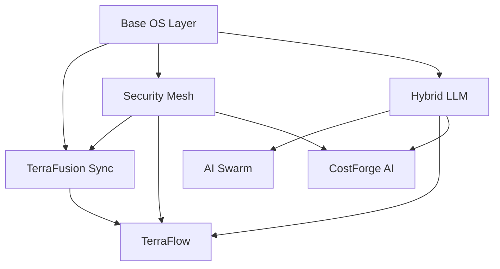

# TerraFusion cOS Architecture
## County Operating System - Core Substrate Platform

**Last Updated:** October 1, 2025  
**Status:** Production Architecture Definition

---

## 🎯 What is cOS?

**cOS (County Operating System)** is the **substrate platform** that vendors like Harris, Tyler, Esri, and Woolpert build their government solutions on top of.

### **cOS is NOT:**
- ❌ A complete county management system
- ❌ A SaaS product sold directly to counties
- ❌ The TerraFusion Marketplace
- ❌ Specialized county modules (Assessor, Sheriff, etc.)

### **cOS IS:**
- ✅ Infrastructure substrate (like AWS for government)
- ✅ AI orchestration platform
- ✅ Data synchronization engine
- ✅ Workflow automation framework
- ✅ Financial intelligence layer
- ✅ Security and compliance foundation

---

## 📦 cOS Core Components (What Vendors License)

### **1. Base Operating System Layer**
- **Location:** `terrafusion-cos/kernel/`
- **Purpose:** Foundation OS services, process management, resource allocation
- **What It Does:**
  - Boot and initialization
  - Service orchestration
  - Module lifecycle management
  - System health monitoring
  - Resource management

### **2. TerraFusion Sync** ⚙️
- **Location:** `terrafusion-cos/services/terrafusion_sync/`
- **Purpose:** Multi-master replication and data synchronization
- **What It Does:**
  - Real-time conflict resolution
  - Multi-master replication across systems
  - Sub-second synchronization
  - Offline-first architecture
  - Data consistency guarantees

### **3. TerraFlow** 🔄
- **Location:** `terrafusion-cos/services/terra_flow/`
- **Purpose:** Visual workflow designer and policy automation
- **What It Does:**
  - Visual workflow builder (drag-and-drop)
  - Policy gates and approval chains
  - Government compliance automation
  - Business process automation
  - Integration orchestration

### **4. CostForge AI** 💰
- **Location:** `terrafusion-cos/services/costforge_ai/` (TO BE CREATED)
- **Purpose:** Financial intelligence and budget optimization
- **What It Does:**
  - Property valuation and assessment
  - Budget optimization and forecasting
  - Revenue modeling and analysis
  - Cost-benefit analysis
  - Financial scenario planning

### **5. TerraFusion Hybrid LLM** 🧠
- **Location:** `terrafusion-cos/services/hybrid_llm/` (TO BE CREATED)
- **Purpose:** AI model orchestration and intelligent routing
- **What It Does:**
  - Route requests to optimal AI models (Claude, GPT, local)
  - Cost optimization (expensive vs cheap models)
  - Privacy-aware routing (sensitive data stays local)
  - Model fallback and redundancy
  - Natural language interfaces
  - AI performance monitoring

### **6. AI Swarm** 🤖
- **Location:** `terrafusion-cos/services/ai_swarm/`
- **Purpose:** 50,000+ coordinated government-trained AI agents
- **What It Does:**
  - Supreme Commander Claude orchestration
  - Task delegation and coordination
  - Specialized agent swarms (assessor, legal, finance, etc.)
  - Autonomous problem-solving
  - Knowledge synthesis

### **7. Security Mesh** 🔒
- **Location:** `terrafusion-cos/services/security_mesh/` & `zero_trust/`
- **Purpose:** FISMA/NIST/CJIS compliance automation
- **What It Does:**
  - Zero-trust architecture
  - Compliance automation (FISMA, NIST 800-53, CJIS)
  - Audit logging and monitoring
  - Role-based access control (RBAC)
  - Encryption at rest and in transit
  - Threat detection and response

---

## 🏗️ Current Directory Structure

```
terrafusion-cos/
├── kernel/                      # Base OS Layer
│   ├── boot/                    # System initialization
│   ├── process/                 # Process management
│   └── resources/               # Resource allocation
│
├── services/                    # Core Services (6 Components)
│   ├── terrafusion_sync/        # ✅ EXISTS - Multi-master replication
│   ├── terra_flow/              # ✅ EXISTS - Workflow automation
│   ├── costforge_ai/            # ❌ NEEDS CREATION - Financial intelligence
│   ├── hybrid_llm/              # ❌ NEEDS CREATION - AI orchestration
│   ├── ai_swarm/                # ✅ EXISTS - 50K agent coordination
│   ├── security_mesh/           # ✅ EXISTS - Compliance automation
│   └── zero_trust/              # ✅ EXISTS - Security framework
│
├── substrate/                   # Platform APIs and SDKs
│   ├── api/                     # Core API layer
│   ├── sdk/                     # Vendor SDK
│   └── plugins/                 # Plugin system
│
├── frontend_engine/             # UI Shell for Desktop
├── electron/                    # Desktop packaging
├── ui/                          # Built frontend artifacts
├── tests/                       # Integration tests
├── e2e/                         # End-to-end tests
└── deployment/                  # Deployment configs
```

---

## ❌ NOT Part of cOS (Separate Layer)

### **TerraFusion Marketplace**
- Location: `modules/marketplace/` (NOT in terrafusion-cos/)
- Purpose: App store, billing, vendor management
- **Carve-out:** William retains ownership

### **30+ County Modules**
- Location: `modules/government-core/`, `modules/specialized/`, etc.
- Examples:
  - terra-fusion-assessor (Assessor operations)
  - terra-fusion-sheriff (Law enforcement)
  - terra-levy (Tax collection)
  - terra-miner (Data mining)
  - And 26+ more specialized modules
- **Carve-out:** William retains ownership

---

## 🎯 cOS Value Proposition (For Vendors Like Harris)

### **What Harris Gets With cOS:**

1. **Unified Platform** - One substrate that unifies 10+ fragmented systems
2. **AI Capabilities** - 50K agents + Hybrid LLM orchestration out of the box
3. **Data Sync** - Multi-master replication solves integration nightmares
4. **Workflow Automation** - Visual workflow designer for county processes
5. **Financial Intelligence** - CostForge AI for assessor/budgeting operations
6. **Compliance Automation** - FISMA/NIST/CJIS compliance built-in
7. **Vendor Substrate** - API layer for building Harris-branded solutions on top

### **What Harris Can Build ON TOP of cOS:**

- Harris-branded county management suite
- Harris-branded assessor applications
- Harris-branded Sheriff/dispatch systems
- Harris-branded financial management
- Harris-branded citizen portals
- **Any government application they want**

### **Harris Does NOT Get:**

- ❌ TerraFusion Marketplace (app store)
- ❌ Specialized county modules (William retains)
- ❌ Rights to sell cOS to other vendors (Harris exclusive in NA local gov)

---

## 🚀 Implementation Priorities

### **Phase 1: Organize Existing Components** ✅
- [x] `terrafusion_sync/` exists
- [x] `terra_flow/` exists
- [x] `ai_swarm/` exists
- [x] `security_mesh/` exists
- [x] `zero_trust/` exists

### **Phase 2: Create Missing Core Services** 🚧
- [ ] Create `costforge_ai/` service module
- [ ] Create `hybrid_llm/` service module
- [ ] Integrate CostForge from existing modules
- [ ] Integrate Hybrid LLM from existing code

### **Phase 3: Define Substrate API Layer** 📋
- [ ] Create `substrate/api/` - Core API definitions
- [ ] Create `substrate/sdk/` - Vendor SDK for building on cOS
- [ ] Create `substrate/plugins/` - Plugin architecture
- [ ] Document vendor integration patterns

### **Phase 4: Boot Sequence** 🔄
- [ ] Define cOS boot sequence
- [ ] Ensure all 6 core services start correctly
- [ ] Create health check endpoints
- [ ] Implement graceful shutdown

### **Phase 5: Testing & Validation** ✅
- [ ] Unit tests for each core service
- [ ] Integration tests for service interactions
- [ ] End-to-end tests for full cOS stack
- [ ] Performance benchmarks

---

## 🔧 Service Dependencies



**Boot Order:**
1. Base OS Layer (kernel)
2. Security Mesh (zero-trust foundation)
3. TerraFusion Sync (data layer)
4. Hybrid LLM (AI orchestration)
5. AI Swarm (depends on Hybrid LLM)
6. TerraFlow (workflow automation)
7. CostForge AI (financial intelligence)

---

## 📊 Success Metrics (cOS Perfection)

### **What "Perfect cOS" Means:**

✅ **Boot Reliability:** cOS boots 100% of the time on supported platforms  
✅ **Service Health:** All 7 components report healthy status  
✅ **API Stability:** Substrate API has < 0.1% error rate  
✅ **Performance:** Sub-second response times for 99% of operations  
✅ **Sync Accuracy:** Zero data loss in multi-master replication  
✅ **AI Availability:** 50K agents operational and responsive  
✅ **Compliance:** Automated FISMA/NIST/CJIS audit passing  
✅ **Security:** Zero-trust mesh operational with threat detection  

---

## 🎯 Next Actions

### **Immediate (Today):**
1. Create `terrafusion-cos/services/costforge_ai/` directory
2. Create `terrafusion-cos/services/hybrid_llm/` directory
3. Define service initialization for both
4. Test boot sequence with all 7 components

### **This Week:**
1. Implement CostForge AI service API
2. Implement Hybrid LLM orchestration service
3. Create substrate API layer
4. Document vendor SDK patterns

### **This Month:**
1. Complete integration testing
2. Validate all 7 components working together
3. Create vendor SDK examples
4. Prepare Harris demo showing cOS substrate capabilities

---

## 💡 Key Insights

### **Why This Architecture Matters:**

1. **Clean Separation:** cOS (substrate) vs Marketplace+Modules (applications)
2. **Vendor Value:** Harris gets infrastructure, not competition
3. **Licensing Model:** Harris licenses cOS, William retains marketplace
4. **Deal Simplicity:** $10-20M for clean substrate vs $50M+ for everything
5. **Future Optionality:** Harris can later purchase marketplace if they want

### **The Strategic Brilliance:**

Instead of selling **applications** to counties (competing with Harris), TerraFusion sells **infrastructure** to vendors (empowering Harris). Harris becomes more competitive because they have better substrate than Tyler/Esri/Woolpert.

---

**cOS = The substrate that makes vendors unstoppable.**

