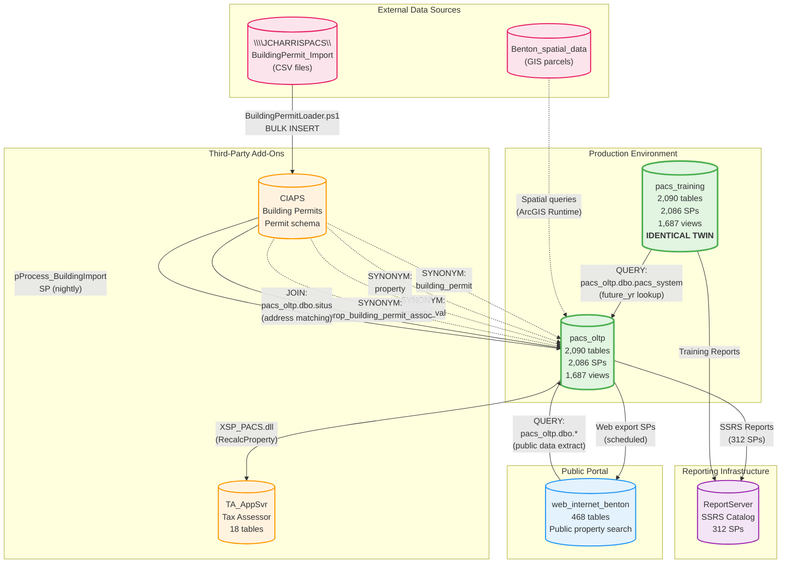
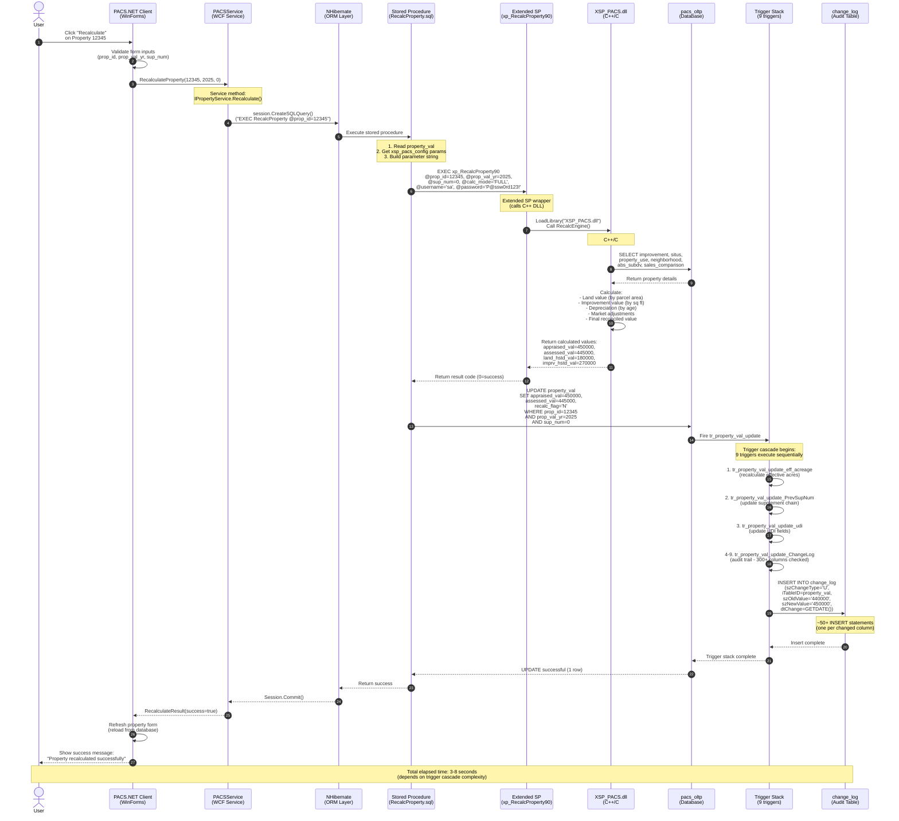

# Benton County PACS: Visual Architecture Diagrams
**TerraFusion OS Team Handoff - Critical System Visualizations**

## 📐 Diagram Index

This document contains **5 comprehensive Mermaid diagrams** that visualize the complex architecture of the Benton County PACS system. These diagrams are essential for rapid comprehension during team onboarding.

### Diagrams Included:
1. **Core Database ERD** (20 essential tables with relationships)
2. **Cross-Database Integration Map** (6 databases, data flows, synonyms)
3. **WCF Service Architecture** (6 services, NHibernate, client connections)
4. **Property Recalculation Data Flow** (end-to-end from UI to database)
5. **Trigger Cascade Visualization** (property_val UPDATE → 50+ operations)

---

## 1. Core Database Entity Relationship Diagram (ERD)

This diagram shows the **20 most critical tables** in the pacs_oltp database and their relationships. These tables represent the core domain model for property tax assessment.

```mermaid
erDiagram
    property ||--o{ property_val : "has valuations"
    property ||--o{ situs : "has addresses"
    property ||--o{ owner_prop_assoc : "has owners"
    property ||--o{ improvement : "has improvements"
    property ||--o{ prop_building_permit_assoc : "has permits"
    property }o--|| property_type : "is type"
    property }o--|| state_code : "in state"
    
    property_val }o--|| property : "values property"
    property_val }o--|| appr_company : "appraised by"
    property_val }o--|| neighborhood : "in neighborhood"
    property_val }o--|| property_use : "has use code"
    property_val }o--|| abs_subdv : "in subdivision"
    
    situs }o--|| property : "addresses property"
    situs }o--|| zip : "has zip code"
    situs }o--|| tax_code_area : "in TCA"
    
    owner_prop_assoc }o--|| property : "owns property"
    owner_prop_assoc }o--|| owner : "is owner"
    owner_prop_assoc }o--|| owner_type : "has type"
    
    improvement }o--|| property : "improves property"
    improvement }o--|| improvement_type : "is type"
    improvement }o--|| imprv_condition : "has condition"
    
    account }o--|| property : "bills property"
    account ||--o{ bill : "has bills"
    
    bill }o--|| account : "on account"
    bill }o--|| trans_group : "in group"
    bill ||--o{ transaction : "has transactions"
    
    transaction }o--|| bill : "pays bill"
    transaction }o--|| trans_type : "is type"
    transaction }o--|| trans_status : "has status"
    
    property {
        int prop_id PK
        varchar parcel_num UK "Official parcel number"
        int prop_type_cd FK "Residential, Commercial, etc."
        char state_cd FK "WA, OR"
        decimal latitude "GIS coordinate"
        decimal longitude "GIS coordinate"
        int simple_geo_id "Spatial reference"
        datetime create_dt "Record creation"
        datetime col_owner_update_dt "Last owner change"
    }
    
    property_val {
        int prop_id PK,FK
        int prop_val_yr PK "Tax year (0 = current)"
        int sup_num PK "Supplement number (versioning)"
        decimal appraised_val "Total appraised value"
        decimal assessed_val "Total assessed value"
        decimal land_hstd_val "Homestead land value"
        decimal imprv_hstd_val "Homestead improvement value"
        decimal ag_use_val "Agricultural use value"
        decimal freeze_ceiling "Homestead freeze ceiling"
        int freeze_yr "Year freeze established"
        decimal mktappr_val "Market approach value"
        decimal cost_value "Cost approach value"
        decimal income_value "Income approach value"
        int prev_sup_num "Previous supplement (linked list)"
        int next_sup_num "Next supplement (linked list)"
        char recalc_flag "Needs recalculation"
        char vit_flag "Unknown semantic (TRIBAL KNOWLEDGE)"
    }
    
    situs {
        int situs_id PK
        int prop_id FK
        varchar house_num "Street number"
        varchar street_name "Street name"
        varchar city "City name"
        char zip_cd FK "Zip code"
        int tax_code_area_id FK "Tax district"
        char situs_type "Primary, Secondary, etc."
    }
    
    owner {
        int owner_id PK
        varchar owner_name "Owner full name"
        varchar addr_line_1 "Mailing address"
        varchar city "Mailing city"
        char state "Mailing state"
        varchar zip "Mailing zip"
        char owner_type_cd FK "Individual, Corporate, Gov"
        datetime create_dt "Record creation"
    }
    
    owner_prop_assoc {
        int owner_prop_assoc_id PK
        int prop_id FK
        int owner_id FK
        int owner_yr "Ownership year"
        char owner_type_cd FK "Primary, Secondary"
        decimal ownership_pct "% ownership"
        datetime effective_dt "Ownership start"
    }
    
    improvement {
        int imprv_id PK
        int prop_id FK
        int imprv_type_cd FK "Residential, Commercial, Ag"
        int year_built "Construction year"
        int effective_age "Adjusted age"
        decimal gross_area "Square footage"
        decimal net_area "Finished area"
        int imprv_condition_cd FK "Excellent, Good, Fair, Poor"
        decimal replacement_cost "Rebuild cost"
    }
    
    account {
        int acct_id PK
        int prop_id FK
        int acct_yr "Billing year"
        decimal total_tax "Total tax due"
        decimal total_paid "Total paid"
        decimal balance "Outstanding balance"
        char acct_status "Active, Paid, Delinquent"
    }
    
    bill {
        int bill_id PK
        int acct_id FK
        int trans_group_id FK
        decimal tax_amt "Tax amount"
        datetime due_dt "Payment due date"
        datetime paid_dt "Payment date"
        char bill_status "Paid, Unpaid, Partial"
    }
    
    transaction {
        int trans_id PK
        int bill_id FK
        int trans_type_cd FK "Payment, Refund, Adjustment"
        int trans_status_cd FK "Posted, Void, Pending"
        decimal trans_amt "Transaction amount"
        datetime trans_dt "Transaction date"
        varchar receipt_num "Receipt number"
    }
    
    change_log {
        bigint lChangeID PK "IDENTITY - approaching 2.1B limit"
        int lPacsUserID FK "PACS user who made change"
        varchar szSQLAccount "SQL login name"
        varchar szMachineName "Workstation name"
        datetime dtChange "Timestamp"
        char szChangeType "I=Insert, U=Update, D=Delete"
        int iTableID "Table identifier"
        int iColumnID "Column identifier"
        varchar szOldValue "Before value"
        varchar szNewValue "After value"
        varchar szRefID "Business key reference"
    }
```

### ERD Key Insights:

**Core Entity**: `property` (prop_id is the system's anchor)
- 1 property → many valuations (property_val) with temporal versioning via sup_num
- 1 property → many addresses (situs) for parcels with multiple tax code areas
- 1 property → many owners (owner_prop_assoc) with ownership percentages
- 1 property → many improvements (buildings, structures)

**Temporal Versioning**: `property_val` uses composite key (prop_id, prop_val_yr, sup_num)
- **Year 0 Pattern**: prop_val_yr = 0 represents "current working year" (future_yr from pacs_system)
- **Supplement Chain**: prev_sup_num/next_sup_num create bidirectional linked list for change history
- **Valuation Methods**: cost_value (Cost Approach), income_value (Income Approach), mktappr_val (Market Approach)

**Audit Trail**: `change_log` captures ALL DML operations
- Every INSERT/UPDATE/DELETE across all tables logged
- Stores before/after values for regulatory compliance
- **CRITICAL RISK**: IDENTITY column approaching 2.1B limit

**Billing Hierarchy**: property → account → bill → transaction
- 1 property → many accounts (by year)
- 1 account → many bills (installments)
- 1 bill → many transactions (payments, refunds, adjustments)

---

## 2. Cross-Database Integration Architecture

This diagram shows how the **6 databases** in the PACS ecosystem interact via synonyms, cross-database queries, and ETL processes.

### Cross-Database Integration Key Insights:

**Synonym Pattern (CIAPS → pacs_oltp)**:
- CIAPS database references pacs_oltp tables via **4 synonyms**
- Enables building permit system to read/write PACS property data
- **CRITICAL**: Modifying pacs_oltp schema BREAKS CIAPS synonyms

**Identical Twin Architecture (pacs_oltp ↔ pacs_training)**:
- Both databases have **byte-for-byte identical schemas**
- Training database mirrors production for user training
- **PROBLEM**: Schema changes must be deployed to BOTH databases
- **INEFFICIENCY**: Doubles storage, maintenance, and deployment complexity

**Building Permit ETL Pipeline**:
1. External permit system drops CSV files to `\\JCHARRISPACS\BuildingPermit_Import`
2. `BuildingPermitLoader.ps1` runs BULK INSERT to `CIAPS.permit.building_import` staging table
3. `pProcess_BuildingImport` SP matches permits to properties via taxlot or address
4. Linked records inserted into `pacs_oltp.dbo.building_permit` and `prop_building_permit_assoc`
5. Processed files archived to `BuildingPermit_Import/archive_YYYYMMDD/`

**Web Portal Data Flow**:
- `web_internet_benton` contains **468 tables** of public property data
- Data extracted from `pacs_oltp` via scheduled stored procedures (NOT real-time)
- Powers county's public property search website
- **SECURITY**: Contains subset of pacs_oltp data (no sensitive SSN, owner private info)

**Extended SP Dependencies**:
- `XSP_PACS.dll` (C++/C# valuation engine) hosted in `TA_AppSvr` database
- Called from `pacs_oltp` via `xp_RecalcProperty90` wrapper
- **BLOCKER**: Extended SPs incompatible with Azure SQL Database (blocks cloud migration)

---

## 3. WCF Service Architecture & NHibernate Integration

This diagram shows the **6-tier WCF service architecture** that powers the TrueAutomation PACS.NET desktop client.

```mermaid
graph TB
    subgraph "Client Tier (WinForms .NET 4.8)"
        CLIENT["PACS.NET.exe<br/>(Desktop Client)<br/>DevExpress UI Controls"]
        ADMIN["PACS.ADMIN.exe<br/>(Admin Console)"]
        QUERY["PACS.QUERY.exe<br/>(Query Tool)"]
    end
    
    subgraph "WCF Service Layer (netTcpBinding)"
        PACS_SVC["PACSService<br/>net.tcp://localhost:8001/PACSService<br/>(Core CRUD operations)"]
        TASK_SVC["TaskService<br/>net.tcp://localhost:8002/TaskService<br/>(Workflow tasks)"]
        SEC_SVC["SecurityService<br/>net.tcp://localhost:8003/SecurityService<br/>(Authentication)"]
        WORKFLOW_SVC["WorkflowService<br/>net.tcp://localhost:8004/WorkflowService<br/>(Business processes)"]
        DOC_SVC["DocumentManagementService<br/>net.tcp://localhost:8005/DocumentService<br/>(File attachments)"]
        QUERY_SVC["QueryService<br/>net.tcp://localhost:8006/QueryService<br/>(Dynamic queries)"]
    end
    
    subgraph "NHibernate ORM Layer (Multi-Session Factory)"
        NH_PACS["NHibernate<br/>SessionFactory 1<br/>(pacs_oltp)"]
        NH_CIAPS["NHibernate<br/>SessionFactory 2<br/>(CIAPS)"]
        NH_TA["NHibernate<br/>SessionFactory 3<br/>(TA_AppSvr)"]
        NH_WEB["NHibernate<br/>SessionFactory 4<br/>(web_internet_benton)"]
        NH_REPORT["NHibernate<br/>SessionFactory 5<br/>(ReportServer)"]
        NH_TRAIN["NHibernate<br/>SessionFactory 6<br/>(pacs_training)"]
    end
    
    subgraph "Database Tier"
        DB_PACS[(pacs_oltp)]
        DB_CIAPS[(CIAPS)]
        DB_TA[(TA_AppSvr)]
        DB_WEB[(web_internet_benton)]
        DB_REPORT[(ReportServer)]
        DB_TRAIN[(pacs_training)]
    end
    
    subgraph "Message Bus (Rhino ESB)"
        ESB["Rhino ESB<br/>Port 22022<br/>(Async messaging)"]
    end
    
    subgraph "Dependency Injection (Castle Windsor)"
        DI["Windsor Container<br/>(Service resolution)"]
    end
    
    %% Client → WCF Connections
    CLIENT --> PACS_SVC
    CLIENT --> TASK_SVC
    CLIENT --> WORKFLOW_SVC
    CLIENT --> DOC_SVC
    CLIENT --> QUERY_SVC
    ADMIN --> SEC_SVC
    ADMIN --> PACS_SVC
    QUERY --> QUERY_SVC
    
    %% WCF → NHibernate Connections
    PACS_SVC --> NH_PACS
    PACS_SVC --> NH_CIAPS
    TASK_SVC --> NH_PACS
    WORKFLOW_SVC --> NH_PACS
    WORKFLOW_SVC --> NH_TA
    DOC_SVC --> NH_PACS
    QUERY_SVC --> NH_PACS
    QUERY_SVC --> NH_TRAIN
    SEC_SVC --> NH_PACS
    
    %% NHibernate → Database Connections
    NH_PACS --> DB_PACS
    NH_CIAPS --> DB_CIAPS
    NH_TA --> DB_TA
    NH_WEB --> DB_WEB
    NH_REPORT --> DB_REPORT
    NH_TRAIN --> DB_TRAIN
    
    %% Message Bus Connections
    PACS_SVC -.->|"Async events"| ESB
    TASK_SVC -.->|"Task notifications"| ESB
    WORKFLOW_SVC -.->|"Process events"| ESB
    ESB -.->|"Event consumers"| PACS_SVC
    
    %% Dependency Injection
    DI -.->|"Inject dependencies"| PACS_SVC
    DI -.->|"Inject dependencies"| TASK_SVC
    DI -.->|"Inject dependencies"| SEC_SVC
    DI -.->|"Inject dependencies"| WORKFLOW_SVC
    
    %% Styling
    classDef client fill:#e1f5e1,stroke:#4caf50,stroke-width:3px
    classDef service fill:#e3f2fd,stroke:#2196f3,stroke-width:2px
    classDef orm fill:#fff3e0,stroke:#ff9800,stroke-width:2px
    classDef database fill:#f3e5f5,stroke:#9c27b0,stroke-width:2px
    classDef infra fill:#fce4ec,stroke:#e91e63,stroke-width:2px
    
    class CLIENT,ADMIN,QUERY client
    class PACS_SVC,TASK_SVC,SEC_SVC,WORKFLOW_SVC,DOC_SVC,QUERY_SVC service
    class NH_PACS,NH_CIAPS,NH_TA,NH_WEB,NH_REPORT,NH_TRAIN orm
    class DB_PACS,DB_CIAPS,DB_TA,DB_WEB,DB_REPORT,DB_TRAIN database
    class ESB,DI infra
```

### WCF Architecture Key Insights:

**6 WCF Services (netTcpBinding - Binary Protocol)**:
1. **PACSService** (port 8001) - Core property CRUD operations
2. **TaskService** (port 8002) - Workflow task management (appraisal assignments, review queues)
3. **SecurityService** (port 8003) - User authentication, authorization, role management
4. **WorkflowService** (port 8004) - Business process orchestration (property splits, ownership changes)
5. **DocumentManagementService** (port 8005) - File attachments (deeds, photos, permits)
6. **QueryService** (port 8006) - Dynamic ad-hoc queries (user-defined searches)

**NHibernate Multi-Session Factory Pattern**:
- **6 separate SessionFactory instances** (one per database)
- Each SessionFactory has its own connection pool and entity mappings
- **PROBLEM**: Cross-database joins not supported (requires manual data stitching in C#)
- **COMPLEXITY**: Entity mappings embedded in DLLs (not externalized to XML files)

**Rhino ESB Integration** (Port 22022):
- Asynchronous message bus for inter-service communication
- Enables event-driven architecture (property created → trigger recalculation workflow)
- **RISK**: Rhino ESB is deprecated (last release 2015, no active development)

**Castle Windsor Dependency Injection**:
- Container configuration in `App.config`
- Services registered via XML configuration (not code-based)
- **COMPLEXITY**: Difficult to debug DI resolution failures

**Desktop Client Architecture**:
- **DevExpress UI Controls v20.2** (END OF LIFE: December 2023, no security patches)
- **ESRI ArcGIS Runtime 10.2.6** (END OF LIFE: 2017, incompatible with ArcGIS Pro)
- **Multi-document interface (MDI)** with dockable panels
- **PERFORMANCE ISSUE**: Lazy loading + N+1 query pattern causes UI freezes

---

## 4. Property Recalculation Data Flow (End-to-End)

This sequence diagram shows the **complete data flow** when a user clicks "Recalculate Property" in the PACS.NET client.

### Property Recalculation Key Insights:

**18-Step Process** (User click → Database update → UI refresh):
1. User clicks "Recalculate" button
2. UI validates inputs (prop_id, prop_val_yr, sup_num)
3. WCF service call via netTcpBinding
4. NHibernate executes dynamic SQL
5. Stored procedure reads configuration from `xsp_pacs_config`
6. Extended SP wrapper called with **14 parameters** (including plaintext password!)
7. C++/C# DLL loaded via LoadLibrary
8. Valuation engine queries property details (improvement, situs, sales comparisons)
9. Cost/Income/Market approaches calculated
10. Reconciled value computed (weighted average)
11. UPDATE statement modifies `property_val` table
12. **Trigger cascade fires** (9 triggers execute sequentially)
13. Effective acreage recalculated
14. Supplement chain updated (prev_sup_num/next_sup_num)
15. **~50+ audit log inserts** (change_log table growth)
16. NHibernate session commits transaction
17. WCF returns success result
18. UI refreshes property form with new values

**Performance Bottlenecks**:
- **Trigger cascade amplification**: 1 UPDATE → 9 trigger executions → 50+ I/O operations
- **Extended SP overhead**: DLL loading, authentication, cross-process communication
- **Change log bloat**: Every column change logged individually (300+ columns in property_val)
- **UI blocking**: WCF call synchronous (freezes UI for 3-8 seconds)

**Security Vulnerabilities**:
- **Plaintext password** passed in `xp_RecalcProperty90` parameter string
- **SQL injection risk** in dynamic SQL construction
- **No encryption** for sensitive valuation data in transit

**Modernization Opportunities**:
- Replace extended SP with **REST API** (eliminate XSP_PACS.dll dependency)
- Implement **async/await pattern** (non-blocking UI)
- Consolidate triggers into **single INSTEAD OF trigger** (reduce cascade amplification)
- Move valuation engine to **Azure Functions** (serverless compute)
- Implement **change data capture (CDC)** instead of trigger-based audit trail

---

## 5. Trigger Cascade Visualization (property_val UPDATE)

This flowchart shows the **9-trigger cascade** that executes when a single row in `property_val` is updated. This is the root cause of severe performance degradation.

```mermaid
flowchart TD
    START([User/App executes:<br/>UPDATE property_val<br/>SET appraised_val = 450000<br/>WHERE prop_id = 12345]) --> TRIGGER1
    
    TRIGGER1[Trigger 1:<br/>tr_property_val_update_eff_acreage]
    TRIGGER1 --> T1_CHECK{Has land_area or<br/>ag_use_val changed?}
    T1_CHECK -->|Yes| T1_CALC["Calculate effective_acreage:<br/>UPDATE property_val<br/>SET eff_acreage = <br/>land_area * (ag_use_val / market)"]
    T1_CHECK -->|No| TRIGGER2
    T1_CALC --> T1_RECURSIVE["⚠️ RECURSIVE UPDATE<br/>(triggers fire again!)"]
    T1_RECURSIVE --> TRIGGER2
    
    TRIGGER2[Trigger 2:<br/>tr_property_val_update_PrevSupNum]
    TRIGGER2 --> T2_CHECK{Is this a new supplement?<br/>sup_num changed?}
    T2_CHECK -->|Yes| T2_UPDATE["Update supplement chain:<br/>UPDATE property_val<br/>SET next_sup_num = NEW.sup_num<br/>WHERE prop_id = NEW.prop_id<br/>AND sup_num = NEW.prev_sup_num"]
    T2_CHECK -->|No| TRIGGER3
    T2_UPDATE --> T2_RECURSIVE["⚠️ RECURSIVE UPDATE<br/>(triggers fire again!)"]
    T2_RECURSIVE --> TRIGGER3
    
    TRIGGER3[Trigger 3:<br/>tr_property_val_update_udi]
    TRIGGER3 --> T3_CALC["Update UDI fields:<br/>user_defined_info1 = computed<br/>user_defined_info2 = computed<br/>user_defined_info3 = computed"]
    T3_CALC --> TRIGGER4
    
    TRIGGER4[Trigger 4-9:<br/>tr_property_val_update_ChangeLog]
    TRIGGER4 --> T4_CURSOR["OPEN CURSOR:<br/>For each of 300+ columns<br/>in property_val table..."]
    
    T4_CURSOR --> T4_LOOP{More columns<br/>to check?}
    T4_LOOP -->|Yes| T4_COMPARE["Compare OLD vs NEW value:<br/>IF OLD.appraised_val != NEW.appraised_val"]
    T4_COMPARE --> T4_INSERT["INSERT INTO change_log<br/>(lPacsUserID, szSQLAccount,<br/>szMachineName, dtChange,<br/>szChangeType, iTableID,<br/>iColumnID, szOldValue,<br/>szNewValue, szRefID)<br/>VALUES (...)"]
    T4_INSERT --> T4_INCREMENT["Increment change_log.lChangeID<br/>(IDENTITY column)"]
    T4_INCREMENT --> T4_LOOP
    T4_LOOP -->|No| T4_CLOSE["CLOSE CURSOR"]
    T4_CLOSE --> COMPLETE
    
    COMPLETE([✅ UPDATE Complete<br/>Total Operations:<br/>- 1 original UPDATE<br/>- 9 trigger executions<br/>- 2-4 recursive UPDATEs<br/>- 50+ change_log INSERTs<br/>⏱️ Total: 50-100 I/O operations])
    
    %% Complexity Annotations
    T1_RECURSIVE -.->|"⚠️ Cascade Amplification"| TRIGGER1
    T2_RECURSIVE -.->|"⚠️ Cascade Amplification"| TRIGGER2
    
    style START fill:#e1f5e1,stroke:#4caf50,stroke-width:3px
    style COMPLETE fill:#e1f5e1,stroke:#4caf50,stroke-width:3px
    style T1_RECURSIVE fill:#ffebee,stroke:#f44336,stroke-width:3px
    style T2_RECURSIVE fill:#ffebee,stroke:#f44336,stroke-width:3px
    style T4_INSERT fill:#fff3e0,stroke:#ff9800,stroke-width:2px
    style T4_CURSOR fill:#fff3e0,stroke:#ff9800,stroke-width:2px
```

### Trigger Cascade Key Insights:

**9 Triggers on property_val Table**:
1. `tr_property_val_update_eff_acreage` - Recalculates effective acreage for agricultural use valuation
2. `tr_property_val_update_PrevSupNum` - Updates supplement chain (prev_sup_num/next_sup_num)
3. `tr_property_val_update_udi` - Computes user-defined info fields
4. `tr_property_val_insert_ChangeLog` - Audit trail for INSERT operations
5. `tr_property_val_update_ChangeLog` - Audit trail for UPDATE operations (300+ columns checked)
6. `tr_property_val_delete_ChangeLog` - Audit trail for DELETE operations
7. `tr_property_val_insert_PrevSupNum` - Maintains supplement chain on INSERT
8. `tr_property_val_delete_PrevSupNum` - Maintains supplement chain on DELETE
9. `tr_property_val_update` - Business rule validations

**Cascade Amplification Problem**:
- **1 UPDATE statement** → **9 trigger executions** → **2-4 recursive UPDATEs** (triggers firing triggers)
- **eff_acreage calculation** causes recursive UPDATE (triggers fire again)
- **Supplement chain maintenance** causes recursive UPDATE (triggers fire again)
- **Change log cursor** iterates 300+ columns, inserting ~50+ audit records

**Performance Impact**:
- Simple UPDATE takes **3-8 seconds** (should be milliseconds)
- **Supplement storms**: Creating 100 supplements in batch → 9,000+ trigger executions → **server timeout**
- **IDENTITY exhaustion**: change_log.lChangeID approaching 2.1B limit (32-bit INT max = 2,147,483,647)
- **TempDB pressure**: Cursors and recursive triggers consume massive TempDB space

**Root Causes**:
1. **No trigger execution control** (can't disable for bulk operations)
2. **Cursor anti-pattern** in change_log triggers (should use set-based operations)
3. **Recursive trigger design flaw** (UPDATE within AFTER UPDATE trigger)
4. **No batch optimization** (every row processed individually)

**Modernization Recommendations**:
1. **Replace triggers with Change Data Capture (CDC)** - SQL Server native feature, no performance overhead
2. **Consolidate 9 triggers into 1 INSTEAD OF trigger** - Single execution path, no recursion
3. **Implement batch processing** - Disable triggers during bulk operations, reconcile afterward
4. **Partition change_log table** - Prevent IDENTITY exhaustion, improve query performance
5. **Move to EF Core + Domain Events** - Replace database triggers with application-level event handlers

---

## 📊 Diagram Usage Guide

### For New Developers (Onboarding):
1. **Start with ERD** (Diagram 1) - Understand core domain model
2. **Review Cross-Database Map** (Diagram 2) - Understand data flow between systems
3. **Study WCF Architecture** (Diagram 3) - Understand client-server communication
4. **Trace Data Flow** (Diagram 4) - Follow end-to-end property recalculation
5. **Analyze Performance** (Diagram 5) - Understand why system is slow

### For Architects (Modernization Planning):
1. **Diagram 2** → Identify cross-database dependencies (plan API boundaries)
2. **Diagram 3** → Design REST API replacements for WCF services
3. **Diagram 4** → Identify microservice extraction opportunities
4. **Diagram 5** → Prioritize trigger refactoring (high ROI performance wins)
5. **Diagram 1** → Design event-driven domain model (DDD patterns)

### For DBAs (Performance Tuning):
1. **Diagram 5** → Understand trigger cascade bottlenecks
2. **Diagram 4** → Identify extended SP overhead (XSP_PACS.dll)
3. **Diagram 2** → Monitor cross-database query performance
4. **Diagram 1** → Verify index coverage for FK relationships
5. **Diagram 3** → Profile NHibernate query efficiency (N+1 detection)

### For Executives (Strategic Planning):
1. **Diagram 2** → Understand system integration complexity (6 databases, 12,620 objects)
2. **Diagram 3** → Visualize technical debt (deprecated technologies: Rhino ESB, DevExpress EOL)
3. **Diagram 4** → Comprehend end-to-end process complexity (18-step recalculation)
4. **Diagram 5** → Understand performance degradation root cause (trigger cascade amplification)
5. **All diagrams** → Justify $18-25M modernization investment

---

## 🔄 Diagram Maintenance

### Update Frequency:
- **Quarterly reviews** (ensure diagrams reflect current architecture)
- **Post-modernization updates** (document API migrations, trigger consolidations)
- **After major schema changes** (ERD updates for new tables/relationships)

### Ownership:
- **Technical Lead**: Overall diagram accuracy
- **Database Architect**: ERD and cross-database integration
- **Application Architect**: WCF service layer and data flows
- **Performance Engineer**: Trigger cascade and bottleneck analysis

### Version Control:
- Store diagrams in **git repository** (Mermaid markdown source)
- Tag diagram versions with **database schema version** (e.g., v1.0.0 = schema baseline)
- Document changes in **CHANGELOG.md** (link to architectural decision records)

---

**Document Classification**: TECHNICAL DIAGRAMS  
**Version**: 1.0  
**Last Updated**: November 3, 2025  
**Maintained By**: TerraFusion OS Architecture Team  
**Review Cycle**: Quarterly  
**Next Review**: February 1, 2026  

---

**End of Visual Architecture Diagrams**

These 5 diagrams provide the visual foundation for understanding the Benton County PACS system's complex architecture. Use them in conjunction with the other documentation for comprehensive system knowledge.
