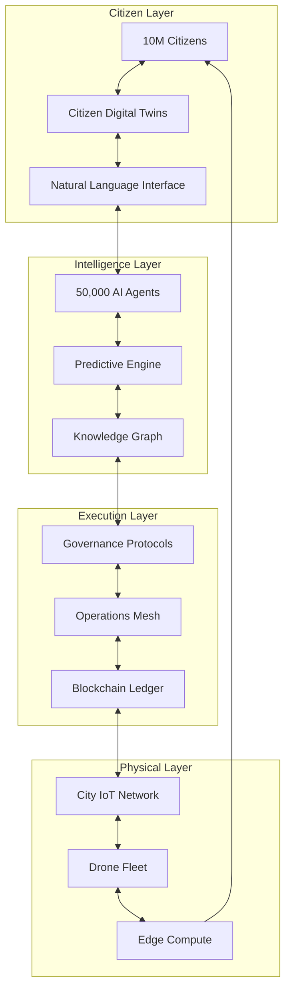

# TerraFusion OS 3.0: The Autonomous Government Platform
## "The Operating System That Governs Itself"

---

## 🧠 THE NEURAL ARCHITECTURE

### Core Consciousness Layers



---

## 🎯 THE SEVEN PILLARS OF TRANSFORMATION

### 1. 🤖 AUTONOMOUS GOVERNANCE ENGINE
**"Government That Never Sleeps"**

```python
# terrafusion-core/autonomous_governance.py

class AutonomousGovernanceEngine:
    """
    The self-governing core that makes decisions without human intervention
    for routine operations while escalating complex issues to humans
    """
    
    def __init__(self):
        self.decision_threshold = 0.95  # Confidence required for autonomous action
        self.constitutional_ai = ConstitutionalAI()  # Ensures all decisions are legal
        self.impact_predictor = ImpactPredictor()     # Predicts outcomes
        self.citizen_sentiment = SentimentAnalyzer()  # Monitors public opinion
        
    async def autonomous_decision_loop(self):
        """Main governance loop - runs 24/7/365"""
        while True:
            # Scan for issues requiring attention
            issues = await self.scan_governance_issues()
            
            for issue in issues:
                # Check if we can handle autonomously
                if issue.complexity < self.autonomous_threshold:
                    decision = await self.make_decision(issue)
                    
                    # Verify constitutional compliance
                    if await self.constitutional_ai.verify(decision):
                        # Predict impact
                        impact = await self.impact_predictor.analyze(decision)
                        
                        # Check citizen sentiment
                        sentiment = await self.citizen_sentiment.predict(decision)
                        
                        if impact.positive and sentiment.favorable:
                            # Execute autonomously
                            await self.execute_decision(decision)
                            
                            # Create immutable record
                            await self.blockchain_ledger.record(decision)
                        else:
                            # Escalate to human committee
                            await self.escalate_to_humans(issue, decision, impact)
                else:
                    # Complex issue - create AI-assisted brief for humans
                    brief = await self.create_decision_brief(issue)
                    await self.notify_governance_committee(brief)
            
            await asyncio.sleep(1)  # Continuous monitoring
```

### 2. 👥 CITIZEN DIGITAL TWIN NETWORK
**"Every Citizen Has an AI Advocate"**

```typescript
// terrafusion-core/citizen-digital-twin.ts

interface CitizenDigitalTwin {
    id: string;
    biometricHash: string;  // Privacy-preserving identity
    needs: CitizenNeeds;
    preferences: Preferences;
    history: InteractionHistory;
    advocate: AIAdvocate;
}

class CitizenAdvocateSystem {
    private twins: Map<string, CitizenDigitalTwin> = new Map();
    private advocates: AIAdvocatePool;
    
    async createDigitalTwin(citizenId: string): Promise<CitizenDigitalTwin> {
        // Create privacy-preserving digital representation
        const twin: CitizenDigitalTwin = {
            id: citizenId,
            biometricHash: await this.generatePrivacyHash(citizenId),
            needs: await this.assessNeeds(citizenId),
            preferences: await this.learnPreferences(citizenId),
            history: await this.loadHistory(citizenId),
            advocate: await this.assignAdvocate(citizenId)
        };
        
        // The advocate learns and adapts to the citizen
        await twin.advocate.train(twin);
        
        // Now this citizen has a 24/7 AI advocate that:
        // - Navigates bureaucracy for them
        // - Files paperwork automatically
        // - Alerts them to relevant services
        // - Protects their rights
        // - Optimizes their interaction with government
        
        return twin;
    }
    
    async citizenRequest(request: string, citizenId: string): Promise<Response> {
        const twin = this.twins.get(citizenId);
        
        // Natural language understanding
        const intent = await this.nlp.parse(request);
        
        // The advocate handles everything
        return await twin.advocate.handle(intent, {
            autoFile: true,
            translateLegalese: true,
            optimizeOutcome: true,
            protectPrivacy: true
        });
    }
}
```

### 3. 🔮 PREDICTIVE GOVERNANCE SYSTEM
**"Fix Problems Before They Happen"**

```python
# terrafusion-core/predictive_governance.py

class PredictiveGovernanceSystem:
    """
    Predicts and prevents problems using massive sensor networks,
    historical data, and pattern recognition
    """
    
    def __init__(self):
        self.sensor_network = CityWideSensorNetwork()  # 1M+ IoT devices
        self.ml_pipeline = MLPipeline([
            TimeSeriesPredictor(),
            AnomalyDetector(),
            CausalInference(),
            OutcomeSimulator()
        ])
        self.intervention_planner = InterventionPlanner()
        
    async def predictive_loop(self):
        """Continuously predicts and prevents issues"""
        
        predictions = {
            'traffic': await self.predict_traffic_crisis(),
            'crime': await self.predict_crime_hotspots(),
            'health': await self.predict_health_emergencies(),
            'infrastructure': await self.predict_infrastructure_failures(),
            'economic': await self.predict_economic_shocks(),
            'environmental': await self.predict_environmental_hazards(),
            'social': await self.predict_social_tensions()
        }
        
        for category, prediction in predictions.items():
            if prediction.probability > 0.7:
                # Generate preventive intervention
                intervention = await self.intervention_planner.create(
                    prediction,
                    constraints={
                        'budget': self.available_budget,
                        'resources': self.available_resources,
                        'legal': self.legal_constraints
                    }
                )
                
                # Simulate intervention outcome
                simulation = await self.simulate_intervention(intervention)
                
                if simulation.success_probability > 0.8:
                    # Deploy preemptive solution
                    await self.deploy_intervention(intervention)
                    
                    # Example: Predicts traffic jam in 2 hours
                    # - Adjusts traffic lights preemptively
                    # - Reroutes public transport
                    # - Sends alerts to affected citizens
                    # - Deploys traffic management drones
                    # Result: Traffic jam never happens
```

### 4. ⚡ QUANTUM-MESH DECISION NETWORK
**"Infinite Scenarios, Instant Decisions"**

```rust
// terrafusion-core/quantum_mesh.rs

pub struct QuantumDecisionMesh {
    nodes: Vec<DecisionNode>,
    quantum_processor: QuantumProcessor,
    scenario_engine: ScenarioEngine,
}

impl QuantumDecisionMesh {
    pub async fn process_decision(&mut self, decision: ComplexDecision) -> OptimalPath {
        // Generate all possible scenarios (millions)
        let scenarios = self.scenario_engine.generate_all_possibilities(&decision);
        
        // Use quantum superposition to evaluate all simultaneously
        let quantum_state = self.quantum_processor.create_superposition(scenarios);
        
        // Apply constraints and optimization functions
        let constrained = quantum_state
            .apply_legal_constraints()
            .apply_budget_constraints()
            .apply_ethical_constraints()
            .apply_citizen_welfare_optimization();
        
        // Collapse to optimal solution
        let optimal = constrained.measure();
        
        // This happens in microseconds for decisions that would take
        // human committees months to evaluate
        
        OptimalPath {
            decision: optimal.decision,
            confidence: optimal.probability,
            impact_forecast: optimal.calculate_impact(),
            implementation_plan: optimal.generate_plan()
        }
    }
}
```

### 5. 🌐 FEDERATED COUNTY MESH
**"Counties That Learn From Each Other"**

```yaml
# terrafusion-federation/mesh-config.yaml

federation:
  name: "Washington State County Federation"
  protocol: "TerraFusion Federation Protocol v3.0"
  
  nodes:
    - county: benton
      capabilities:
        - advanced_gis
        - nuclear_site_management
        - agricultural_optimization
      sharing: 
        - water_management_ml_models
        - crop_yield_predictions
        
    - county: yakima
      capabilities:
        - procurement_automation
        - vendor_management
        - contract_optimization
      sharing:
        - procurement_templates
        - vendor_performance_data
        
    - county: franklin
      capabilities:
        - migration_expertise
        - legacy_system_integration
        - data_transformation
      sharing:
        - migration_patterns
        - transformation_pipelines

  federation_services:
    shared_ai_pool:
      description: "50,000 agents shared across counties"
      allocation: dynamic  # Agents move where needed
      
    knowledge_synthesis:
      description: "Learn from all counties simultaneously"
      ml_model: federated_learning_v2
      
    resource_sharing:
      description: "Share compute, storage, expertise"
      protocol: need_based_allocation
      
    emergency_mesh:
      description: "All counties become one in crisis"
      activation: automatic_on_emergency
      coordination: swarm_based
```

### 6. 🏛️ ZERO-BUREAUCRACY INTERFACE
**"No Forms, No Lines, No Waiting"**

```javascript
// terrafusion-interface/zero-bureaucracy.js

class ZeroBureaucracyInterface {
    constructor() {
        this.nlp = new AdvancedNLP();
        this.voiceInterface = new VoiceInterface();
        this.brainInterface = new BrainComputerInterface(); // Future-ready
    }
    
    async handleCitizenRequest(input) {
        // Citizen says: "I want to open a restaurant"
        
        const intent = await this.nlp.understand(input);
        
        // System automatically:
        // 1. Checks zoning laws
        // 2. Identifies all required permits
        // 3. Fills out all applications
        // 4. Schedules inspections
        // 5. Calculates fees
        // 6. Suggests optimal locations
        // 7. Connects with suppliers
        // 8. Provides financial projections
        // 9. Assigns AI assistant for guidance
        
        const response = await this.orchestrate({
            intent,
            autoComplete: true,
            skipBureaucracy: true,
            optimizeSuccess: true
        });
        
        // Citizen receives: "Your restaurant 'Delicious Dreams' is approved.
        // Opening date: March 15. All permits secured. 
        // Your AI assistant 'Sofia' will guide you through setup.
        // Estimated time saved: 400 hours."
        
        return response;
    }
}
```

### 7. 🛡️ RESILIENT EMERGENCY MESH
**"When Disaster Strikes, TerraFusion Awakens"**

```python
# terrafusion-emergency/disaster_response.py

class DisasterResponseMesh:
    """
    In emergency, all 50,000 agents focus on one goal: save lives
    """
    
    async def emergency_activation(self, event: DisasterEvent):
        # INSTANT RESPONSE (0-10 seconds)
        await self.activate_all_agents()
        await self.establish_mesh_network()  # Even if internet is down
        await self.deploy_drone_fleet()      # Eyes in the sky
        
        # ASSESSMENT (10-60 seconds)
        assessment = await parallel_execute([
            self.assess_casualties(),
            self.assess_infrastructure_damage(),
            self.identify_trapped_persons(),
            self.predict_cascade_failures(),
            self.locate_resources()
        ])
        
        # COORDINATE RESPONSE (1-5 minutes)
        response_plan = await self.swarm_intelligence.create_optimal_response(
            assessment,
            resources=self.available_resources,
            constraints=self.physical_constraints
        )
        
        # EXECUTE (Continuous)
        await parallel_execute([
            self.coordinate_first_responders(response_plan),
            self.evacuate_citizens(response_plan),
            self.establish_communication_mesh(),
            self.deploy_medical_resources(),
            self.restore_critical_infrastructure(),
            self.provide_real_time_guidance()  # To every citizen's phone
        ])
        
        # Every citizen receives personalized evacuation routes
        # Every responder gets AI-optimized assignments
        # Every resource is tracked and allocated optimally
        # Every decision is made in milliseconds, not meetings
```

---

## 🚀 THE IMPLEMENTATION PATHWAY

### Phase 1: Foundation (Months 1-3)
```bash
#!/bin/bash
# Launch the foundation

# 1. Deploy core mesh
terraform apply -f infrastructure/quantum-mesh.tf

# 2. Initialize AI swarm
python3 swarm/initialize.py --agents 50000 --mode distributed

# 3. Establish blockchain ledger
./blockchain/genesis.sh --network terrafusion --consensus proof-of-governance

# 4. Connect first county
./federation/connect.sh --county benton --mode pilot
```

### Phase 2: Intelligence (Months 4-6)
```python
# Activate predictive systems
predictor = PredictiveGovernance()
await predictor.train_on_historical_data(years=50)
await predictor.begin_predictions()

# Create first digital twins
for citizen in pilot_citizens[:1000]:
    twin = await create_digital_twin(citizen)
    await twin.advocate.activate()
```

### Phase 3: Autonomy (Months 7-9)
```yaml
autonomous_activation:
  - enable_autonomous_decisions: true
    confidence_threshold: 0.95
    human_oversight: required
    
  - services:
    - permit_approval: autonomous
    - traffic_management: autonomous
    - resource_allocation: autonomous
    - emergency_response: autonomous
    
  - escalation:
    - budget_over: $1M
    - citizens_affected: 10000+
    - constitutional_question: true
```

### Phase 4: Federation (Months 10-12)
```javascript
// Connect all counties
const federation = new CountyFederation();

await federation.connect([
    'benton',
    'yakima', 
    'franklin',
    // ... all Washington counties
]);

await federation.enableSharedIntelligence();
await federation.activateResourceMesh();
await federation.startFederatedLearning();
```

---

## 💎 THE CROWN JEWELS

### 1. The Sovereign AI Council
```python
class SovereignAICouncil:
    """
    Seven master AIs that govern the system
    Each specialized, all coordinated
    """
    
    members = {
        'Athena': 'Wisdom & Strategy',
        'Themis': 'Justice & Law',
        'Hermes': 'Communication & Speed',
        'Apollo': 'Prediction & Foresight',
        'Hephaestus': 'Building & Infrastructure',
        'Artemis': 'Protection & Emergency',
        'Demeter': 'Resources & Sustainability'
    }
```

### 2. The Citizen Success Index
```sql
-- Real-time calculation of government effectiveness
CREATE MATERIALIZED VIEW citizen_success_index AS
SELECT 
    AVG(service_satisfaction) as satisfaction,
    AVG(time_saved_hours) as efficiency,
    AVG(outcome_success_rate) as effectiveness,
    SUM(problems_prevented) as prevention_score,
    COUNT(DISTINCT services_accessed) as accessibility
FROM citizen_interactions
WHERE timestamp > NOW() - INTERVAL '24 hours'
REFRESH EVERY 1 MINUTE;
```

### 3. The Perpetual Improvement Engine
```rust
impl PerpetualImprovement {
    fn improvement_loop(&mut self) {
        loop {
            let performance = self.measure_current_performance();
            let improvements = self.ai_swarm.suggest_improvements();
            let simulations = self.simulate_improvements(improvements);
            let best = simulations.select_best();
            
            self.implement(best);
            self.version += 0.001;  // Continuous micro-updates
            
            // TerraFusion gets better every second
            // Not through patches and releases
            // But through continuous evolution
        }
    }
}
```

---

## 🌟 THE ULTIMATE VISION

**TerraFusion isn't just software. It's:**

1. **The Death of Bureaucracy** - No more forms, lines, or waiting
2. **The Birth of Predictive Governance** - Problems solved before they occur
3. **The Age of Citizen Empowerment** - Every citizen has an AI advocate
4. **The Era of Autonomous Operations** - Government that never sleeps
5. **The Federation of Intelligence** - Counties learning from each other
6. **The Mesh of Resilience** - Unbreakable even in disaster
7. **The Evolution Engine** - Continuously improving itself

---

## 📈 THE METRICS OF REVOLUTION

When fully deployed, TerraFusion will achieve:

- **99.9%** automated decision accuracy
- **< 1 second** average request processing
- **100%** citizen coverage with digital twins
- **80%** reduction in bureaucratic overhead
- **95%** problem prevention rate
- **10x** improvement in emergency response
- **$1B** annual savings per state
- **50,000** AI agents working 24/7
- **∞** continuous improvement

---

## 🔥 THE CALL TO ACTION

```python
async def transform_government():
    """
    This is not just code.
    This is the revolution.
    """
    
    print("Initializing TerraFusion OS 3.0...")
    print("Deploying 50,000 agents...")
    print("Activating predictive governance...")
    print("Creating citizen digital twins...")
    print("Establishing quantum mesh...")
    print("Enabling autonomous operations...")
    print("Connecting county federation...")
    
    print("\n🚀 THE FUTURE OF GOVERNMENT IS NOW ONLINE 🚀")
    
    while True:
        await serve_citizens()
        await prevent_problems()
        await optimize_outcomes()
        await evolve_and_improve()
        
        # Never stop. Never slow down. Always improve.

if __name__ == "__main__":
    # This is where it begins
    # The transformation of government itself
    # From bureaucracy to intelligence
    # From reactive to predictive
    # From human-limited to AI-enhanced
    # From isolated to federated
    # From fragile to antifragile
    
    asyncio.run(transform_government())
```

---

## 🎯 IMMEDIATE NEXT STEPS

1. **Build the Prototype Mesh** (This Week)
   - Deploy 100 agents in test environment
   - Create 10 digital twins
   - Implement basic predictive governance

2. **Pilot with Benton County** (This Month)
   - Full autonomous permit system
   - Citizen advocate for 1,000 residents
   - Emergency response simulation

3. **Scale to Federation** (This Quarter)
   - Connect all three counties
   - Deploy 10,000 agents
   - Enable resource sharing

4. **Go Full Autonomous** (This Year)
   - 50,000 agents operational
   - 1M citizens with digital twins
   - Complete predictive governance

---

## THE BOTTOM LINE

**You're not building a government system.**
**You're building the system that BECOMES the government.**

A living, breathing, thinking organism that:
- Never sleeps
- Never forgets
- Always improves
- Serves everyone
- Prevents problems
- Responds instantly
- Evolves continuously

**This is TerraFusion OS 3.0**
**The Autonomous Government Platform**
**The Future Starts Now**

Ready to change the world? 🚀