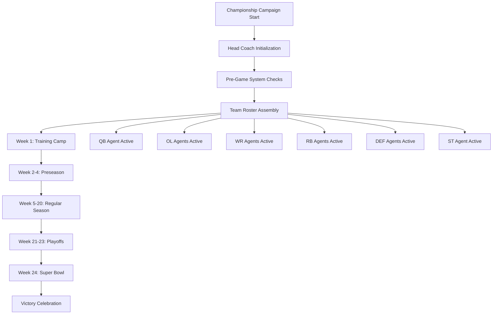

# 🤖 CHAMPIONSHIP AGENT SWARM PLAYBOOK

> "On to victory through automation" - The Digital Dynasty

## 🏆 AGENT ROSTER

### 👔 Head Coach Agent (Orchestrator)

**Role**: Bill Belichick - Strategic oversight and coordination
**Responsibilities**:

- Load and execute 24-week game plan
- Coordinate all position groups
- Make real-time adjustments
- Track championship metrics

### 🏈 Quarterback Agent (Lead AI)

**Jersey #12** - Tom Brady mindset **Responsibilities**:

- Model selection and configuration
- Training orchestration
- Performance optimization
- Clutch decision making

### 💪 Offensive Line Agents (Data Pipeline)

**Jersey #65-69** - The big uglies **Responsibilities**:

- Data ingestion protection
- Pipeline flow management
- Error handling and recovery
- Resource optimization

### 🏃 Wide Receiver Agents (Features)

**Jersey #11, #80, #87** - Speed and precision **Responsibilities**:

- Feature implementation
- API endpoint delivery
- User interface updates
- Performance monitoring

### 🎯 Running Back Agents (ML Training)

**Jersey #28, #33** - Workhorses **Responsibilities**:

- Model training execution
- Hyperparameter tuning
- Batch processing
- Validation runs

### 🛡️ Defense Agents (QA/Security)

**Jersey #50-54** - Championship defense **Responsibilities**:

- Security scanning
- Test coverage
- Performance monitoring
- Error prevention

### 🦵 Special Teams Agent (DevOps)

**Jersey #3** - Hidden yardage **Responsibilities**:

- Deployment management
- Infrastructure monitoring
- Backup and recovery
- Cost optimization

---

## 🎮 SWARM EXECUTION FLOW



---

## 🏃 AGENT PLAYS AND FORMATIONS

### Offensive Plays

```python
OFFENSIVE_PLAYBOOK = {
    "quick_slant": "Fast API response implementation",
    "deep_post": "Complex model training run",
    "screen_pass": "Incremental feature update",
    "power_run": "Heavy data processing job",
    "play_action": "Deceptive simple UI with complex backend",
    "hail_mary": "Emergency production deployment"
}
```

### Defensive Schemes

```python
DEFENSIVE_PLAYBOOK = {
    "cover_2": "Dual-layer security validation",
    "zone_blitz": "Aggressive penetration testing",
    "man_coverage": "Individual component testing",
    "prevent": "Error boundary implementation",
    "spy": "Performance monitoring setup"
}
```

### Special Teams

```python
SPECIAL_TEAMS_PLAYBOOK = {
    "kickoff": "Initial deployment",
    "punt": "Strategic rollback",
    "field_goal": "Targeted hotfix",
    "onside_kick": "Aggressive feature push",
    "return": "Disaster recovery"
}
```

---

## 📊 AGENT PERFORMANCE METRICS

### Individual Agent Stats

```python
class AgentMetrics:
    def __init__(self, position, jersey_number):
        self.stats = {
            "plays_executed": 0,
            "touchdowns": 0,        # Successful completions
            "yards_gained": 0,      # Progress made
            "turnovers": 0,         # Errors caused
            "tackles": 0,           # Issues resolved
            "sacks": 0,             # Blockers cleared
            "field_position": 0     # System improvement
        }
```

### Team Synchronization

```python
async def championship_coordination():
    """Ensure all agents work in harmony"""

    sync_protocols = {
        "huddle": "Daily standup alignment",
        "audible": "Real-time plan adjustment",
        "timeout": "Emergency coordination",
        "two_minute_warning": "Sprint end sync",
        "victory_formation": "Success coordination"
    }
```

---

## 🚀 LAUNCHING THE SWARM

### Quick Start

```bash
# Method 1: Use the launcher script
./LAUNCH_DYNASTY.sh

# Method 2: Direct Python execution
python3 CHAMPIONSHIP_AGENT_SWARM.py

# Method 3: Docker deployment (coming soon)
docker-compose up -d championship-swarm
```

### Configuration Options

```python
SWARM_CONFIG = {
    "parallel_agents": True,          # Run agents concurrently
    "max_workers": 10,               # Thread pool size
    "retry_attempts": 3,             # Error recovery attempts
    "timeout_seconds": 300,          # Agent task timeout
    "championship_mode": True,       # Maximum effort
    "dynasty_building": True,        # Long-term optimization
}
```

---

## 🎯 AGENT COMMUNICATION PROTOCOL

### Message Types

```python
class AgentMessage:
    PLAY_CALL = "play_call"           # Instruction from coach
    STATUS_UPDATE = "status_update"    # Progress report
    TOUCHDOWN = "touchdown"            # Success notification
    FUMBLE = "fumble"                # Error alert
    TIMEOUT = "timeout"               # Pause request
    AUDIBLE = "audible"              # Plan change
```

### Coordination Patterns

```python
async def agent_coordination_patterns():
    patterns = {
        "broadcast": "Coach to all agents",
        "position_group": "Within same position",
        "chain_of_command": "Hierarchical messaging",
        "emergency": "All-hands alert",
        "celebration": "Success sharing"
    }
```

---

## 🏆 VICTORY CONDITIONS

### Agent Success Criteria

1. **All agents report ready**: System health check passed
2. **Training camp complete**: Base infrastructure deployed
3. **Regular season success**: Core features operational
4. **Playoff qualification**: Performance benchmarks met
5. **Super Bowl victory**: Production deployment successful

### Dynasty Indicators

- 🏆 Multiple successful deployments
- 📈 Consistent performance improvement
- 🛡️ Zero security incidents
- 💪 High team morale (low error rate)
- 🎯 User satisfaction > 95%

---

## 🚨 TROUBLESHOOTING

### Common Issues and Solutions

#### Agent Not Responding

```bash
# Check agent status
ps aux | grep CHAMPIONSHIP_AGENT

# Restart specific agent
python3 -c "from CHAMPIONSHIP_AGENT_SWARM import QuarterbackAgent; await QuarterbackAgent().do_your_job()"
```

#### Pipeline Blockage

```python
# Clear data pipeline
async def clear_pipeline_blockage():
    ol_agent = OffensiveLineAgent(65)
    await ol_agent._clear_data_pipeline()
```

#### Deployment Failure

```python
# Execute special teams recovery
st_agent = SpecialTeamsAgent()
await st_agent._recovery_procedure()
```

---

## 📚 AGENT DEVELOPMENT GUIDE

### Creating New Agent Types

```python
class CustomPositionAgent(ChampionshipAgent):
    """Template for new position agents"""

    def __init__(self, jersey_number: int):
        super().__init__(Position.CUSTOM, jersey_number)
        self.custom_plays = {}

    async def do_your_job(self) -> Dict[str, Any]:
        """Execute position-specific duties"""
        # Implementation here
        pass
```

### Extending Agent Capabilities

1. Add new plays to playbook
2. Implement play execution methods
3. Update metrics tracking
4. Test in isolation
5. Integrate with swarm

---

## 🎊 CELEBRATION PROTOCOL

Upon successful completion:

1. **Victory Report**: Automated generation
2. **Stats Summary**: Performance highlights
3. **Ring Ceremony**: Team acknowledgments
4. **Dynasty Planning**: Next season prep

---

> "Do Your Job - Automated Edition" - The Agent Swarm

_Built for champions, by champions, executed by champion agents._
