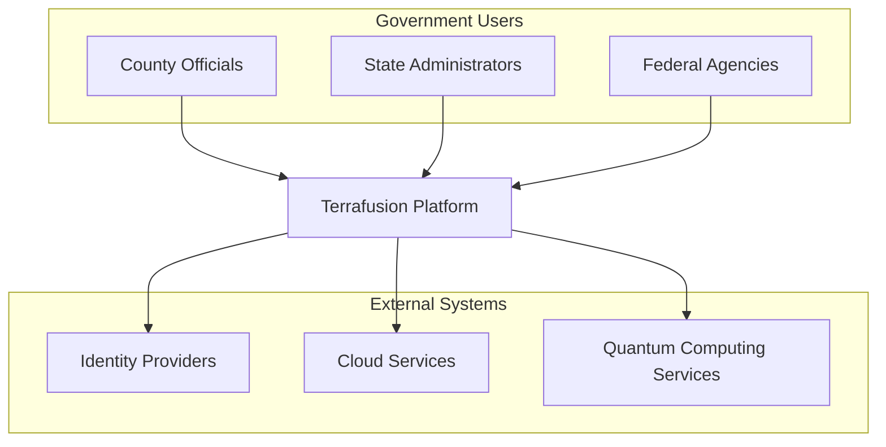
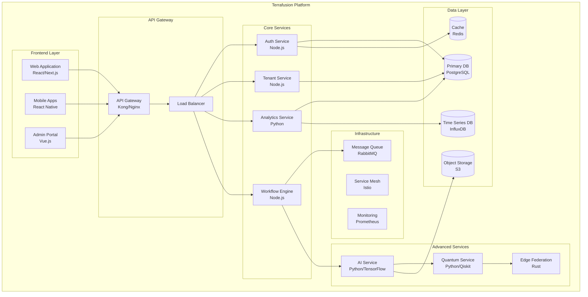
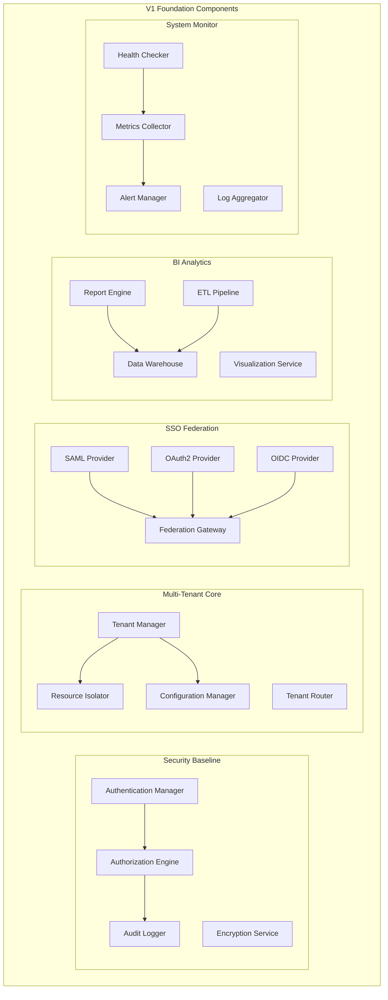
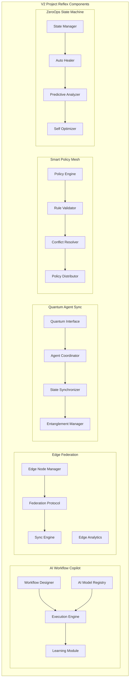
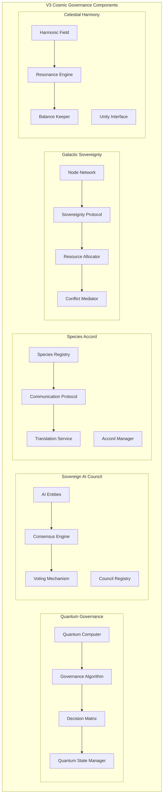
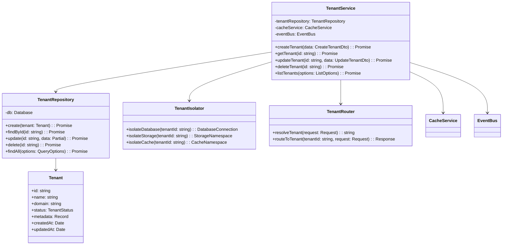
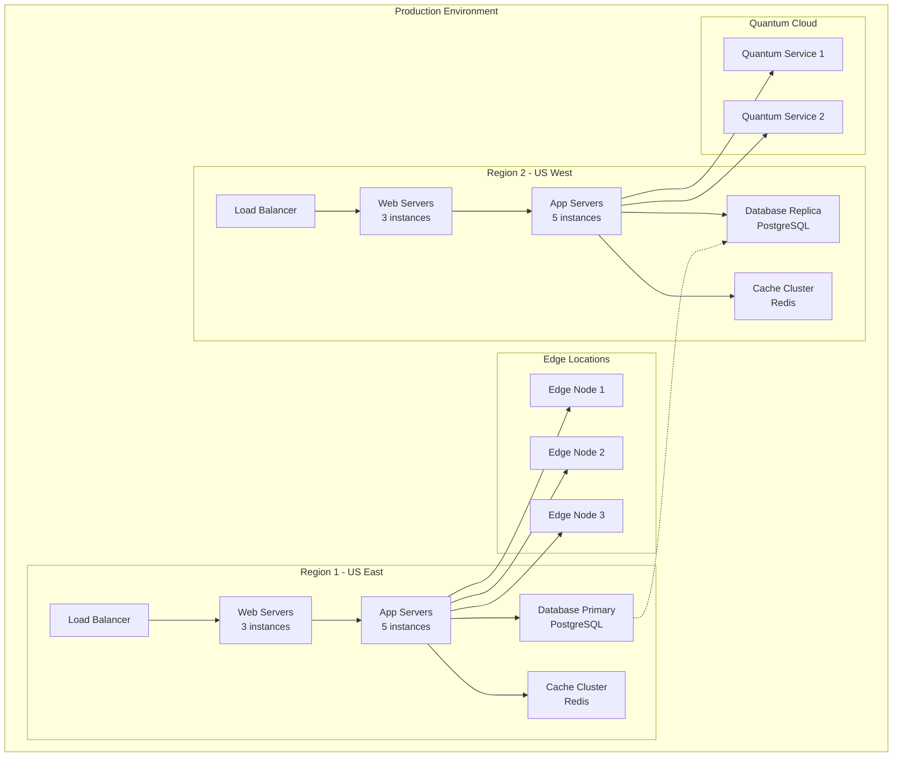
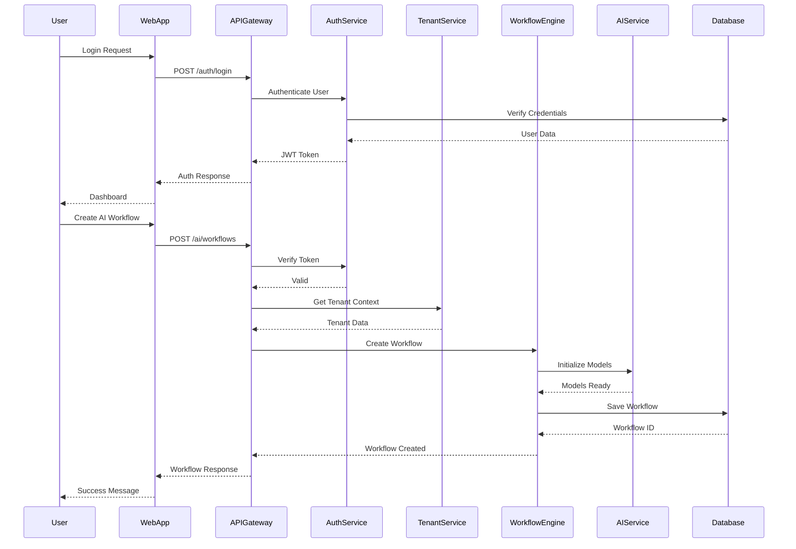
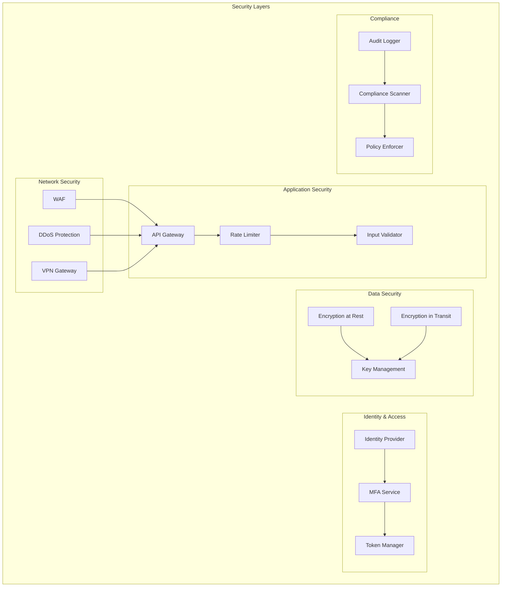

# Terrafusion Platform - C4 Architecture Diagrams

## Level 1: System Context Diagram

### Description

The Terrafusion Platform serves as a comprehensive government operations
platform that evolves from traditional enterprise systems to cosmic governance
capabilities. It integrates with various identity providers for authentication,
leverages cloud services for scalability, and connects to quantum computing
services for advanced computations.

## Level 2: Container Diagram

## Level 3: Component Diagram - V1 Foundation

## Level 3: Component Diagram - V2 Project Reflex

## Level 3: Component Diagram - V3 Cosmic Governance

## Level 4: Code Diagram - Multi-Tenant Service

## Deployment Diagram

## Data Flow Diagram

## Security Architecture

## Evolution Path Diagram

```mermaid
graph LR
    subgraph "Phase 1: V1 Foundation"
        A[Traditional Enterprise]
        B[Multi-Tenant SaaS]
        C[Government Operations]
    end

    subgraph "Phase 2: V2 Project Reflex"
        D[AI Integration]
        E[Edge Computing]
        F[Quantum Ready]
    end

    subgraph "Phase 3: V3 Cosmic Governance"
        G[Quantum Native]
        H[Multi-Species]
        I[Galactic Scale]
    end

    A --> B
    B --> C
    C --> D
    D --> E
    E --> F
    F --> G
    G --> H
    H --> I

    style A fill:#f9f,stroke:#333,stroke-width:2px
    style D fill:#bbf,stroke:#333,stroke-width:2px
    style G fill:#bfb,stroke:#333,stroke-width:2px
```

## Architecture Decision Records (ADRs)

### ADR-001: Multi-Tenant Architecture

- **Status**: Accepted
- **Context**: Need to support multiple government entities with strict data
  isolation
- **Decision**: Implement schema-based multi-tenancy with row-level security
- **Consequences**: Simplified deployment, shared resources, complex access
  control

### ADR-002: Event-Driven Architecture

- **Status**: Accepted
- **Context**: Need for scalable, loosely coupled services
- **Decision**: Use event bus pattern with RabbitMQ for inter-service
  communication
- **Consequences**: Better scalability, eventual consistency, complex debugging

### ADR-003: Quantum Integration Strategy

- **Status**: Accepted
- **Context**: Preparing for quantum computing capabilities
- **Decision**: Abstract quantum operations behind service interface
- **Consequences**: Future-proof design, additional abstraction layer

### ADR-004: Edge Federation Protocol

- **Status**: Proposed
- **Context**: Need for distributed edge computing with central coordination
- **Decision**: Implement custom federation protocol with eventual consistency
- **Consequences**: Offline capability, sync complexity, conflict resolution
  needed
