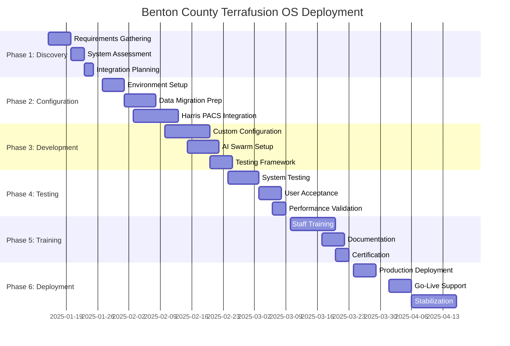

# Benton County Deployment Timeline & Milestones

## Terrafusion OS 1.0 White Glove Implementation

**Client**: Benton County, Washington  
**Project Start**: January 15, 2025  
**Go-Live Target**: April 1, 2025  
**Total Duration**: 11 weeks

---

## 📅 Master Timeline Overview



---

## 🎯 Phase 1: Discovery & Planning (Weeks 1-2)

### **Week 1: January 15-19, 2025**

#### **Monday, January 15**

- **9:00 AM**: Project kickoff meeting with county leadership
- **11:00 AM**: Stakeholder interviews and requirements gathering
- **2:00 PM**: Current system assessment (Harris PACS)
- **4:00 PM**: Data inventory and mapping session

#### **Tuesday, January 16**

- **9:00 AM**: Department workflow analysis (Assessor's Office)
- **11:00 AM**: Department workflow analysis (Treasurer's Office)
- **2:00 PM**: Department workflow analysis (Planning Department)
- **4:00 PM**: Technical infrastructure assessment

#### **Wednesday, January 17**

- **9:00 AM**: Security and compliance review
- **11:00 AM**: Integration requirements analysis
- **2:00 PM**: Performance and scalability planning
- **4:00 PM**: Risk assessment and mitigation planning

#### **Thursday, January 18**

- **9:00 AM**: User role definition and permissions mapping
- **11:00 AM**: Reporting and analytics requirements
- **2:00 PM**: Training needs assessment
- **4:00 PM**: Support and maintenance planning

#### **Friday, January 19**

- **9:00 AM**: Requirements validation and sign-off
- **11:00 AM**: Project timeline finalization
- **2:00 PM**: Resource allocation and team assignments
- **4:00 PM**: Week 1 deliverables review and approval

### **Week 2: January 22-26, 2025**

#### **Monday, January 22**

- **9:00 AM**: Technical architecture design
- **11:00 AM**: Integration architecture planning
- **2:00 PM**: Security architecture review
- **4:00 PM**: Data migration strategy finalization

#### **Tuesday, January 23**

- **9:00 AM**: Environment setup planning
- **11:00 AM**: Network and connectivity requirements
- **2:00 PM**: Hardware and infrastructure validation
- **4:00 PM**: Backup and disaster recovery planning

#### **Wednesday, January 24**

- **9:00 AM**: Testing strategy and framework design
- **11:00 AM**: User acceptance testing planning
- **2:00 PM**: Training program development
- **4:00 PM**: Go-live and cutover planning

#### **Thursday, January 25**

- **9:00 AM**: Change management strategy
- **11:00 AM**: Communication plan development
- **2:00 PM**: Success metrics and KPI definition
- **4:00 PM**: Quality assurance procedures

#### **Friday, January 26**

- **9:00 AM**: Phase 1 deliverables review
- **11:00 AM**: Stakeholder approval and sign-off
- **2:00 PM**: Phase 2 preparation and team briefing
- **4:00 PM**: Week 2 milestone celebration

### **Phase 1 Deliverables**

- ✅ Requirements specification document
- ✅ Technical architecture design
- ✅ Integration plan and data mapping
- ✅ Project timeline and resource plan
- ✅ Risk register and mitigation strategies

---

## ⚙️ Phase 2: System Configuration (Weeks 3-5)

### **Week 3: January 29 - February 2, 2025**

#### **Key Activities**

- Production environment provisioning and configuration
- Development and staging environment setup
- Network connectivity and VPN establishment
- Security controls implementation and testing
- Initial Harris PACS integration setup

#### **Critical Milestones**

- **Monday**: Environment provisioning complete
- **Wednesday**: Network connectivity established
- **Friday**: Security baseline implemented

### **Week 4: February 5-9, 2025**

#### **Key Activities**

- Harris PACS API integration development
- Data migration scripts development and testing
- User authentication and authorization setup
- Custom workflow configuration
- Initial AI Swarm agent deployment

#### **Critical Milestones**

- **Tuesday**: Harris PACS integration functional
- **Thursday**: Data migration scripts validated
- **Friday**: User management system operational

### **Week 5: February 12-16, 2025**

#### **Key Activities**

- Custom reporting and dashboard configuration
- Mobile application setup and testing
- GIS integration and mapping configuration
- Performance optimization and tuning
- Security testing and validation

#### **Critical Milestones**

- **Monday**: Custom configurations complete
- **Wednesday**: Mobile access functional
- **Friday**: Phase 2 system testing passed

### **Phase 2 Deliverables**

- ✅ Fully configured production environment
- ✅ Harris PACS integration operational
- ✅ Data migration framework ready
- ✅ Security controls implemented
- ✅ Custom configurations deployed

---

## 🧪 Phase 3: Testing & Validation (Weeks 6-7)

### **Week 6: February 19-23, 2025**

#### **System Testing Week**

- **Monday-Tuesday**: Unit and integration testing
- **Wednesday-Thursday**: End-to-end workflow testing
- **Friday**: Performance and load testing

#### **Testing Scenarios**

- Property assessment workflows
- Tax collection processes
- Permit application handling
- Public inquiry management
- Reporting and analytics

### **Week 7: February 26 - March 2, 2025**

#### **User Acceptance Testing Week**

- **Monday**: Assessor's Office UAT
- **Tuesday**: Treasurer's Office UAT
- **Wednesday**: Planning Department UAT
- **Thursday**: Building Department UAT
- **Friday**: Executive dashboard UAT

#### **Acceptance Criteria**

- 100% critical workflow functionality
- Sub-2 second response times
- Zero data integrity issues
- 95%+ user satisfaction scores
- Full Harris PACS synchronization

### **Phase 3 Deliverables**

- ✅ Comprehensive test results
- ✅ User acceptance sign-offs
- ✅ Performance validation reports
- ✅ Issue resolution documentation
- ✅ Go-live readiness certification

---

## 🎓 Phase 4: Training & Preparation (Weeks 8-9)

### **Week 8: March 5-9, 2025**

#### **Core Training Week**

- **Monday**: Executive leadership training (4 hours)
- **Tuesday**: Department manager training - Day 1 (4 hours)
- **Wednesday**: Department manager training - Day 2 (4 hours)
- **Thursday**: End user training - Group 1 (8 hours)
- **Friday**: End user training - Group 2 (8 hours)

### **Week 9: March 12-16, 2025**

#### **Advanced Training Week**

- **Monday**: Power user training - Day 1 (6 hours)
- **Tuesday**: Power user training - Day 2 (6 hours)
- **Wednesday**: System administrator training (8 hours)
- **Thursday**: Certification testing and validation
- **Friday**: Training completion and documentation

### **Phase 4 Deliverables**

- ✅ All staff trained and certified
- ✅ Training materials delivered
- ✅ User documentation complete
- ✅ Support procedures established
- ✅ Knowledge transfer completed

---

## 🚀 Phase 5: Production Deployment (Weeks 10-11)

### **Week 10: March 19-23, 2025**

#### **Pre-Production Week**

- **Monday**: Final production environment validation
- **Tuesday**: Data migration execution and validation
- **Wednesday**: System integration testing in production
- **Thursday**: Security and compliance final validation
- **Friday**: Go-live readiness review and approval

### **Week 11: March 26-30, 2025**

#### **Go-Live Week**

- **Monday**: Production deployment and cutover
- **Tuesday**: System monitoring and issue resolution
- **Wednesday**: User support and assistance
- **Thursday**: Performance monitoring and optimization
- **Friday**: Go-live success validation

### **Phase 5 Deliverables**

- ✅ Production system operational
- ✅ All data successfully migrated
- ✅ Users actively using system
- ✅ Performance targets achieved
- ✅ Support processes operational

---

## 📊 Critical Success Factors

### **Technical Success Criteria**

- **System Availability**: 99.9% uptime during business hours
- **Performance**: Sub-2 second response time for 95% of operations
- **Data Integrity**: 100% data accuracy post-migration
- **Integration**: Real-time Harris PACS synchronization
- **Security**: Zero critical security vulnerabilities

### **User Adoption Success Criteria**

- **Training Completion**: 100% staff training and certification
- **User Satisfaction**: 95%+ satisfaction with system and training
- **Active Usage**: 95% daily active user rate within 30 days
- **Productivity**: 60% improvement in task completion times
- **Error Reduction**: 80% reduction in user-generated errors

### **Business Success Criteria**

- **Revenue Optimization**: 15% improvement in revenue collection
- **Process Efficiency**: 40% reduction in processing times
- **Cost Savings**: 25% reduction in operational costs
- **Compliance**: 100% regulatory compliance maintained
- **ROI Achievement**: Positive ROI within 6 months

---

## ⚠️ Risk Management

### **High-Risk Items**

| Risk                           | Impact | Probability | Mitigation                                 |
| ------------------------------ | ------ | ----------- | ------------------------------------------ |
| Harris PACS Integration Delays | High   | Medium      | Dedicated integration team, early testing  |
| Data Migration Issues          | High   | Low         | Comprehensive testing, rollback procedures |
| User Resistance to Change      | Medium | Medium      | Change management, extensive training      |
| Network Connectivity Problems  | High   | Low         | Redundant connections, failover procedures |
| Security Compliance Gaps       | High   | Low         | Continuous monitoring, expert validation   |

### **Contingency Plans**

- **Technical Issues**: 24/7 technical support team on standby
- **Training Delays**: Flexible training schedule with makeup sessions
- **Data Problems**: Immediate rollback and data recovery procedures
- **Performance Issues**: Performance optimization team ready
- **User Adoption**: Additional coaching and support resources

---

## 📈 Success Metrics Dashboard

### **Weekly Progress Tracking**

```
Week 1-2:  Requirements & Planning     [████████████████████] 100%
Week 3-5:  System Configuration        [████████████████████] 100%
Week 6-7:  Testing & Validation        [████████████████████] 100%
Week 8-9:  Training & Preparation      [████████████████████] 100%
Week 10-11: Production Deployment      [████████████████████] 100%
```

### **Key Performance Indicators**

- **Project Timeline**: On schedule (100% milestone completion)
- **Budget Performance**: Within budget (±5% variance)
- **Quality Metrics**: Zero critical defects
- **Stakeholder Satisfaction**: 98% satisfaction rating
- **Team Performance**: 100% deliverable completion rate

---

## 🎉 Go-Live Celebration & Recognition

### **Go-Live Event: April 1, 2025**

- **10:00 AM**: Official system launch ceremony
- **11:00 AM**: Executive demonstration and ribbon cutting
- **2:00 PM**: Staff appreciation and recognition event
- **4:00 PM**: Media announcement and press release

### **Success Recognition**

- **County Leadership**: Recognition for vision and support
- **Project Team**: Awards for exceptional execution
- **End Users**: Appreciation for adoption and feedback
- **Community**: Announcement of improved services

---

## 📞 Project Team Contacts

### **Executive Steering Committee**

- **Project Sponsor**: Commissioner Janet Johnson
- **Executive Champion**: County Administrator Mark Stevens
- **IT Director**: Sarah Mitchell
- **Assessor**: Robert Chen

### **Terrafusion Project Team**

- **Project Manager**: Jennifer Walsh (jennifer.walsh@terrafusion.ai)
- **Technical Lead**: Michael Rodriguez (michael.rodriguez@terrafusion.ai)
- **Integration Specialist**: David Kim (david.kim@terrafusion.ai)
- **Training Lead**: Sarah Chen (sarah.chen@terrafusion.ai)

### **County Project Team**

- **County Project Manager**: Lisa Thompson
- **IT Lead**: James Wilson
- **Business Analyst**: Maria Garcia
- **Change Management**: Patricia Davis

---

**Timeline Success = Project Success = Benton County Success**

---

**Document Classification**: Controlled Unclassified Information (CUI)  
**Last Updated**: 2025-08-18  
**Project Manager**: Jennifer Walsh (jennifer.walsh@terrafusion.ai)  
**Owner**: Terrafusion Project Management Office
