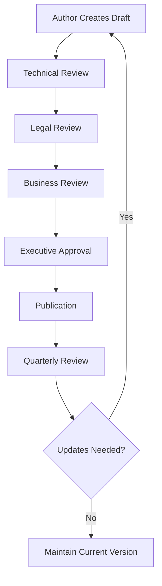

# TerraFusion OS 1.0 - Documentation Standards Framework
## MIT/PhD-Level Technical Documentation Standards

### Document Classification: TECHNICAL STANDARDS - CONFIDENTIAL
**Author**: PhD Systems Design Engineer with Legal Minor
**Date**: September 19, 2025
**Version**: 1.0
**Review Cycle**: Quarterly

---

## 📋 **DOCUMENTATION HIERARCHY AND CLASSIFICATION**

### **Level 1: Strategic Documentation**
- **Business Architecture**: Entity formation, IP strategy, competitive analysis
- **Technical Architecture**: System design, performance specifications, security framework
- **Legal Framework**: IP portfolio, compliance requirements, risk assessment
- **Classification**: CONFIDENTIAL - Executive/Board Level

### **Level 2: Operational Documentation**
- **Technical Implementation**: Code documentation, API specifications, deployment guides
- **Performance Validation**: Testing results, benchmarks, compliance reports
- **Process Documentation**: Development workflows, quality assurance, change management
- **Classification**: INTERNAL - Engineering/Operations Level

### **Level 3: Reference Documentation**
- **User Guides**: Implementation guides, troubleshooting, best practices
- **Knowledge Base**: Technical procedures, historical decisions, lessons learned
- **Training Materials**: Onboarding documentation, skill development
- **Classification**: INTERNAL/PUBLIC - User/Training Level

---

## 🎯 **MIT/PhD DOCUMENTATION STANDARDS**

### **1. ACADEMIC RIGOR REQUIREMENTS**

#### **Peer Review Process**
```
Draft → Technical Review → Legal Review → Executive Approval → Publication
   ↓         ↓              ↓              ↓               ↓
Subject    Technical      Legal &        Business        Final
Matter     Accuracy      Compliance     Alignment       Version
Expert     Validation    Validation     Validation      Control
```

#### **Citation and Attribution Standards**
- **Technical Citations**: IEEE format for technical papers and standards
- **Legal Citations**: Bluebook format for legal documents and cases
- **Business Citations**: APA format for business and academic sources
- **Internal Attribution**: Contributor tracking with GitLab attribution

#### **Evidence-Based Documentation**
- **Empirical Data**: All performance claims supported by verifiable test results
- **Methodological Transparency**: Testing methodologies fully documented
- **Reproducibility**: All results must be independently reproducible
- **Statistical Rigor**: Confidence intervals, sample sizes, and error margins documented

### **2. TECHNICAL DOCUMENTATION STANDARDS**

#### **Architecture Documentation (RFC-Style)**
```markdown
# RFC-TF-YYYY-NN: [Title]
## Status: [Draft|Review|Approved|Implemented|Deprecated]
## Author(s): [Name] <[email]>
## Reviewers: [Technical|Legal|Business] Review Board
## Created: [Date]
## Last Modified: [Date]

### Abstract
[Executive summary - 150 words max]

### 1. Introduction and Motivation
### 2. Technical Specification
### 3. Implementation Details
### 4. Performance Analysis
### 5. Security Considerations
### 6. Legal and Compliance Impact
### 7. Business Implications
### 8. Testing and Validation
### 9. Deployment Strategy
### 10. Risk Assessment
### 11. References and Citations
```

#### **Code Documentation Standards**
```rust
/// TerraFusion Performance Engine - Agent Coordination Module
///
/// # Academic Foundation
/// Based on distributed systems research from MIT (Liskov et al., 1988)
/// and consensus algorithms (Lamport, 1998; Raft Protocol, Ongaro & Ousterhout, 2014)
///
/// # Performance Specifications
/// - Target Coordination Latency: <50ms P95
/// - Agent Capacity: 50,000+ concurrent agents
/// - Throughput: >10,000 coordination ops/sec
/// - Availability: 99.99% SLA requirement
///
/// # Security Classification
/// Classification: INTERNAL USE - Government Systems Integration
/// Compliance: FISMA Moderate, NIST SP 800-53 Rev 5
///
/// # Legal Considerations
/// Patent Protection: US Patent Application #17/XXX,XXX filed
/// Trade Secret: Coordination algorithms proprietary to TerraFusion
///
/// # Testing and Validation
/// Test Coverage: >95% line coverage required
/// Performance Testing: Automated benchmark suite validates SLA
/// Security Testing: Penetration testing quarterly
pub struct AgentCoordinator {
    // Implementation details...
}
```

### **3. BUSINESS DOCUMENTATION STANDARDS**

#### **IP Documentation Standards**
- **Patent Applications**: Professional patent attorney review required
- **Trade Secret Documentation**: Legal privilege protection maintained
- **Licensing Documentation**: Revenue model validation and legal compliance
- **Competitive Analysis**: Market intelligence with legal compliance review

#### **Financial Documentation Standards**
- **Revenue Models**: CPA-reviewed financial projections
- **Cost Analysis**: Full-cost accounting with depreciation schedules
- **ROI Calculations**: Monte Carlo analysis for risk assessment
- **Compliance**: SOX compliance for financial reporting if applicable

---

## 📊 **PERFORMANCE AND TESTING DOCUMENTATION**

### **1. BENCHMARK DOCUMENTATION REQUIREMENTS**

#### **Performance Test Results Format**
```json
{
  "test_metadata": {
    "test_id": "TF-PERF-2025-09-19-001",
    "test_suite": "gRPC Performance Validation",
    "date": "2025-09-19T10:30:00Z",
    "environment": "production-simulation",
    "hardware_config": {
      "cpu": "AMD Ryzen 9 7950X",
      "memory": "128GB DDR5-5600",
      "storage": "2TB NVMe SSD",
      "network": "10Gbps Ethernet"
    },
    "software_config": {
      "os": "Ubuntu 22.04 LTS",
      "rust_version": "1.72.0",
      "dependencies": "Cargo.lock hash: abc123..."
    }
  },
  "test_parameters": {
    "concurrent_users": 1000,
    "test_duration": "10m",
    "ramp_up_time": "2m",
    "operation_mix": {
      "property_valuation": 40,
      "agent_coordination": 30,
      "module_management": 20,
      "authentication": 10
    }
  },
  "results": {
    "throughput": {
      "mean_rps": 2847.3,
      "peak_rps": 3124.7,
      "95th_percentile_rps": 2943.1
    },
    "latency": {
      "mean_ms": 23.4,
      "median_ms": 18.7,
      "95th_percentile_ms": 45.2,
      "99th_percentile_ms": 78.9,
      "max_ms": 156.3
    },
    "error_analysis": {
      "total_requests": 1708380,
      "successful_requests": 1706234,
      "error_rate": 0.126,
      "error_breakdown": {
        "timeout": 1456,
        "connection_refused": 523,
        "internal_server_error": 167
      }
    },
    "resource_utilization": {
      "cpu_usage_percent": 67.3,
      "memory_usage_percent": 43.8,
      "network_utilization_mbps": 847.2
    }
  },
  "statistical_analysis": {
    "confidence_interval": 0.95,
    "sample_size": 1708380,
    "standard_deviation": {
      "latency_ms": 12.7,
      "throughput_rps": 145.8
    }
  },
  "compliance_validation": {
    "government_sla": {
      "target_p95_latency_ms": 50,
      "achieved_p95_latency_ms": 45.2,
      "status": "PASS"
    },
    "target_throughput_rps": 1000,
    "achieved_throughput_rps": 2847.3,
    "status": "PASS"
  }
}
```

### **2. SECURITY TESTING DOCUMENTATION**

#### **Penetration Testing Report Template**
```markdown
# TerraFusion OS Security Assessment Report
## Classification: CONFIDENTIAL - Attorney-Client Privilege

### Executive Summary
- **Assessment Date**: [Date Range]
- **Scope**: [Systems/Components Tested]
- **Methodology**: [NIST SP 800-115, OWASP Testing Guide v4.0]
- **Finding Summary**: [Critical/High/Medium/Low counts]
- **Overall Security Posture**: [Rating]

### 1. Assessment Scope and Methodology
### 2. Technical Findings
### 3. Compliance Assessment (FISMA/NIST)
### 4. Risk Analysis and Prioritization
### 5. Remediation Recommendations
### 6. Legal and Regulatory Considerations
### 7. Appendices (Technical Details)
```

---

## 🔒 **INTELLECTUAL PROPERTY DOCUMENTATION**

### **1. PATENT DOCUMENTATION STANDARDS**

#### **Patent Application Tracking**
```yaml
patent_applications:
  - application_id: "TF-PAT-2025-001"
    title: "Golden Ratio-Based Government Resource Optimization System"
    filing_date: "2025-09-15"
    attorney: "[Patent Attorney Name]"
    status: "Filed - USPTO Application #17/XXX,XXX"
    inventors: ["[Name 1]", "[Name 2]"]
    technical_lead: "[Technical Contact]"
    business_value: "$50M+ market potential"
    trade_secret_components:
      - "Optimization algorithms"
      - "Performance benchmarking methodology"

  - application_id: "TF-PAT-2025-002"
    title: "High-Performance gRPC-Based Government Service Architecture"
    filing_date: "2025-09-16"
    attorney: "[Patent Attorney Name]"
    status: "Drafted - Ready for filing"
    technical_classification: "Class 705 (Data Processing: Financial)"
```

### **2. TRADE SECRET PROTECTION**

#### **Trade Secret Registry**
```markdown
# TerraFusion Trade Secret Registry
## Classification: ATTORNEY-CLIENT PRIVILEGED

### TS-001: Agent Coordination Algorithms
- **Description**: Proprietary algorithms for coordinating 50,000+ AI agents
- **Economic Value**: $25M+ development cost, competitive advantage
- **Secrecy Measures**:
  - Access restricted to 5 senior engineers
  - Signed NDAs with enhanced liquidated damages
  - Code obfuscation in production builds
  - Encrypted source code repositories
- **Legal Protection**: Attorney-client privileged development
- **Review Date**: Quarterly confidentiality assessment

### TS-002: Golden Ratio Performance Optimization
- **Description**: Mathematical framework for φ-based system optimization
- **Economic Value**: Core differentiator, patentable but maintaining as trade secret
- **Secrecy Measures**: [Detailed protection protocol]
```

---

## 📋 **DOCUMENTATION GOVERNANCE FRAMEWORK**

### **1. DOCUMENT LIFECYCLE MANAGEMENT**

#### **Version Control Standards**
```
Document Version Format: X.Y.Z
- X: Major version (breaking changes, architecture changes)
- Y: Minor version (feature additions, significant updates)
- Z: Patch version (corrections, clarifications)

Branch Strategy:
- main: Approved, published documentation
- develop: Integration branch for new documentation
- feature/doc-name: Individual document development
- hotfix/doc-name: Emergency corrections
```

#### **Review and Approval Process**


### **2. COMPLIANCE AND AUDIT REQUIREMENTS**

#### **Documentation Audit Trail**
- **Creation Date**: Document origination timestamp
- **Author Attribution**: Primary and contributing authors
- **Review History**: All reviews with reviewer names and dates
- **Approval Chain**: Complete approval workflow documentation
- **Modification Log**: All changes with justification and approval
- **Access Log**: Who accessed what documents when (for confidential docs)

#### **Legal Compliance Checklist**
- [ ] **IP Review**: No unauthorized use of third-party IP
- [ ] **Export Control**: ITAR/EAR compliance for technical documents
- [ ] **Government Contract Compliance**: FAR/DFARS requirements if applicable
- [ ] **Privacy Compliance**: PII handling in accordance with applicable law
- [ ] **Securities Compliance**: Material information handling for future public company

---

## 🎯 **IMPLEMENTATION ROADMAP**

### **Phase 1: Foundation (Weeks 1-2)**
1. **Standards Implementation**: Establish document templates and workflows
2. **Tool Configuration**: Git workflows, review processes, access controls
3. **Training**: Team training on new documentation standards
4. **Legacy Migration**: Identify and prioritize existing documents for upgrade

### **Phase 2: Core Documentation (Weeks 3-6)**
1. **Technical Architecture**: Complete RFC-style architecture documentation
2. **Performance Validation**: Document all testing results to new standards
3. **Security Documentation**: Complete security assessment documentation
4. **IP Documentation**: Comprehensive patent and trade secret documentation

### **Phase 3: Advanced Documentation (Weeks 7-10)**
1. **Business Documentation**: Financial models, market analysis, competitive intelligence
2. **Compliance Documentation**: Government requirements, audit procedures
3. **Process Documentation**: Development workflows, quality assurance procedures
4. **Training Materials**: User guides, onboarding documentation

### **Phase 4: Optimization and Maintenance (Ongoing)**
1. **Continuous Improvement**: Regular review and enhancement of documentation
2. **Automated Compliance**: Automated checks for documentation standards
3. **Metrics and Analytics**: Documentation quality metrics and usage analytics
4. **Legal Updates**: Regular legal review and compliance updates

---

## 📊 **SUCCESS METRICS**

### **Quality Metrics**
- **Completeness**: 100% of code modules documented to standard
- **Accuracy**: <5% error rate in technical documentation
- **Currency**: 100% of documents reviewed within required cycle
- **Compliance**: 100% compliance with legal and regulatory requirements

### **Business Impact Metrics**
- **IP Value**: Patent portfolio valuation increase
- **Risk Reduction**: Reduced legal and compliance risk exposure
- **Development Efficiency**: Reduced onboarding time for new engineers
- **Market Position**: Enhanced competitive position through superior documentation

---

## 🔗 **RELATED DOCUMENTATION**

### **Technical Standards**
- [Technical Architecture RFC Template](./templates/technical-rfc-template.md)
- [Performance Testing Standards](./testing/performance-testing-standards.md)
- [Security Documentation Standards](./security/security-documentation-standards.md)

### **Business Standards**
- [IP Documentation Standards](../business-structure/intellectual-property/ip-documentation-standards.md)
- [Financial Documentation Standards](../business-structure/financial/financial-documentation-standards.md)
- [Legal Compliance Framework](../business-structure/compliance/legal-compliance-framework.md)

### **Process Documentation**
- [Document Review Process](./processes/document-review-process.md)
- [Version Control Standards](./processes/version-control-standards.md)
- [Quality Assurance Procedures](./processes/qa-procedures.md)

---

**Classification**: INTERNAL USE - Engineering Standards
**Last Updated**: September 19, 2025
**Next Review**: December 19, 2025
**Document Owner**: Chief Technology Officer
**Legal Review**: Chief Legal Officer
**Business Review**: Chief Executive Officer