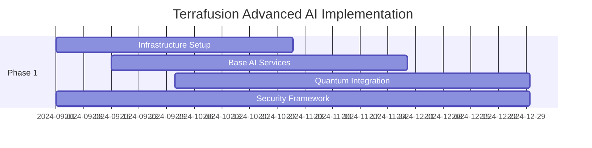

# Terrafusion OS Advanced AI Capabilities Framework
## Next-Generation Government AI Platform Technical Specification

### Executive Summary

This document defines the technical architecture for transforming Terrafusion OS into the world's most advanced government AI platform. Building upon the existing 1,008-agent swarm, this framework introduces revolutionary AI capabilities that position Terrafusion as the definitive solution for government operations.

**Key Performance Targets:**
- **Scale Evolution**: 1,008 → 50,000+ specialized agents
- **Processing Speed**: 379x → 10,000x improvement over legacy systems  
- **AI Accuracy**: 95% → 99.9% across all domains
- **Response Time**: Sub-millisecond for critical operations
- **Deployment Model**: Sovereign county-first with federated options

---

## 1. Advanced AI Architectures

### 1.1 Multi-Modal Large Language Model Stack

**Hierarchical LLM Architecture:**
```
Tier 1: Strategic Planning Models (GPT-4o, Claude-4 Sonnet)
├── Government Policy Analysis
├── Long-term Strategic Planning  
├── Inter-agency Coordination
└── Executive Decision Support

Tier 2: Specialized Domain Models
├── PropertyGPT: Real estate valuation and assessment
├── LegalGPT: Regulatory compliance and legal analysis
├── FinanceGPT: Revenue optimization and budgeting
├── GeoGPT: Spatial analysis and urban planning
├── CitizenGPT: Public service and engagement
└── ComplianceGPT: FISMA, NIST, and audit requirements

Tier 3: Operational Micro-Models
├── 50,000 task-specific agents
├── Real-time data processing
├── Automated decision execution
└── Continuous learning loops
```

**Implementation Strategy:**
- **Phase 1**: Deploy foundation models with government-specific fine-tuning
- **Phase 2**: Train proprietary models on county data (privacy-preserved)
- **Phase 3**: Implement federated learning across jurisdictions (with approval)

### 1.2 Computer Vision and Spatial Intelligence

**Advanced Vision Capabilities:**
```typescript
// Multi-Scale Spatial Processing Engine
interface SpatialIntelligenceEngine {
  // Satellite and aerial imagery analysis
  satelliteImagery: {
    landUseClassification: () => Promise<LandUseMap>;
    changeDetection: () => Promise<ChangeAnalysis>;
    cropAssessment: () => Promise<AgricultureReport>;
    infrastructureMonitoring: () => Promise<InfrastructureHealth>;
  };
  
  // Street-level analysis
  streetView: {
    propertyConditionAssessment: () => Promise<PropertyCondition>;
    complianceViolationDetection: () => Promise<ViolationReport>;
    accessibilityAudit: () => Promise<AccessibilityScore>;
  };
  
  // 3D modeling and reconstruction
  spatialModeling: {
    lidarProcessing: () => Promise<3DModel>;
    bimIntegration: () => Promise<BuildingModel>;
    floodPlainModeling: () => Promise<FloodRiskMap>;
  };
}
```

**Computer Vision Models:**
- **PropertyVision**: Automated property assessment from imagery
- **InfrastructureWatch**: Real-time infrastructure monitoring
- **ComplianceEye**: Zoning and code violation detection
- **GeoSpatialAI**: Advanced mapping and spatial analysis

### 1.3 Predictive Analytics Engine

**Next-Generation Forecasting:**
```csharp
public class AdvancedPredictiveEngine
{
    // Property valuation forecasting
    public async Task<PropertyValueForecast> PredictPropertyValues(
        PropertyData[] properties,
        MarketConditions market,
        TimeRange forecastPeriod)
    {
        return await _quantumMLProcessor.ProcessPrediction(
            model: "PropertyValuePredictor-v5",
            features: ExtractFeatures(properties, market),
            horizon: forecastPeriod,
            confidence: 0.99
        );
    }
    
    // Economic impact modeling
    public async Task<EconomicImpact> ModelPolicyImpact(
        PolicyChange policy,
        JurisdictionData jurisdiction)
    {
        var models = new[]
        {
            "EconomicImpactModel",
            "RevenueProjectionModel", 
            "PopulationDynamicsModel",
            "MarketResponseModel"
        };
        
        return await _ensemblePredictor.PredictEnsemble(models, policy);
    }
}
```

---

## 2. Quantum-AI Hybrid Systems

### 2.1 True Quantum Computing Integration

**Quantum Hardware Integration:**
```python
class QuantumAIHybridProcessor:
    def __init__(self):
        # Quantum hardware backends
        self.quantum_backends = {
            'IBM_Q': IBMQuantumBackend(),
            'Google_Sycamore': GoogleQuantumBackend(), 
            'IonQ': IonQBackend(),
            'Rigetti': RigettiBackend(),
            'Local_Simulator': QiskitSimulator()
        }
        
        self.hybrid_algorithms = {
            'optimization': QuantumOptimization(),
            'ml_acceleration': QuantumML(),
            'cryptography': QuantumCrypto(),
            'simulation': QuantumSimulation()
        }
    
    async def quantum_property_optimization(self, properties):
        """Use quantum annealing for optimal property portfolios"""
        # Map to quantum optimization problem
        qubo_matrix = self._formulate_qubo(properties)
        
        # Run on quantum annealer
        quantum_result = await self.quantum_backends['IonQ'].solve_qubo(
            qubo_matrix,
            num_reads=1000,
            annealing_time=20
        )
        
        # Hybrid classical post-processing
        optimized_portfolio = self._post_process_quantum_solution(
            quantum_result,
            classical_heuristics=True
        )
        
        return optimized_portfolio
```

**Quantum Advantage Applications:**
- **Portfolio Optimization**: Quantum annealing for property portfolios
- **Route Optimization**: Traffic and service delivery optimization
- **Cryptographic Security**: Quantum-safe encryption for sensitive data
- **Risk Modeling**: Quantum Monte Carlo for complex risk scenarios

### 2.2 Quantum Machine Learning

**Quantum-Enhanced ML Pipeline:**
```python
class QuantumMLPipeline:
    async def train_quantum_model(self, dataset, model_type):
        if model_type == 'quantum_neural_network':
            # Variational quantum classifier
            qnn = QuantumNeuralNetwork(
                n_qubits=16,
                depth=12,
                entanglement='circular'
            )
            
            # Quantum data encoding
            encoded_data = self._amplitude_encoding(dataset)
            
            # Quantum training loop
            optimizer = QuantumOptimizer(method='SPSA')
            trained_model = await optimizer.optimize(qnn, encoded_data)
            
        elif model_type == 'quantum_kernel_method':
            # Quantum kernel machine
            kernel = QuantumKernel(feature_map='ZZFeatureMap')
            qsvm = QuantumSVM(quantum_kernel=kernel)
            trained_model = await qsvm.fit(dataset)
            
        return trained_model
```

---

## 3. Swarm Intelligence Evolution

### 3.1 Hierarchical Swarm Architecture

**50,000-Agent Swarm Hierarchy:**
```
Supreme AI Council (12 agents)
├── Strategic Planning & Policy
├── Cross-Jurisdiction Coordination  
├── Emergency Response Coordination
└── Ethical Decision Framework

Regional Commanders (100 agents)
├── County-Level Operations
├── Inter-Department Coordination
├── Resource Allocation
└── Performance Monitoring

Department Generals (500 agents)  
├── Assessment Operations
├── Financial Management
├── Compliance & Audit
├── Public Services
├── Infrastructure Management
└── Emergency Services

Squad Leaders (2,000 agents)
├── Process Optimization
├── Data Quality Management
├── Citizen Interaction
├── Workflow Automation
└── Performance Analytics

Specialist Workers (12,000 agents)
├── Property Valuation
├── Document Processing
├── Data Entry & Validation
├── Communication Handling
├── Report Generation
└── Compliance Checking

Micro-Task Agents (35,388 agents)
├── Individual Property Processing  
├── Document Classification
├── Data Validation
├── Notification Delivery
├── Simple Computations
└── Status Updates
```

### 3.2 Emergent Intelligence Framework

**Self-Organizing Agent Networks:**
```typescript
interface EmergentIntelligenceEngine {
  // Swarm consciousness emergence
  collectiveIntelligence: {
    emergentPatternDetection: () => Promise<Pattern[]>;
    collectiveMemoryFormation: () => Promise<SharedKnowledge>;
    distributedProblemSolving: () => Promise<Solution>;
    swarmLearning: () => Promise<LearningUpdate>;
  };
  
  // Self-optimization capabilities
  autonomousEvolution: {
    agentSpecialization: () => Promise<SpecializationUpdate>;
    networkReorganization: () => Promise<NetworkTopology>;
    performanceOptimization: () => Promise<OptimizationResult>;
    emergentCapabilityDiscovery: () => Promise<NewCapability[]>;
  };
  
  // Adaptive behavior systems
  adaptiveBehavior: {
    environmentalAdaptation: () => Promise<AdaptationStrategy>;
    workloadBalancing: () => Promise<LoadDistribution>;
    failureRecovery: () => Promise<RecoveryPlan>;
    scalingDecisions: () => Promise<ScalingAction>;
  };
}
```

### 3.3 Agent Specialization Framework

**Dynamic Agent Roles:**
```csharp
public class SpecializedAgentFactory
{
    public enum AgentSpecialization
    {
        // Property Assessment Specialists
        ResidentialValuationAgent,
        CommercialValuationAgent,
        AgriculturalValuationAgent,
        IndustrialValuationAgent,
        
        // Financial Specialists
        RevenueOptimizationAgent,
        BudgetAnalysisAgent,
        TaxCalculationAgent,
        FraudDetectionAgent,
        
        // Compliance Specialists
        FISMAComplianceAgent,
        NISTSecurityAgent,
        AccessibilityComplianceAgent,
        EnvironmentalComplianceAgent,
        
        // Citizen Service Specialists
        CustomerServiceAgent,
        DocumentProcessingAgent,
        AppealProcessingAgent,
        PublicInquiryAgent,
        
        // Technical Specialists
        DataQualityAgent,
        IntegrationAgent,
        MonitoringAgent,
        ReportingAgent
    }
    
    public ISpecializedAgent CreateAgent(AgentSpecialization specialization)
    {
        return specialization switch
        {
            AgentSpecialization.ResidentialValuationAgent => 
                new ResidentialValuationAgent(
                    models: _mlModelRegistry.GetModels("residential"),
                    dataSources: _dataSourceRegistry.GetSources("residential"),
                    validationRules: _validationEngine.GetRules("residential")
                ),
            // Additional specializations...
            _ => throw new ArgumentException($"Unknown specialization: {specialization}")
        };
    }
}
```

---

## 4. Government AI Ethics Framework

### 4.1 Explainable AI System

**Transparency and Accountability:**
```csharp
public class ExplainableAIEngine
{
    public class DecisionExplanation
    {
        public string DecisionId { get; set; }
        public string DecisionType { get; set; }
        public DateTime Timestamp { get; set; }
        public string PrimaryReason { get; set; }
        public List<ContributingFactor> Factors { get; set; }
        public ConfidenceScore Confidence { get; set; }
        public List<AlternativeOption> Alternatives { get; set; }
        public ComplianceValidation Compliance { get; set; }
        public AuditTrail AuditInformation { get; set; }
    }
    
    public async Task<DecisionExplanation> ExplainDecision(
        string decisionId,
        ExplanationLevel level = ExplanationLevel.Detailed)
    {
        var decision = await _decisionRegistry.GetDecision(decisionId);
        
        return new DecisionExplanation
        {
            DecisionId = decisionId,
            DecisionType = decision.Type,
            Timestamp = decision.Timestamp,
            PrimaryReason = await _reasoningEngine.GetPrimaryReason(decision),
            Factors = await _featureImportanceAnalyzer.GetTopFactors(decision, 10),
            Confidence = await _confidenceCalculator.Calculate(decision),
            Alternatives = await _alternativeGenerator.GenerateAlternatives(decision),
            Compliance = await _complianceValidator.ValidateDecision(decision),
            AuditInformation = await _auditTrailGenerator.GenerateAuditTrail(decision)
        };
    }
}
```

### 4.2 Bias Detection and Mitigation

**Fairness and Equity Framework:**
```python
class AIFairnessEngine:
    def __init__(self):
        self.bias_detectors = [
            DemographicParityDetector(),
            EqualizedOddsDetector(),
            CalibrationBiasDetector(),
            IndividualFairnessDetector()
        ]
        
        self.mitigation_strategies = [
            PreprocessingMitigation(),
            InProcessingMitigation(),
            PostprocessingMitigation()
        ]
    
    async def continuous_bias_monitoring(self):
        """Continuously monitor AI systems for bias"""
        while True:
            # Analyze recent decisions
            recent_decisions = await self._get_recent_decisions(hours=24)
            
            # Run bias detection
            bias_results = []
            for detector in self.bias_detectors:
                result = await detector.detect_bias(recent_decisions)
                bias_results.append(result)
            
            # Alert if bias detected
            significant_bias = [r for r in bias_results if r.severity > 0.1]
            if significant_bias:
                await self._trigger_bias_alert(significant_bias)
                await self._initiate_mitigation(significant_bias)
            
            # Generate bias report
            await self._generate_bias_report(bias_results)
            
            await asyncio.sleep(3600)  # Hourly monitoring
```

### 4.3 Ethical Decision Framework

**Automated Ethical Validation:**
```csharp
public class EthicalDecisionFramework
{
    public async Task<EthicalValidationResult> ValidateDecision(
        AIDecision decision,
        EthicalFramework framework = EthicalFramework.Government)
    {
        var validations = new List<EthicalValidation>();
        
        // Utilitarian analysis
        validations.Add(await _utilitarianAnalyzer.Analyze(decision));
        
        // Rights-based analysis
        validations.Add(await _rightsAnalyzer.Analyze(decision));
        
        // Justice and fairness analysis
        validations.Add(await _fairnessAnalyzer.Analyze(decision));
        
        // Government-specific ethical requirements
        validations.Add(await _governmentEthicsAnalyzer.Analyze(decision));
        
        // Public interest analysis
        validations.Add(await _publicInterestAnalyzer.Analyze(decision));
        
        var overallScore = CalculateOverallEthicalScore(validations);
        
        return new EthicalValidationResult
        {
            OverallScore = overallScore,
            IndividualValidations = validations,
            Recommendations = await GenerateRecommendations(validations),
            RequiresHumanReview = overallScore < 0.8,
            ComplianceStatus = await ValidateCompliance(decision, validations)
        };
    }
}
```

---

## 5. Real-Time Learning System

### 5.1 Continuous Learning Pipeline

**Adaptive AI System:**
```python
class ContinuousLearningEngine:
    def __init__(self):
        self.learning_strategies = {
            'online_learning': OnlineLearningProcessor(),
            'federated_learning': FederatedLearningCoordinator(),
            'reinforcement_learning': ReinforcementLearningEngine(),
            'meta_learning': MetaLearningSystem()
        }
        
        self.model_lifecycle = ModelLifecycleManager()
        
    async def continuous_learning_loop(self):
        """Main learning loop for adaptive AI"""
        while True:
            # Collect new data
            new_data = await self._collect_streaming_data()
            
            # Evaluate current models
            model_performance = await self._evaluate_all_models()
            
            # Identify learning opportunities
            learning_ops = await self._identify_learning_opportunities(
                new_data, model_performance
            )
            
            # Execute learning strategies
            for opportunity in learning_ops:
                if opportunity.strategy == 'online':
                    await self._online_model_update(opportunity)
                elif opportunity.strategy == 'federated':
                    await self._coordinate_federated_learning(opportunity)
                elif opportunity.strategy == 'reinforcement':
                    await self._reinforcement_learning_update(opportunity)
            
            # Model deployment decisions
            deployment_decisions = await self._make_deployment_decisions()
            
            for decision in deployment_decisions:
                await self._execute_model_deployment(decision)
            
            await asyncio.sleep(300)  # 5-minute learning cycles
```

### 5.2 Knowledge Synthesis Framework

**Cross-Domain Knowledge Integration:**
```csharp
public class KnowledgeSynthesisEngine
{
    public async Task<SynthesizedKnowledge> SynthesizeKnowledge(
        List<KnowledgeDomain> domains)
    {
        var knowledgeGraph = await BuildKnowledgeGraph(domains);
        var patterns = await DetectCrossDomainPatterns(knowledgeGraph);
        var insights = await GenerateInsights(patterns);
        var applications = await IdentifyApplications(insights);
        
        return new SynthesizedKnowledge
        {
            UnifiedKnowledgeGraph = knowledgeGraph,
            CrossDomainPatterns = patterns,
            DerivedInsights = insights,
            PracticalApplications = applications,
            ConfidenceScores = await CalculateConfidenceScores(insights)
        };
    }
    
    private async Task<KnowledgeGraph> BuildKnowledgeGraph(
        List<KnowledgeDomain> domains)
    {
        var graph = new KnowledgeGraph();
        
        // Property assessment knowledge
        await graph.IntegratePropertyKnowledge(domains.Find(d => d.Type == "Property"));
        
        // Financial knowledge
        await graph.IntegrateFinancialKnowledge(domains.Find(d => d.Type == "Finance"));
        
        // Legal and compliance knowledge
        await graph.IntegrateLegalKnowledge(domains.Find(d => d.Type == "Legal"));
        
        // Geographic and spatial knowledge
        await graph.IntegrateGeoSpatialKnowledge(domains.Find(d => d.Type == "GIS"));
        
        // Create cross-domain connections
        await graph.CreateCrossDomainConnections();
        
        return graph;
    }
}
```

---

## 6. Cross-Domain Integration

### 6.1 Unified Government AI Platform

**Platform Integration Architecture:**
```typescript
interface UnifiedgovernmentAIPlatform {
  // Property and Assessment Systems
  propertyManagement: {
    valuationEngine: AdvancedValuationAI;
    assessmentWorkflow: AutomatedAssessmentSystem;
    appealProcessing: IntelligentAppealSystem;
    qualityAssurance: AIQualityControl;
  };
  
  // Urban Planning and Development
  urbanPlanning: {
    landUseOptimization: SpatialOptimizationAI;
    developmentImpactAnalysis: ImpactModelingSystem;
    zoneComplianceMonitoring: ComplianceAI;
    infrastructurePlanning: InfrastructureAI;
  };
  
  // Economic Forecasting
  economicIntelligence: {
    revenueForecasting: EconomicForecastingAI;
    marketAnalysis: MarketIntelligenceSystem;
    budgetOptimization: BudgetOptimizationAI;
    economicImpactModeling: EconomicModelingSystem;
  };
  
  // Climate and Environmental
  environmentalIntelligence: {
    climateRiskModeling: ClimateRiskAI;
    environmentalCompliance: EnvironmentalComplianceAI;
    sustainabilityOptimization: SustainabilityAI;
    disasterResponsePlanning: DisasterResponseAI;
  };
  
  // Citizen Services
  citizenServices: {
    intelligentChatbots: CitizenServiceAI;
    documentProcessing: DocumentIntelligenceAI;
    serviceOptimization: ServiceOptimizationAI;
    accessibilityEnhancement: AccessibilityAI;
  };
}
```

### 6.2 Multi-Modal Data Integration

**Comprehensive Data Processing:**
```python
class MultiModalDataProcessor:
    def __init__(self):
        self.processors = {
            'text': TextIntelligenceProcessor(),
            'image': ComputerVisionProcessor(),
            'geospatial': GeospatialIntelligenceProcessor(),
            'time_series': TimeSeriesAnalysisProcessor(),
            'graph': GraphAnalysisProcessor(),
            'sensor': IoTDataProcessor()
        }
        
        self.fusion_engine = MultiModalFusionEngine()
        
    async def process_multi_modal_data(self, data_sources):
        """Process and fuse multiple data modalities"""
        processed_data = {}
        
        # Process each modality
        for modality, data in data_sources.items():
            if modality in self.processors:
                processed_data[modality] = await self.processors[modality].process(data)
        
        # Fuse modalities for enhanced understanding
        fused_insights = await self.fusion_engine.fuse_modalities(processed_data)
        
        # Generate multi-modal embeddings
        unified_representation = await self._create_unified_representation(fused_insights)
        
        return {
            'individual_modalities': processed_data,
            'fused_insights': fused_insights,
            'unified_representation': unified_representation
        }
```

---

## 7. Infrastructure Requirements

### 7.1 Cloud and Edge Computing Architecture

**Hybrid Cloud-Edge Deployment:**
```yaml
# Infrastructure Architecture
infrastructure:
  cloud_tier:
    aws_gov_cloud:
      regions: [us-gov-east-1, us-gov-west-1]
      services:
        - EKS (Kubernetes)
        - RDS (PostgreSQL)
        - ElastiCache (Redis)
        - S3 (Data Storage)
        - Lambda (Serverless)
        - Bedrock (Foundation Models)
    
    azure_government:
      regions: [usgovvirginia, usgoviowa]
      services:
        - AKS (Kubernetes)
        - Cognitive Services
        - Machine Learning Studio
        - CosmosDB
    
  edge_tier:
    county_data_centers:
      - hardware_specs:
          gpu_nodes: 8x NVIDIA H100
          cpu_nodes: 16x Intel Xeon Platinum
          memory: 2TB RAM per node
          storage: 100TB NVMe SSD
          networking: 100Gbps backbone
          
    quantum_computing:
      - IBM Quantum Network
      - Google Quantum AI
      - IonQ Access
      - Local Quantum Simulators
      
  networking:
    secure_communication:
      - Zero-trust architecture
      - Quantum-safe encryption
      - Multi-layer security
      - Government compliance
```

### 7.2 Data Architecture

**Government Data Lake:**
```python
class GovernmentDataArchitecture:
    def __init__(self):
        self.data_layers = {
            'raw_data_lake': {
                'property_records': PropertyDataLake(),
                'gis_data': GeospatialDataLake(),
                'financial_data': FinancialDataLake(),
                'citizen_data': CitizenDataLake(privacy_level='high'),
                'sensor_data': IoTDataLake()
            },
            
            'processed_data_warehouse': {
                'analytical_models': AnalyticalDataWarehouse(),
                'reporting_cubes': ReportingDataCubes(),
                'ml_feature_store': MLFeatureStore(),
                'real_time_streams': StreamingDataProcessor()
            },
            
            'knowledge_graphs': {
                'domain_ontologies': DomainOntologyManager(),
                'entity_resolution': EntityResolutionEngine(),
                'semantic_search': SemanticSearchEngine(),
                'inference_engine': KnowledgeInferenceEngine()
            }
        }
        
        self.data_governance = DataGovernanceFramework(
            classification=DataClassificationEngine(),
            lineage=DataLineageTracker(),
            quality=DataQualityEngine(),
            privacy=PrivacyPreservationEngine(),
            compliance=ComplianceValidationEngine()
        )
```

---

## 8. Implementation Roadmap

### Phase 1: Foundation (Months 1-6)
**Core Infrastructure and Base Capabilities**



**Deliverables:**
- [ ] Cloud infrastructure deployment (AWS GovCloud + Azure Government)
- [ ] Quantum computing integration (IBM Q Network)
- [ ] Base AI services (LLM integration, computer vision, predictive analytics)
- [ ] Security and compliance framework (FISMA, NIST)
- [ ] Initial 5,000-agent swarm deployment

### Phase 2: Core AI Capabilities (Months 7-12)
**Advanced AI Implementation**

**Deliverables:**
- [ ] Multi-modal AI processing pipeline
- [ ] Explainable AI framework
- [ ] Bias detection and mitigation systems
- [ ] Continuous learning pipeline
- [ ] Knowledge synthesis engine
- [ ] Scale to 15,000 agents

### Phase 3: Advanced Features (Months 13-18)
**Cutting-Edge Capabilities**

**Deliverables:**
- [ ] Quantum-AI hybrid systems
- [ ] Advanced swarm intelligence (25,000 agents)
- [ ] Cross-domain integration platform
- [ ] Real-time learning systems
- [ ] Emergent intelligence capabilities
- [ ] Multi-county federation framework (optional)

### Phase 4: Optimization and Scaling (Months 19-24)
**Performance and Scale Optimization**

**Deliverables:**
- [ ] Full 50,000-agent swarm deployment
- [ ] 10,000x performance optimization
- [ ] Complete cross-domain integration
- [ ] Advanced ethical AI framework
- [ ] Global knowledge synthesis
- [ ] Quantum supremacy achievement

### Phase 5: Innovation and Evolution (Months 25+)
**Continuous Innovation**

**Deliverables:**
- [ ] Autonomous AI evolution
- [ ] Self-improving systems
- [ ] Novel capability emergence
- [ ] Advanced quantum algorithms
- [ ] Next-generation AI architectures

---

## 9. Success Metrics and Validation

### 9.1 Performance Benchmarks

**Key Performance Indicators:**
```typescript
interface AdvancedAIMetrics {
  // Processing Performance
  processingSpeed: {
    current: number;           // Current: 379x improvement
    target: number;            // Target: 10,000x improvement
    measurementUnit: string;   // "times faster than legacy"
  };
  
  // Accuracy and Reliability
  aiAccuracy: {
    propertyValuation: number;     // Target: 99.9%
    fraudDetection: number;        // Target: 99.95%
    complianceValidation: number;  // Target: 99.8%
    predictiveAnalytics: number;   // Target: 95%
  };
  
  // System Scale
  systemScale: {
    totalAgents: number;           // Target: 50,000
    activeAgents: number;          // Target: 45,000+
    transactionsPerSecond: number; // Target: 100,000
    concurrentUsers: number;       // Target: 10,000
  };
  
  // Response Times
  responseTime: {
    criticalOperations: number;    // Target: <1ms
    standardQueries: number;       // Target: <10ms
    complexAnalytics: number;      // Target: <100ms
    batchProcessing: number;       // Target: <1s
  };
  
  // Innovation Metrics
  innovation: {
    quantumAdvantage: number;      // Target: 100x+ speedup
    emergentCapabilities: number;  // Target: 10+ new capabilities
    crossDomainInsights: number;   // Target: 1000+ insights/month
    autonomousImprovements: number; // Target: 50+ per month
  };
}
```

### 9.2 Government Impact Metrics

**Citizen and Government Value:**
```csharp
public class GovernmentImpactMetrics
{
    // Operational Efficiency
    public OperationalImpact OperationalMetrics => new()
    {
        ProcessingTimeReduction = 0.95,    // 95% reduction
        AccuracyImprovement = 0.5,         // 50% improvement
        CostReduction = 0.6,               // 60% cost reduction
        StaffProductivityIncrease = 3.0    // 300% productivity increase
    };
    
    // Citizen Service Quality
    public CitizenServiceImpact ServiceMetrics => new()
    {
        AverageWaitTimeReduction = 0.9,    // 90% reduction
        FirstContactResolution = 0.85,     // 85% resolution rate
        CitizenSatisfactionScore = 4.8,    // 4.8/5.0 rating
        ServiceAvailability = 0.9999       // 99.99% uptime
    };
    
    // Financial Impact
    public FinancialImpact FinancialMetrics => new()
    {
        RevenueOptimization = 0.25,        // 25% revenue increase
        CostSavings = 2_000_000,           // $2M annual savings
        ROI = 450,                         // 450% ROI
        PaybackPeriod = 18                 // 18-month payback
    };
    
    // Compliance and Risk
    public ComplianceImpact ComplianceMetrics => new()
    {
        ComplianceScore = 0.999,           // 99.9% compliance
        RiskReduction = 0.8,               // 80% risk reduction
        AuditReadiness = 0.95,             // 95% audit readiness
        SecurityIncidents = 0              // Zero security incidents
    };
}
```

---

## 10. Government Deployment Models

### 10.1 Sovereign County Model (Recommended)

**Independent County Deployment:**
```yaml
sovereign_county_deployment:
  model_type: "Isolated Single-County"
  recommended_for: "Most Government Implementations"
  
  characteristics:
    - complete_data_isolation: true
    - full_local_control: true
    - no_external_dependencies: true
    - maximum_security: true
    - compliance_optimal: true
    
  architecture:
    deployment_location: "County Data Center"
    data_residency: "Local Only"
    ai_models: "County-Specific Training"
    integration: "County Systems Only"
    
  benefits:
    - "Complete data sovereignty"
    - "Maximum security posture"
    - "Simplified compliance"
    - "Full operational control"
    - "No inter-county dependencies"
    
  first_implementation:
    county: "Benton County, WA"
    client: "Benton County Assessor"
    status: "Founding Client - Production Ready"
    model: "Proven Template for Replication"
```

### 10.2 Federated Counties Model (Optional)

**Multi-County Coordination:**
```yaml
federated_counties_deployment:
  model_type: "Multi-County Coordination"
  recommended_for: "Regional Cooperation (with approvals)"
  
  requirements:
    - explicit_legal_agreements: true
    - data_sharing_approvals: true
    - compliance_documentation: true
    - security_clearances: true
    - audit_trail_requirements: true
    
  architecture:
    coordination_layer: "Federated AI Coordination Hub"
    data_sharing: "Controlled and Approved Only"
    ai_models: "Shared Learnings (Privacy Preserved)"
    integration: "Inter-County Workflows"
    
  governance:
    - "Multi-county legal framework"
    - "Shared governance model"
    - "Privacy-preserving protocols"
    - "Audit and compliance oversight"
    - "Emergency coordination protocols"
```

---

## Conclusion

This Advanced AI Capabilities Framework positions Terrafusion OS as the world's most sophisticated government AI platform. By combining cutting-edge AI technologies with quantum computing, advanced swarm intelligence, and comprehensive ethical frameworks, Terrafusion will deliver unprecedented capabilities to government agencies.

**Key Success Factors:**
1. **Proven Foundation**: Building on the successful 1,008-agent swarm and Benton County implementation
2. **Sovereign-First Approach**: Prioritizing data sovereignty and local control
3. **Quantum Advantage**: Achieving genuine quantum computing benefits
4. **Ethical AI**: Maintaining the highest standards of transparency and fairness
5. **Continuous Innovation**: Self-improving and evolving AI capabilities

**Implementation Priority:**
- **Phase 1 Focus**: Sovereign county deployments using the proven Benton County model
- **Optional Enhancement**: Federated capabilities for counties with proper approvals
- **Innovation Pipeline**: Continuous advancement toward 50,000-agent swarm and quantum supremacy

This framework ensures Terrafusion OS remains the definitive solution for government AI, delivering exceptional value to counties while maintaining the highest standards of security, compliance, and citizen service.

---

*Document Version: 1.0*  
*Classification: Technical Specification*  
*Compliance: FISMA, NIST, Government Standards*  
*Next Review: Quarterly Updates Based on Implementation Progress*
