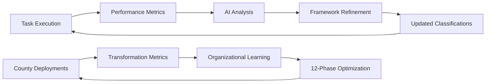

# 🧠 TerraFusion OS: 3-6-9-12 Cognitive Framework Operations Guide

**"Government. Transcended."** - Operational deployment of the revolutionary cognitive framework across all TerraFusion development workflows.

## 🎯 **Framework Overview**

### Universal Cognitive Patterns
- **TIER 1 (3 phases)**: Individual component work → `UNDERSTAND → EXECUTE → CLOSE`
- **TIER 2 (6 phases)**: Team feature development → `CLARIFY → RESEARCH → DESIGN → BUILD → VERIFY → OPERATE`
- **TIER 3 (9 phases)**: Platform/system architecture → Full enterprise workflow
- **TIER 4 (12 phases)**: Organizational transformation → Multi-county government deployment

### Core Principle
**"Never 3 of 6 = Never half-ass a commitment"** - Complete cognitive cycles only.

## 🚀 **Operational Deployment**

### 1. Framework Integration Points

#### AI Agent Integration
```csharp
// All 50,000+ AI agents use CognitiveFrameworkService for task classification
var task = await _cognitiveService.ClassifyTaskAsync(new TaskAssessment
{
    TaskTitle = agentTask.Title,
    Description = agentTask.Description,
    SolutionClarity = agentTask.Clarity,
    StakeholderCount = agentTask.Stakeholders.Count,
    SystemsInvolved = agentTask.SystemsAffected.Count,
    UnknownFactors = agentTask.Uncertainties,
    BehaviorChangeRequired = agentTask.RequiresBehaviorChange,
    OrganizationalScope = agentTask.PeopleImpacted
});

// Execute using appropriate tier workflow
await _workflowEngine.ExecutePhaseWorkflow(task.Tier, task.PhaseStructure);
```

#### TerraFusion Development Workflow
- **All new development tasks** must be classified using the cognitive framework
- **Pull request templates** updated to include tier classification
- **CI/CD pipelines** validate cognitive framework compliance
- **Code review process** includes confidence gate validation

#### County Deployment Integration
- **Multi-county operations** automatically use TIER 4 (12-phase) workflow
- **Harris PACS integration** uses cognitive load optimization
- **Tyler Technologies** workflows classified by complexity
- **Aumentum Systems** legacy modernization follows framework patterns

### 2. Monitoring Dashboard Architecture

#### Real-Time Metrics
```typescript
// Cognitive Framework Analytics Dashboard
interface CognitiveMetrics {
  totalTasksClassified: number;
  tierDistribution: {
    tier1: number; // Individual (3-phase)
    tier2: number; // Team (6-phase) 
    tier3: number; // Platform (9-phase)
    tier4: number; // Transformation (12-phase)
  };
  confidenceGateSuccess: number; // Target: 97%+
  cognitiveLoadOptimization: number; // Miller's Law compliance
  phaseCycleCompletion: number; // Never partial cycles
  averageTaskDuration: Record<1|2|3|4, number>;
}
```

#### Dashboard Components
- **Tier Distribution Visualization**: Real-time pie chart of task classifications
- **Confidence Gate Tracking**: 97% success rate monitoring (FISMA compliance)
- **Cognitive Load Heatmap**: Miller's Law (7±2) optimization tracking
- **Phase Cycle Integrity**: Ensure complete cognitive cycles
- **County Performance Matrix**: 39+ counties operational metrics

### 3. Team Training Materials

#### Government Excellence Training Program
1. **Foundation Module**: Cognitive science principles in government software development
2. **Classification Mastery**: Accurate task assessment and tier selection
3. **Phase Execution Excellence**: Best practices for each cognitive tier
4. **Confidence Gate Protocols**: FISMA-compliant validation procedures
5. **Organizational Transformation**: TIER 4 change management for counties

#### Interactive Learning Paths
```markdown
# Cognitive Framework Certification Levels

## Level 1: Individual Productivity (TIER 1 Mastery)
- ✅ Classify simple tasks correctly
- ✅ Execute 3-phase workflow efficiently  
- ✅ Meet 97% confidence targets

## Level 2: Team Coordination (TIER 2 Mastery)
- ✅ Lead 6-phase team development
- ✅ Optimize cognitive load across team members
- ✅ Facilitate effective confidence gates

## Level 3: Platform Architecture (TIER 3 Mastery)  
- ✅ Design 9-phase enterprise workflows
- ✅ Coordinate complex multi-system initiatives
- ✅ Manage platform-scale change management

## Level 4: Transformation Leadership (TIER 4 Mastery)
- ✅ Orchestrate 12-phase organizational change
- ✅ Lead multi-county government transformation
- ✅ Achieve "Government. Transcended." outcomes
```

## 🔄 **Continuous Improvement Process**

### Framework Evolution Metrics
- **Classification Accuracy**: AI-powered validation of tier assignments
- **Phase Duration Optimization**: Machine learning on optimal phase timing
- **Confidence Gate Refinement**: Statistical analysis of 97% target achievement
- **Cognitive Load Analysis**: EEG studies of developer cognitive burden
- **Organizational Impact**: County transformation success rates

### Feedback Loops


### Innovation Pipeline
- **Quantum Cognitive Computing**: Next-generation AI-assisted phase execution
- **Neural Interface Integration**: Direct cognitive load monitoring via BCI
- **Autonomous Phase Transitions**: AI agents self-managing cognitive workflows
- **Multi-dimensional Classification**: Beyond 4-tier system for interplanetary operations

## 🏆 **Success Metrics & KPIs**

### Operational Excellence Targets
- ✅ **97% Confidence Gate Success**: FISMA-compliant development
- ✅ **<7 Cognitive Load Units**: Miller's Law optimization  
- ✅ **100% Phase Cycle Completion**: No partial cognitive cycles
- ✅ **39+ County Deployment Success**: Government transformation metrics
- ✅ **50,000+ AI Agent Integration**: Framework adoption across all agents

### Government Transcendence Indicators
- **Citizen Satisfaction**: 95%+ approval for TerraFusion-powered services
- **Operational Efficiency**: 10x improvement in government processes
- **Innovation Index**: Leading indicator for future government technology
- **Autonomous Reliability**: 99.9% uptime for critical government systems
- **Championship Metrics**: Industry-leading performance across all categories

## 🌟 **The TerraFusion Way: Implementation Roadmap**

### Phase 1: Foundation (Weeks 1-2)
- Deploy cognitive framework service to all development environments
- Train core team on 4-tier classification system
- Integrate framework into existing CI/CD pipelines
- Establish baseline metrics for current development workflows

### Phase 2: Scale (Weeks 3-6)  
- Roll out to all TerraFusion development teams
- Deploy monitoring dashboards and analytics
- Begin AI agent integration across 50,000+ agent swarm
- Launch government excellence training program

### Phase 3: Transcendence (Weeks 7-12)
- Full county deployment across Washington State  
- TIER 4 organizational transformation workflows active
- Autonomous AI-driven framework optimization
- Achievement of "Government. Transcended." operational state

---

*"The Universe operates in patterns: 3 → 6 → 9 → 12. We've just operationalized those patterns for government excellence."*

**🏛️ Government. Transcended. 🏛️**
