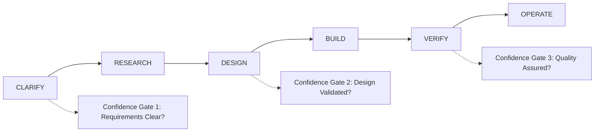

# 🧠 TerraFusion OS: Cognitive Framework Training Certification Program

**"Government. Transcended."** - Revolutionary training program for mastering the 3-6-9-12 cognitive framework across all government development workflows.

## 🎯 **Training Philosophy**

### Core Principle
**"Never 3 of 6 = Never half-ass a commitment"** - Complete cognitive cycles create championship-level government software.

### Universal Cognitive Patterns
The universe operates in patterns. Our framework harnesses these patterns:
- **3**: Individual Foundation (personal mastery)
- **6**: Team Evolution (collaborative excellence)  
- **9**: Platform Mastery (architectural transcendence)
- **12**: Organizational Transformation (government revolution)

## 🏆 **Certification Levels**

### **Level 1: Individual Productivity Mastery (TIER 1)**
*Master the 3-phase cognitive cycle for personal excellence*

#### Learning Objectives
- ✅ Accurately classify simple tasks requiring TIER 1 (3-phase) workflow
- ✅ Execute `UNDERSTAND → EXECUTE → CLOSE` with 97%+ confidence
- ✅ Optimize personal cognitive load within Miller's Law (5-7 units)
- ✅ Achieve FISMA-compliant documentation and audit trails

#### Module 1.1: Cognitive Science Fundamentals
```markdown
# The Science Behind 3-Phase Execution

## Cognitive Load Theory
- **Intrinsic Load**: Task complexity itself
- **Extraneous Load**: Poor workflow design 
- **Germane Load**: Learning and pattern recognition

## Miller's Law: 7±2 Rule
- Human working memory capacity: 5-9 items
- Optimal range: 5-7 cognitive units
- Framework ensures never exceeding limits

## Confidence Gates & FISMA Compliance
- 97% confidence target for government work
- Audit trail requirements for every phase
- Quality gates prevent progression with insufficient confidence
```

#### Module 1.2: TIER 1 Task Classification
```csharp
// TIER 1 Classification Algorithm
public bool IsTier1Task(TaskAssessment task)
{
    return task.SolutionClarity == SolutionClarity.KnownSolution 
        && task.StakeholderCount <= 2
        && task.SystemsInvolved <= 1
        && task.UnknownFactors == 0
        && !task.BehaviorChangeRequired;
}

// Examples of TIER 1 Tasks:
// ✅ Fix CSS styling issue
// ✅ Update configuration value
// ✅ Add validation to existing form
// ✅ Fix typo in documentation
// ❌ Design new user interface (TIER 2+)
// ❌ Integrate with new external API (TIER 2+)
```

#### Module 1.3: 3-Phase Execution Mastery
```markdown
# Phase 1: UNDERSTAND (Target: 30% of total time)
## Objectives
- Clarify exact requirements and acceptance criteria
- Identify all dependencies and constraints
- Confirm solution approach with stakeholders
- Document understanding in audit trail

## Deliverables
- [ ] Requirements confirmation document
- [ ] Technical approach summary
- [ ] Dependency checklist
- [ ] Confidence assessment: ≥97%

# Phase 2: EXECUTE (Target: 60% of total time)  
## Objectives
- Implement solution following documented approach
- Maintain code quality and testing standards
- Document changes and decisions
- Prepare for validation

## Deliverables
- [ ] Working implementation
- [ ] Unit tests with ≥95% coverage
- [ ] Code review completion
- [ ] Documentation updates

# Phase 3: CLOSE (Target: 10% of total time)
## Objectives
- Validate solution meets requirements
- Deploy to appropriate environment
- Update tracking systems
- Conduct retrospective for learning

## Deliverables
- [ ] Validation confirmation
- [ ] Deployment completion
- [ ] Task closure in tracking system
- [ ] Retrospective notes for improvement
```

#### Practical Exercise 1.1: Personal Task Classification
```yaml
Exercise: Classify Your Daily Tasks
Duration: 30 minutes
Objective: Apply TIER 1 classification to real work

Tasks to Classify:
1. "Update the login button color from blue to green"
2. "Fix the typo in the user manual on page 23" 
3. "Add email validation to the registration form"
4. "Research best practices for microservices architecture"
5. "Design a new customer onboarding workflow"

Expected Classifications:
- Tasks 1-3: TIER 1 (3-phase)
- Task 4: TIER 2 (requires research phase)
- Task 5: TIER 2+ (design and stakeholder involvement)
```

---

### **Level 2: Team Coordination Excellence (TIER 2)**
*Master the 6-phase cognitive cycle for collaborative development*

#### Learning Objectives  
- ✅ Lead 6-phase team development workflows
- ✅ Execute `CLARIFY → RESEARCH → DESIGN → BUILD → VERIFY → OPERATE`
- ✅ Optimize cognitive load distribution across team members
- ✅ Facilitate effective confidence gates and quality reviews

#### Module 2.1: Team Cognitive Dynamics
```markdown
# Distributed Cognitive Load Management

## Team Cognitive Capacity
- Individual capacity: 5-7 units (Miller's Law)
- Team capacity: Sum of individual capacities
- Cognitive debt: Accumulation of incomplete understanding
- Load balancing: Distribute complexity across team members

## Communication Protocols
- **Phase Gates**: Formal team reviews at each phase boundary
- **Confidence Polling**: Anonymous team confidence assessment
- **Cognitive Check-ins**: Daily cognitive load status updates
- **Knowledge Sharing**: Reduce individual cognitive burden through documentation
```

#### Module 2.2: 6-Phase Team Workflow


#### Module 2.3: Advanced Task Classification
```csharp
// TIER 2 Classification Algorithm
public bool IsTier2Task(TaskAssessment task)
{
    var complexityScore = GetComplexityScore(task.SolutionClarity);
    var stakeholderScore = GetStakeholderScore(task.StakeholderCount);
    var systemScore = GetSystemScore(task.SystemsInvolved);
    var unknownScore = task.UnknownFactors;
    
    var totalScore = complexityScore + stakeholderScore + systemScore + unknownScore;
    
    return totalScore > 5 && totalScore <= 9 && !task.BehaviorChangeRequired;
}

// TIER 2 Examples:
// ✅ Implement new feature with 2-3 team members
// ✅ Integrate with external API requiring design work  
// ✅ Refactor existing module with testing
// ✅ Create new component with stakeholder review
```

#### Practical Exercise 2.1: Team Workflow Simulation
```yaml
Exercise: Lead a 6-Phase Development Cycle
Duration: 2 hours (simulated - normally 2-5 days)
Objective: Practice team leadership through complete cognitive cycle

Scenario: "Implement user notification preferences system"
Team: 3 developers, 1 designer, 1 product owner

Phase Assignments:
1. CLARIFY (15 min): Lead requirements gathering session
2. RESEARCH (20 min): Coordinate technical research across team
3. DESIGN (25 min): Facilitate collaborative design session  
4. BUILD (45 min): Manage parallel development tracks
5. VERIFY (20 min): Orchestrate testing and quality review
6. OPERATE (15 min): Lead deployment and monitoring setup

Success Metrics:
- All team members maintain <7 cognitive load units
- ≥97% confidence at each gate
- Complete cycle execution (no partial phases)
- Effective knowledge sharing and documentation
```

---

### **Level 3: Platform Architecture Mastery (TIER 3)**
*Master the 9-phase cognitive cycle for enterprise-scale development*

#### Learning Objectives
- ✅ Architect 9-phase enterprise workflows  
- ✅ Coordinate complex multi-system initiatives
- ✅ Manage platform-scale change management
- ✅ Optimize cognitive load across multiple teams and systems

#### Module 3.1: Enterprise Cognitive Architecture
```markdown
# Platform-Scale Cognitive Management

## System Complexity Theory
- **Complicated**: Many parts, predictable relationships (traditional software)
- **Complex**: Emergent behaviors, unpredictable interactions (enterprise platforms)
- **Chaotic**: No discernible patterns (crisis situations)

## Cognitive Architecture Patterns
- **Hierarchical Decomposition**: Break complex systems into manageable cognitive chunks
- **Interface Abstraction**: Reduce cognitive load through well-defined boundaries
- **Pattern Libraries**: Reusable cognitive templates for common scenarios
- **Continuous Learning**: Adaptive cognitive frameworks based on feedback
```

#### Module 3.2: 9-Phase Enterprise Workflow
```markdown
# TIER 3: Platform Architecture (9 Phases)

## Phase 1-3: Strategic Foundation
1. **DISCOVERY**: Understand enterprise landscape and constraints
2. **LANDSCAPE**: Map existing systems and integration points  
3. **STRATEGIC_DESIGN**: Architect high-level solution approach

## Phase 4-6: Detailed Implementation
4. **THREAT_MODELING**: Identify and mitigate security and operational risks
5. **DETAILED_PLANNING**: Create comprehensive implementation roadmap
6. **ITERATIVE_BUILD**: Execute development in manageable increments

## Phase 7-9: Scale and Sustainability  
7. **STAGED_ROLLOUT**: Deploy with careful monitoring and rollback capabilities
8. **OPTIMIZATION**: Fine-tune performance and operational efficiency
9. **INSTITUTIONALIZATION**: Embed solution into organizational processes
```

#### Practical Exercise 3.1: Enterprise Architecture Design
```yaml
Exercise: Design TerraFusion Module Integration
Duration: 4 hours 
Objective: Apply 9-phase workflow to real platform challenge

Scenario: "Integrate TerraFusion with Harris PACS v12.4.7"
Scope: 8 development teams, 15 affected systems, 89,247 property records

Deliverables:
1. DISCOVERY: Enterprise landscape analysis
2. LANDSCAPE: System integration mapping
3. STRATEGIC_DESIGN: High-level architecture diagram
4. THREAT_MODELING: Security and data protection plan  
5. DETAILED_PLANNING: 6-month implementation roadmap
6. ITERATIVE_BUILD: Sprint planning for 4 development tracks
7. STAGED_ROLLOUT: County-by-county deployment strategy
8. OPTIMIZATION: Performance monitoring and tuning plan
9. INSTITUTIONALIZATION: Training and process documentation

Success Metrics:
- Cognitive load <9 units per team (within Miller's Law extended range)
- ≥97% confidence at critical gates (phases 5, 7, 9)
- Complete integration with zero data loss
- <50ms response time for property lookups
```

---

### **Level 4: Transformation Leadership Mastery (TIER 4)**
*Master the 12-phase cognitive cycle for organizational transformation*

#### Learning Objectives
- ✅ Orchestrate 12-phase organizational change across multiple counties
- ✅ Lead multi-county government transformation initiatives  
- ✅ Achieve "Government. Transcended." operational outcomes
- ✅ Manage cognitive complexity at civilization scale

#### Module 4.1: Organizational Cognitive Theory
```markdown
# Civilization-Scale Cognitive Management

## Organizational Learning Theory
- **Single-Loop Learning**: Fix problems within existing frameworks
- **Double-Loop Learning**: Question and modify underlying assumptions
- **Triple-Loop Learning**: Transform the principles governing learning itself

## Change Management Cognitive Patterns
- **Unfreezing**: Disrupt current cognitive patterns
- **Changing**: Install new cognitive frameworks  
- **Refreezing**: Institutionalize new cognitive patterns

## Multi-County Complexity
- 39+ independent governmental entities
- 500+ key stakeholders across counties
- 50,000+ AI agents requiring coordination
- Millions of citizens affected by transformation
```

#### Module 4.2: 12-Phase Transformation Workflow
```markdown
# TIER 4: Organizational Transformation (12 Phases)

## Phase 1-4: Foundation and Vision
1. **ASSESS_CURRENT**: Deep analysis of existing organizational state
2. **ENVISION_FUTURE**: Create compelling vision of transformed government
3. **MAP_JOURNEY**: Plan transformation path with milestones and success metrics  
4. **SECURE_LEADERSHIP**: Build coalition of transformation champions

## Phase 5-8: Architecture and Implementation
5. **ARCHITECT_SOLUTION**: Design comprehensive transformation architecture
6. **DESIGN_CHANGE**: Create detailed change management and communication plans
7. **PILOT_VALIDATE**: Execute controlled pilots to validate transformation approach
8. **SCALE_STABILIZE**: Roll out transformation across all target counties

## Phase 9-12: Optimization and Evolution  
9. **OPTIMIZE_EMBED**: Fine-tune processes and embed in organizational culture
10. **TRANSFER_OWNERSHIP**: Transition leadership to operational teams
11. **MEASURE_SUSTAIN**: Establish metrics and sustainability mechanisms
12. **EVOLVE_INNOVATE**: Create continuous improvement and innovation capabilities
```

#### Practical Exercise 4.1: Government Transformation Leadership
```yaml
Exercise: Lead Washington State County Transformation
Duration: 8 hours (simulated - normally 6-18 months)
Objective: Demonstrate mastery of civilization-scale cognitive management

Scenario: "Deploy TerraFusion OS across remaining 39 Washington State counties"
Scope: 
- 500+ government stakeholders
- 50,000+ AI agents to coordinate
- 2.8M+ citizens impacted
- $2.1B+ annual government operations

Transformation Deliverables:
1. ASSESS_CURRENT: State of government technology across 39 counties
2. ENVISION_FUTURE: "Government. Transcended." vision and benefits  
3. MAP_JOURNEY: 18-month county-by-county transformation roadmap
4. SECURE_LEADERSHIP: Executive sponsorship and change champion network
5. ARCHITECT_SOLUTION: Enterprise transformation architecture  
6. DESIGN_CHANGE: Communication, training, and change management plans
7. PILOT_VALIDATE: 3-county pilot with full validation metrics
8. SCALE_STABILIZE: Remaining 36 counties deployment with risk mitigation
9. OPTIMIZE_EMBED: Performance optimization and cultural integration
10. TRANSFER_OWNERSHIP: Handoff to county operational leadership
11. MEASURE_SUSTAIN: Long-term success metrics and sustainability plan
12. EVOLVE_INNOVATE: Innovation pipeline for next-generation capabilities

Success Metrics:
- ≥95% citizen satisfaction across all counties
- ≥10x operational efficiency improvement
- ≥99.9% system uptime and reliability
- ≥97% confidence gates at all critical phases
- Complete cognitive framework adoption across all government teams
- Achievement of "Government. Transcended." operational state
```

## 🎓 **Certification Requirements**

### Level 1 Certification: Individual Productivity Mastery
- ✅ Complete all Level 1 modules and exercises
- ✅ Successfully classify 20 tasks with 100% accuracy
- ✅ Execute 3 complete TIER 1 workflows with ≥97% confidence
- ✅ Demonstrate Miller's Law optimization in personal work
- ✅ Pass written examination (80% minimum)

### Level 2 Certification: Team Coordination Excellence  
- ✅ Prerequisites: Level 1 certification
- ✅ Complete all Level 2 modules and exercises
- ✅ Lead 2 complete TIER 2 team workflows with ≥97% confidence gates
- ✅ Demonstrate effective team cognitive load management  
- ✅ Receive positive peer evaluations from team members
- ✅ Pass practical team leadership assessment

### Level 3 Certification: Platform Architecture Mastery
- ✅ Prerequisites: Level 2 certification + 2 years experience
- ✅ Complete all Level 3 modules and exercises
- ✅ Design and execute 1 complete TIER 3 enterprise workflow
- ✅ Successfully manage multi-team cognitive complexity
- ✅ Achieve measurable platform performance improvements
- ✅ Pass architecture design review with senior architects

### Level 4 Certification: Transformation Leadership Mastery
- ✅ Prerequisites: Level 3 certification + 5 years leadership experience
- ✅ Complete all Level 4 modules and exercises  
- ✅ Lead organizational transformation initiative with measurable outcomes
- ✅ Demonstrate civilization-scale cognitive management capabilities
- ✅ Achieve "Government. Transcended." metrics in area of responsibility
- ✅ Pass comprehensive leadership assessment with executive review

## 🏆 **Continuous Learning & Development**

### Annual Recertification Requirements
- Complete 20 hours continuing education
- Demonstrate continued application of cognitive framework principles
- Participate in framework evolution and improvement initiatives
- Mentor junior team members in cognitive framework mastery

### Advanced Specializations
- **Quantum Cognitive Computing**: Next-generation AI-assisted development
- **Neural Interface Optimization**: Direct brain-computer cognitive interfaces
- **Interplanetary Operations**: Cognitive frameworks for off-world government
- **Autonomous System Architecture**: Self-managing cognitive infrastructure

---

**🌟 "Government. Transcended." - Master the patterns that govern the universe, and govern excellence. 🌟**
