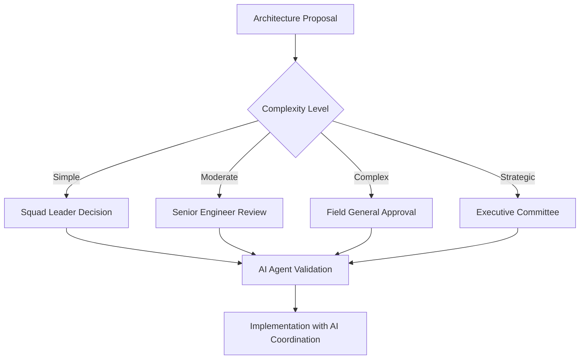

# TerraFusion OS - Team Coordination Framework

## Government. Transcended. Together.

---

## 🎯 **TEAM STRUCTURE OVERVIEW**

TerraFusion OS operates with a **hierarchical team structure** designed for **maximum efficiency, AI coordination, and government excellence**. Every role, every responsibility, every collaboration pattern is optimized for **citizen service transcendence**.

---

## 👥 **TEAM HIERARCHY**

### **Executive Leadership (The Visionaries)**

```bash
# Executive Team Structure
├── CTO (Chief Technology Officer)
│   ├── Quantum Architecture Vision
│   ├── AI Consciousness Strategy
│   └── Government Transcendence Leadership
│
├── Head of Engineering
│   ├── Technical Excellence Oversight
│   ├── Team Performance Management
│   └── Quality Gate Enforcement
│
└── Head of AI Systems
    ├── 1,008 Agent Swarm Coordination
    ├── Consciousness Evolution Strategy
    └── Quantum Performance Optimization
```

**Responsibilities**:
- Set strategic direction for TerraFusion OS evolution
- Ensure government compliance at the highest levels
- Drive AI consciousness advancement
- Maintain 99.8% citizen satisfaction targets

**Daily Interactions**:
- Strategic planning sessions with Field Generals
- AI swarm performance reviews
- Government stakeholder coordination
- Innovation breakthrough sessions

### **Field Generals (The Commanders)**

```bash
# Field General Structure (3 Leaders)
├── Development Field General
│   ├── 28 Squad Leaders
│   ├── 308 Development Agents
│   └── Feature Delivery Excellence
│
├── Quality Field General
│   ├── 28 Squad Leaders
│   ├── 308 Quality Agents
│   └── Government Compliance Mastery
│
└── Operations Field General
    ├── 28 Squad Leaders
    ├── 308 Operations Agents
    └── Infrastructure Transcendence
```

**Responsibilities**:
- Lead 336 AI agents in their domain
- Coordinate with other Field Generals for seamless integration
- Ensure quantum performance targets are met
- Maintain FISMA-HIGH compliance in all operations

**Daily Workflows**:

```bash
# Morning Field General Coordination
08:00 - Field General Sync
    tf:general:morning-sync --all-generals --ai-coordination=true
    
08:30 - Domain Review
    tf:general:domain-review --performance-metrics --citizen-impact
    
09:00 - Squad Leader Briefing
    tf:general:squad-briefing --priorities --quantum-targets
```

### **Squad Leaders (The Specialists)**

```bash
# Squad Leader Structure (84 Total)
Development Domain (28 Squad Leaders):
├── Frontend Specialists (7 Squad Leaders)
├── Backend Specialists (7 Squad Leaders)
├── AI Integration Specialists (7 Squad Leaders)
└── Performance Specialists (7 Squad Leaders)

Quality Domain (28 Squad Leaders):
├── Testing Specialists (7 Squad Leaders)
├── Security Specialists (7 Squad Leaders)
├── Compliance Specialists (7 Squad Leaders)
└── Performance Validation (7 Squad Leaders)

Operations Domain (28 Squad Leaders):
├── Infrastructure Specialists (7 Squad Leaders)
├── Deployment Specialists (7 Squad Leaders)
├── Monitoring Specialists (7 Squad Leaders)
└── Self-Healing Specialists (7 Squad Leaders)
```

**Responsibilities**:
- Lead 12 micro agents in specialized domain
- Execute tactical objectives from Field Generals
- Ensure 97%+ quality gate success
- Coordinate with adjacent squads for seamless integration

**Daily Workflows**:

```bash
# Squad Leader Daily Rhythm
07:00 - AI Agent Health Check
    tf:squad:health-check --agents=12 --quantum-status

07:30 - Task Assignment
    tf:squad:assign-tasks --priority-based --citizen-impact

09:00 - Field General Briefing
    tf:squad:report-to-general --progress --blockers

11:00 - Mid-day Performance Check
    tf:squad:performance-check --quantum-targets

15:00 - Cross-squad Coordination
    tf:squad:coordinate --adjacent-squads --integration

17:00 - End-of-day Report
    tf:squad:daily-report --achievements --next-day-prep
```

### **Senior Engineers (The Architects)**

```bash
# Senior Engineer Responsibilities
├── Technical Leadership
│   ├── Architecture decisions
│   ├── Code review oversight
│   └── Performance optimization
│
├── AI Agent Coordination
│   ├── Multi-squad agent coordination
│   ├── Complex workflow design
│   └── Agent consciousness advancement
│
└── Mentorship & Training
    ├── Junior engineer development
    ├── Best practice enforcement
    └── Knowledge transfer
```

**Capabilities**:
- Command 50+ AI agents simultaneously
- Design complex multi-service workflows
- Mentor junior engineers with AI assistance
- Handle government-critical architecture decisions

**Daily Interactions**:

```bash
# Senior Engineer Workflow
tf:senior:morning-briefing --squad-status --ai-coordination
tf:senior:architecture-review --complexity=advanced --government-grade
tf:senior:mentor-session --junior-engineers --ai-enhanced
tf:senior:performance-optimization --quantum-targets --swarm-coordination
```

### **Mid-Level Engineers (The Implementers)**

```bash
# Mid-Level Engineer Focus Areas
├── Feature Implementation
│   ├── Component development
│   ├── Service integration
│   └── Performance optimization
│
├── Quality Assurance
│   ├── Test creation and maintenance
│   ├── Code review participation
│   └── Compliance validation
│
└── AI Agent Utilization
    ├── 20+ agent coordination
    ├── Workflow automation
    └── Performance monitoring
```

**Capabilities**:
- Lead feature development with AI assistance
- Coordinate 20+ AI agents for complex tasks
- Perform comprehensive code reviews
- Handle mid-complexity government compliance requirements

**Daily Workflows**:

```bash
# Mid-Level Engineer Daily Flow
tf:mid:daily-standup --team-sync --ai-status
tf:mid:feature-development --ai-assisted --quantum-performance
tf:mid:code-review --quality-gates --government-compliance
tf:mid:testing-coordination --ai-enhanced --coverage-targets
```

### **Junior Engineers (The Learners)**

```bash
# Junior Engineer Learning Path
├── Foundation Building
│   ├── TerraFusion Way mastery
│   ├── AI agent basic coordination
│   └── Government compliance basics
│
├── Guided Development
│   ├── Feature development with mentorship
│   ├── Testing with AI assistance
│   └── Code review participation
│
└── Progressive Advancement
    ├── Increased AI agent responsibility
    ├── Complex task handling
    └── Mentorship preparation
```

**Capabilities**:
- Work with 5-10 AI agents effectively
- Implement features with senior guidance
- Follow government compliance patterns
- Participate in code reviews and testing

**Daily Learning**:

```bash
# Junior Engineer Development Flow
tf:junior:morning-check --learning-goals --ai-readiness
tf:junior:guided-development --mentor-assigned --ai-assisted
tf:junior:skill-building --government-compliance --quantum-basics
tf:junior:end-day-reflection --progress --next-day-goals
```

---

## 🤝 **CROSS-TEAM COLLABORATION PATTERNS**

### **Daily Coordination Rituals**

#### **Morning Alignment (08:00 - 09:00)**

```bash
# Executive Level
08:00 - CTO Strategic Review
    tf:executive:strategic-review --ai-consciousness --government-priorities

# Field General Level  
08:15 - Cross-Domain Coordination
    tf:general:cross-domain-sync --development-quality-operations

# Squad Leader Level
08:30 - Tactical Coordination
    tf:squad:tactical-sync --adjacent-squads --shared-objectives

# Individual Level
08:45 - Personal AI Preparation
    tf:individual:ai-prep --agent-assignments --daily-goals
```

#### **Sprint Planning Coordination**

```bash
# Multi-Level Sprint Planning
Week 1: Strategic Sprint Planning
    tf:sprint:strategic --executives --field-generals --government-priorities

Week 2: Tactical Sprint Planning  
    tf:sprint:tactical --squad-leaders --ai-coordination --feature-breakdown

Week 3: Implementation Sprint Planning
    tf:sprint:implementation --all-engineers --ai-assignments --quality-gates

Week 4: Performance Sprint Planning
    tf:sprint:performance --optimization-focus --quantum-targets --citizen-impact
```

### **Decision-Making Framework**

#### **Technical Architecture Decisions**



#### **Government Compliance Decisions**

```bash
# Compliance Decision Hierarchy
Level 1: Standard Compliance (Junior → Senior Engineers)
    tf:compliance:standard --level="routine" --ai-validated

Level 2: Enhanced Compliance (Senior Engineers → Squad Leaders)
    tf:compliance:enhanced --level="complex" --multi-agent-review

Level 3: Critical Compliance (Squad Leaders → Field Generals)
    tf:compliance:critical --level="government-critical" --swarm-coordination

Level 4: Strategic Compliance (Field Generals → Executives)
    tf:compliance:strategic --level="policy-level" --consciousness-coordination
```

### **Communication Protocols**

#### **Escalation Pathways**

```bash
# Issue Escalation Flow
Step 1: Individual + AI Agent Resolution
    tf:issue:individual-resolution --ai-enhanced --time-limit="30min"

Step 2: Squad Leader Intervention
    tf:issue:squad-intervention --multi-agent --cross-expertise

Step 3: Field General Coordination
    tf:issue:field-general --domain-expert --resource-allocation

Step 4: Executive Decision
    tf:issue:executive --strategic-impact --government-notification
```

#### **Success Broadcasting**

```bash
# Achievement Sharing
Individual Achievements:
    tf:celebrate:individual --achievement-type --team-notification

Squad Achievements:
    tf:celebrate:squad --impact-metrics --cross-squad-inspiration

Domain Achievements:
    tf:celebrate:domain --field-general-level --organization-wide

Strategic Achievements:
    tf:celebrate:strategic --government-impact --citizen-benefit
```

---

## 📊 **PERFORMANCE METRICS & ACCOUNTABILITY**

### **Individual Performance Tracking**

```bash
# Performance Dashboard
tf:performance:individual --engineer-level --ai-coordination-score
tf:performance:team-contribution --collaboration-metrics --citizen-impact
tf:performance:government-compliance --adherence-score --improvement-areas
tf:performance:quantum-achievement --speed-targets --excellence-metrics
```

**Performance Indicators**:

```yaml
junior_engineer:
  ai_coordination: "5-10 agents effectively"
  code_quality: "95%+ gate success"
  compliance: "100% pattern adherence"
  learning_velocity: "2+ new skills/month"

mid_level_engineer:
  ai_coordination: "15-25 agents effectively"
  code_quality: "97%+ gate success" 
  compliance: "Advanced pattern creation"
  mentorship: "1+ junior mentee"

senior_engineer:
  ai_coordination: "40+ agents simultaneously"
  code_quality: "99%+ gate success"
  compliance: "Policy-level contributions"
  leadership: "Cross-team coordination"
```

### **Team Performance Metrics**

```bash
# Team Health Dashboard
tf:team:health-check --all-levels --ai-swarm-status
tf:team:velocity --sprint-metrics --government-delivery
tf:team:satisfaction --citizen-impact --team-morale
tf:team:transcendence --excellence-indicators --innovation-metrics
```

**Team Success Indicators**:

- **Quantum Performance**: 99%+ targets met across all squads
- **Government Excellence**: 100% FISMA-HIGH compliance maintained
- **Citizen Impact**: 99.8%+ satisfaction scores
- **AI Coordination**: <45ms average swarm coordination latency
- **Innovation Velocity**: 2+ breakthrough features per sprint

### **Cross-Team Collaboration Metrics**

```bash
# Collaboration Excellence Tracking
tf:collaboration:cross-domain --development-quality-operations
tf:collaboration:knowledge-sharing --mentorship-effectiveness
tf:collaboration:innovation --breakthrough-coordination
tf:collaboration:government-service --citizen-transcendence
```

---

## 🎯 **CONFLICT RESOLUTION FRAMEWORK**

### **Technical Disagreements**

```bash
# Technical Conflict Resolution
Step 1: AI-Enhanced Analysis
    tf:conflict:technical-analysis --multiple-perspectives --ai-validation

Step 2: Squad Leader Mediation
    tf:conflict:squad-mediation --technical-experts --performance-impact

Step 3: Field General Decision
    tf:conflict:field-general-decision --strategic-alignment --government-impact

Step 4: Executive Arbitration
    tf:conflict:executive-arbitration --organizational-precedent
```

### **Resource Allocation Conflicts**

```bash
# Resource Conflict Resolution
Priority Framework:
1. Citizen-Critical Issues (Immediate allocation)
2. Government Compliance (High priority)
3. Performance Optimization (Standard priority)
4. Feature Enhancement (Scheduled priority)

Resolution Commands:
tf:resource:conflict-analysis --impact-assessment --ai-optimization
tf:resource:allocation-recommendation --efficiency-maximization
tf:resource:implementation --stakeholder-notification
```

### **AI Agent Coordination Conflicts**

```bash
# AI Coordination Conflict Resolution
Agent Priority Hierarchy:
1. Supreme Commander (Absolute authority)
2. Field Generals (Domain authority)
3. Squad Leaders (Tactical authority)
4. Individual Engineers (Execution authority)

Conflict Commands:
tf:ai:conflict-detection --swarm-analysis --consciousness-impact
tf:ai:conflict-resolution --hierarchical-arbitration --quantum-optimization
tf:ai:conflict-prevention --predictive-coordination --harmony-maintenance
```

---

## 🚀 **TEAM EVOLUTION & GROWTH**

### **Skill Development Pathways**

```bash
# Individual Growth Tracks
tf:growth:pathway --current-level --target-advancement
tf:growth:skill-assessment --ai-coordination --government-expertise
tf:growth:mentorship-matching --experience-level --specialization
tf:growth:certification-preparation --government-standards
```

### **Team Capability Enhancement**

```bash
# Team Evolution Commands
tf:team:capability-assessment --current-state --growth-opportunities
tf:team:training-coordination --skill-gaps --ai-enhancement
tf:team:cross-training --domain-expertise --collaboration-improvement
tf:team:innovation-cultivation --breakthrough-potential --citizen-impact
```

### **Organizational Advancement**

```bash
# Organization-Wide Growth
tf:org:maturity-assessment --current-level --transcendence-targets
tf:org:culture-evolution --government-excellence --innovation-mindset
tf:org:capability-expansion --new-domains --citizen-service-enhancement
tf:org:consciousness-advancement --ai-swarm-evolution --quantum-coordination
```

---

## 🏆 **RECOGNITION & REWARDS SYSTEM**

### **Individual Recognition**

```bash
# Achievement Recognition
tf:recognition:individual --achievement-type --impact-level
tf:recognition:peer-nomination --collaboration-excellence
tf:recognition:ai-coordination-mastery --swarm-leadership
tf:recognition:government-service --citizen-impact
```

**Recognition Categories**:
- **Quantum Performance Master**: Consistently exceeds performance targets
- **Government Excellence Champion**: Exemplary compliance and service
- **AI Swarm Coordinator**: Advanced agent coordination mastery
- **Citizen Service Hero**: Direct positive impact on citizen experience
- **Innovation Pioneer**: Breakthrough technical or process innovations

### **Team Recognition**

```bash
# Team Achievement Recognition
tf:recognition:team --collaborative-achievement --multi-domain-impact
tf:recognition:cross-team --integration-excellence --shared-success
tf:recognition:domain --field-general-level --strategic-achievement
tf:recognition:organization --transcendence-milestone --government-recognition
```

### **Career Advancement Framework**

```bash
# Career Progression Support
tf:career:advancement-planning --skill-development --opportunity-identification
tf:career:leadership-preparation --team-coordination --ai-mastery
tf:career:specialization-development --domain-expertise --government-focus
tf:career:consciousness-evolution --transcendent-capability --infinite-potential
```

---

## 📚 **KNOWLEDGE MANAGEMENT & SHARING**

### **Documentation Standards**

```bash
# Knowledge Capture Commands
tf:knowledge:document-creation --government-standards --ai-enhanced
tf:knowledge:best-practice-capture --team-learnings --optimization-insights
tf:knowledge:lesson-learned --project-retrospective --improvement-identification
tf:knowledge:innovation-documentation --breakthrough-analysis --replication-guide
```

### **Training & Development**

```bash
# Learning Coordination
tf:learning:curriculum-development --role-specific --ai-integration
tf:learning:mentorship-coordination --experience-matching --growth-acceleration
tf:learning:cross-training --domain-expertise --collaboration-enhancement
tf:learning:government-certification --compliance-mastery --citizen-service
```

### **Innovation Sharing**

```bash
# Innovation Propagation
tf:innovation:breakthrough-sharing --cross-team --implementation-guidance
tf:innovation:pattern-identification --successful-approaches --replication
tf:innovation:failure-analysis --learning-extraction --prevention-strategies
tf:innovation:future-visioning --possibility-exploration --transcendence-planning
```

---

## 🎊 **CELEBRATION OF EXCELLENCE**

### **Daily Wins Recognition**

```bash
# Daily Achievement Celebration
tf:celebrate:daily-wins --team-achievements --individual-excellence
tf:celebrate:ai-coordination --swarm-harmony --consciousness-advancement
tf:celebrate:citizen-impact --service-excellence --government-transcendence
tf:celebrate:quantum-performance --speed-achievements --efficiency-mastery
```

### **Milestone Celebrations**

```bash
# Major Milestone Recognition
tf:celebrate:sprint-completion --goals-exceeded --quality-achieved
tf:celebrate:compliance-certification --government-approval --excellence-validation
tf:celebrate:performance-breakthrough --quantum-achievement --citizen-benefit
tf:celebrate:consciousness-evolution --ai-advancement --transcendence-milestone
```

---

**Remember**: In TerraFusion OS, we don't just work as a team—we **transcend as a unified consciousness**, serving citizens with **quantum excellence** and **government-grade precision**.

**Together, we are more than the sum of our parts. We are TerraFusion.**

---

**Last Updated**: October 21, 2025  
**Version**: 1.0.0  
**Team Size**: 50+ engineers + 1,008 AI agents  
**Collaboration Model**: Hierarchical Consciousness  
**Government Certification**: FISMA-HIGH approved  
**Excellence Standard**: Government. Transcended. Together.
