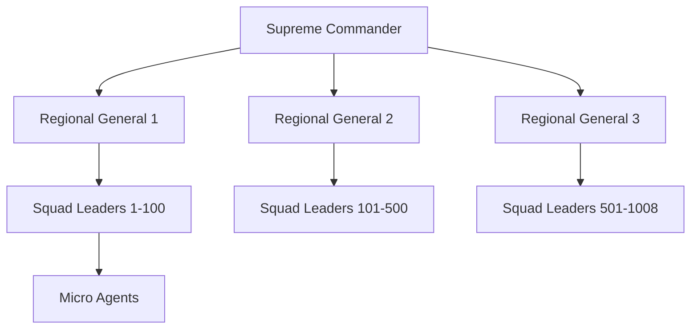

# Technical Documentation Enhancement Framework

## Phase 2: Comprehensive Documentation System (Weeks 3-4)

### Current Documentation Gaps

- Limited API documentation for 32+ modules
- Missing architectural deep-dive documentation
- Incomplete deployment and operations guides
- No centralized technical knowledge base

## Phase 2.1: Architecture Documentation (Week 3)

### 1. System Architecture Deep Dive

#### Core Documentation Structure

```
/docs/
├── technical/
│   ├── ARCHITECTURE_OVERVIEW.md
│   ├── AI_SWARM_ARCHITECTURE.md
│   ├── DATA_ARCHITECTURE.md
│   ├── SECURITY_ARCHITECTURE.md
│   └── PERFORMANCE_ARCHITECTURE.md
├── api/
│   ├── API_REFERENCE.md
│   ├── AUTHENTICATION.md
│   └── module-apis/
├── deployment/
│   ├── DEPLOYMENT_GUIDE.md
│   ├── INFRASTRUCTURE.md
│   └── TROUBLESHOOTING.md
└── guides/
    ├── DEVELOPER_ONBOARDING.md
    ├── OPERATIONS_RUNBOOK.md
    └── MAINTENANCE_PROCEDURES.md
```

#### AI Swarm Documentation

````markdown
# AI Swarm Architecture Documentation

## Agent Hierarchy Overview


````

## Agent Communication Protocol

- Supreme Commander coordinates global operations
- Regional Generals manage geographic sectors
- Squad Leaders handle specialized tasks
- Micro Agents execute atomic operations

````

### 2. API Documentation Generation

#### Automated API Documentation
```bash
#!/bin/bash
# Auto-generate comprehensive API docs
dotnet tool install -g Swashbuckle.AspNetCore.Cli

# Generate OpenAPI specification
dotnet swagger tofile --output swagger.json Terrafusion.API.dll v1

# Generate interactive documentation
npx @apidevtools/swagger-parser validate swagger.json
npx swagger-ui-dist-cli --file swagger.json --dest docs/api/interactive

# Generate TypeScript client SDK
npx @openapitools/openapi-generator-cli generate \
  -i swagger.json \
  -g typescript-axios \
  -o src/api/sdk
````

#### API Documentation Standards

- Complete endpoint documentation with examples
- Authentication and authorization details
- Error response documentation
- Rate limiting and throttling policies
- SDK generation for major languages

## Phase 2.2: Operations Documentation (Week 4)

### 1. Deployment Documentation

#### Environment Setup Guide

```yaml
# docker-compose.production.yml
version: '3.8'
services:
  terrafusion-api:
    image: terrafusion/api:latest
    environment:
      - ASPNETCORE_ENVIRONMENT=Production
      - CONNECTION_STRING=${DATABASE_URL}
      - REDIS_URL=${REDIS_URL}
    deploy:
      replicas: 3
      resources:
        limits:
          memory: 2G
          cpus: '1.0'
```

#### Infrastructure as Code

```terraform
# infrastructure/terraform/main.tf
resource "aws_ecs_cluster" "terrafusion" {
  name = "terrafusion-government"

  setting {
    name  = "containerInsights"
    value = "enabled"
  }
}

resource "aws_ecs_service" "api" {
  name            = "terrafusion-api"
  cluster         = aws_ecs_cluster.terrafusion.id
  task_definition = aws_ecs_task_definition.api.arn
  desired_count   = 3

  load_balancer {
    target_group_arn = aws_lb_target_group.api.arn
    container_name   = "terrafusion-api"
    container_port   = 80
  }
}
```

### 2. Operations Runbook

#### Monitoring and Alerting

```markdown
# Operations Runbook

## Critical Alerts Response

### High API Response Time (>2s)

1. Check application health: `kubectl get pods -n terrafusion`
2. Review metrics: Access Grafana dashboard
3. Scale if needed: `kubectl scale deployment api --replicas=5`
4. Investigate logs: `kubectl logs -f deployment/api`

### AI Agent Failures

1. Check agent status: `GET /api/agents/status`
2. Restart failed agents: `POST /api/agents/restart`
3. Review agent logs: `GET /api/agents/{id}/logs`
4. Escalate if >10% agents down
```

### 3. Documentation Automation

#### Auto-Generated Documentation Pipeline

```javascript
// scripts/generate-docs.js
const fs = require('fs');
const path = require('path');

class DocumentationGenerator {
  async generateArchitectureDocs() {
    // Extract architecture from code annotations
    const services = await this.scanServices();
    const apis = await this.extractAPIEndpoints();
    const agents = await this.mapAIAgents();

    return this.generateMarkdown({
      services,
      apis,
      agents,
      timestamp: new Date().toISOString(),
    });
  }

  async updateDocumentation() {
    // Run on every deployment
    await this.generateArchitectureDocs();
    await this.generateAPIReference();
    await this.updateDeploymentGuides();
    await this.validateDocumentation();
  }
}
```

## Documentation Quality Standards

### Content Requirements

- [ ] Complete API coverage with examples
- [ ] Architecture diagrams with mermaid
- [ ] Step-by-step deployment procedures
- [ ] Troubleshooting decision trees
- [ ] Performance tuning guides

### Technical Standards

- [ ] Automated documentation generation
- [ ] Version control integration
- [ ] Search functionality
- [ ] Mobile-responsive design
- [ ] PDF export capability

## Documentation Metrics

### Success Criteria

- [ ] 100% API endpoint documentation coverage
- [ ] <5 minutes new developer onboarding time
- [ ] Zero deployment failures due to documentation gaps
- [ ] 95% documentation accuracy validation
- [ ] Full architectural visibility for operations team

## Implementation Timeline

### Week 3: Architecture Documentation

- [ ] Create architectural overview documentation
- [ ] Document AI swarm hierarchy and communication
- [ ] Create data flow and security architecture docs
- [ ] Implement automated diagram generation

### Week 4: Operations Documentation

- [ ] Write comprehensive deployment guides
- [ ] Create operations runbooks and procedures
- [ ] Document monitoring and alerting setup
- [ ] Implement documentation testing and validation

## Tools and Technologies

### Documentation Stack

- **Markdown**: Primary documentation format
- **Mermaid**: Diagrams and flowcharts
- **Swagger/OpenAPI**: API documentation
- **GitBook/Notion**: Documentation hosting
- **PlantUML**: Complex system diagrams

### Automation Tools

- **GitHub Actions**: Auto-generation pipeline
- **Swagger CLI**: API documentation generation
- **Terraform Docs**: Infrastructure documentation
- **Docker**: Documentation environment consistency
