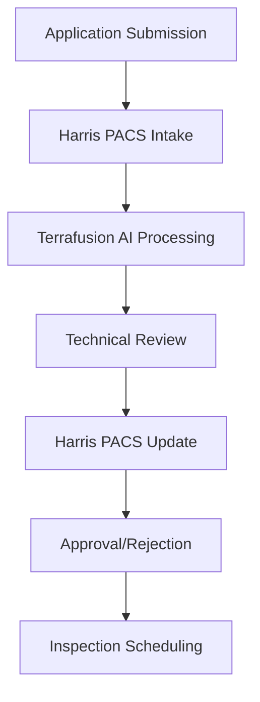

# Permit Processing Workflow Template

## Overview

Streamlined permit processing workflow leveraging Terrafusion OS AI capabilities
with Harris PACS integration for efficient government permit management.

## Prerequisites

- Harris PACS permit module access
- Terrafusion OS AI processing engine
- Permit review team assignments
- Compliance validation systems active

## Workflow Steps

### Phase 1: Application Intake

**Duration**: Same day  
**Responsible**: Intake Specialist

#### 1.1 Digital Application Submission

```typescript
// Initialize permit application
POST /api/harris-pacs/permits/submit
{
  "applicantInfo": {
    "name": "John Smith",
    "address": "123 Main St, Benton County",
    "phone": "555-0123",
    "email": "john.smith@email.com"
  },
  "permitType": "building",
  "projectDescription": "Single family home addition",
  "propertyInfo": {
    "parcelId": "12345-67890",
    "address": "123 Main St",
    "zoning": "R-1"
  }
}
```

#### 1.2 AI-Powered Document Analysis

```typescript
// Trigger document processing AI
POST /api/ai/document-analysis
{
  "applicationId": "PERM-2024-001234",
  "documents": [
    "site-plan.pdf",
    "architectural-drawings.pdf",
    "structural-calculations.pdf"
  ],
  "analysisType": "completeness-check"
}
```

#### 1.3 Automated Completeness Validation

- **Required Documents**: Site plan, architectural drawings, structural
  calculations
- **Fee Calculation**: AI-based fee estimation
- **Zoning Compliance**: Automated preliminary check
- **Routing Assignment**: AI-optimized reviewer assignment

### Phase 2: Technical Review

**Duration**: 5-10 business days  
**Responsible**: Technical Review Team

#### 2.1 Multi-Disciplinary Review Assignment

```typescript
// AI-optimized reviewer assignment
POST /api/ai/reviewer-assignment
{
  "permitId": "PERM-2024-001234",
  "permitType": "building",
  "complexity": "standard",
  "requiredDisciplines": [
    "structural",
    "electrical",
    "plumbing",
    "fire-safety"
  ]
}
```

#### 2.2 Parallel Review Process

```typescript
// Track review progress
GET /api/permits/review-status/PERM-2024-001234
Response: {
  "overallStatus": "in-review",
  "reviews": [
    {
      "discipline": "structural",
      "reviewer": "jane.engineer@county.gov",
      "status": "approved",
      "completedDate": "2024-08-20"
    },
    {
      "discipline": "electrical",
      "reviewer": "mike.electrician@county.gov",
      "status": "in-progress",
      "estimatedCompletion": "2024-08-22"
    }
  ]
}
```

#### 2.3 AI-Assisted Code Compliance

```typescript
// Building code compliance check
POST /api/ai/code-compliance
{
  "permitId": "PERM-2024-001234",
  "buildingCodes": ["IBC-2021", "NEC-2020", "UPC-2021"],
  "projectSpecs": {
    "occupancy": "R-3",
    "constructionType": "V-B",
    "stories": 2,
    "area": 2400
  }
}
```

### Phase 3: Approval Process

**Duration**: 1-2 business days  
**Responsible**: Permit Manager

#### 3.1 Consolidated Review Summary

```sql
-- Generate review summary
SELECT
  p.permit_id,
  p.project_description,
  COUNT(r.review_id) as total_reviews,
  SUM(CASE WHEN r.status = 'approved' THEN 1 ELSE 0 END) as approved_reviews,
  SUM(CASE WHEN r.status = 'rejected' THEN 1 ELSE 0 END) as rejected_reviews
FROM permits p
LEFT JOIN reviews r ON p.permit_id = r.permit_id
WHERE p.permit_id = 'PERM-2024-001234'
GROUP BY p.permit_id;
```

#### 3.2 Final Approval Decision

```typescript
// Issue permit approval
POST /api/permits/approve
{
  "permitId": "PERM-2024-001234",
  "approvedBy": "permit.manager@county.gov",
  "conditions": [
    "Final electrical inspection required",
    "Erosion control measures must be in place"
  ],
  "validUntil": "2025-08-18"
}
```

#### 3.3 Harris PACS Integration

```typescript
// Sync approval to Harris PACS
POST /api/harris-pacs/permits/sync-approval
{
  "permitId": "PERM-2024-001234",
  "approvalData": {
    "status": "approved",
    "issuedDate": "2024-08-18",
    "expirationDate": "2025-08-18",
    "conditions": [...]
  }
}
```

### Phase 4: Inspection Scheduling

**Duration**: Ongoing during construction  
**Responsible**: Inspection Coordinator

#### 4.1 AI-Optimized Inspection Scheduling

```typescript
// Schedule inspections
POST /api/ai/inspection-scheduling
{
  "permitId": "PERM-2024-001234",
  "inspectionTypes": [
    "foundation",
    "framing",
    "electrical-rough",
    "plumbing-rough",
    "final"
  ],
  "constraints": {
    "inspectorAvailability": true,
    "weatherConditions": true,
    "constructionSequence": true
  }
}
```

#### 4.2 Mobile Inspection Support

```typescript
// Mobile inspector app integration
GET /api/inspections/mobile-checklist/PERM-2024-001234
Response: {
  "inspectionType": "framing",
  "checklist": [
    "Verify lumber grades and sizes",
    "Check structural connections",
    "Validate fire blocking installation"
  ],
  "photos": ["required", "optional"],
  "gpsLocation": "required"
}
```

## Quality Gates

### Gate 1: Application Completeness

- [ ] All required documents submitted
- [ ] Fee payment processed
- [ ] Property information verified
- [ ] AI completeness check passed

### Gate 2: Technical Review

- [ ] All discipline reviews completed
- [ ] Code compliance verified
- [ ] Structural calculations approved
- [ ] Fire safety requirements met

### Gate 3: Final Approval

- [ ] All review comments addressed
- [ ] Permit conditions documented
- [ ] Harris PACS synchronization successful
- [ ] Applicant notification sent

### Gate 4: Inspection Readiness

- [ ] Inspection schedule optimized
- [ ] Inspector assignments confirmed
- [ ] Mobile tools configured
- [ ] Tracking systems active

## Performance Metrics

### Key Performance Indicators

- **Average Processing Time**: Target <10 business days
- **First-Time Approval Rate**: Target >80%
- **Customer Satisfaction**: Target >4.5/5.0
- **Digital Submission Rate**: Target >90%

### AI Performance Metrics

```typescript
// Monitor AI performance
GET /api/ai/permit-processing-metrics
Response: {
  "documentAnalysisAccuracy": 96.8,
  "codeComplianceDetection": 94.2,
  "reviewerAssignmentOptimization": 89.5,
  "inspectionSchedulingEfficiency": 92.1
}
```

## Error Handling

### Common Issues and Resolutions

#### Issue: Harris PACS Synchronization Failure

```bash
# Check Harris PACS permit module status
curl -X GET "https://harris-pacs.county.gov/api/permits/health" \
  -H "Authorization: Bearer $HARRIS_TOKEN"

# Retry synchronization
./scripts/retry-harris-sync.sh --module permits --permit-id PERM-2024-001234
```

#### Issue: AI Document Analysis Timeout

```typescript
// Retry document analysis with reduced scope
POST /api/ai/document-analysis/retry
{
  "applicationId": "PERM-2024-001234",
  "analysisType": "basic-completeness",
  "timeout": 300
}
```

#### Issue: Reviewer Overload

```typescript
// Rebalance reviewer assignments
POST /api/ai/reviewer-rebalance
{
  "jurisdiction": "benton-county",
  "discipline": "structural",
  "redistributeFrom": "overloaded-reviewers",
  "redistributeTo": "available-reviewers"
}
```

## Compliance Requirements

### Building Codes and Standards

- **International Building Code (IBC)**
- **National Electrical Code (NEC)**
- **Uniform Plumbing Code (UPC)**
- **International Fire Code (IFC)**
- **Local Amendments and Ordinances**

### Accessibility Compliance

- **ADA Requirements**: Public accommodations
- **Fair Housing Act**: Residential modifications
- **State Accessibility Codes**: Local requirements

### Environmental Regulations

- **SEPA Review**: Environmental impact assessment
- **Stormwater Management**: Runoff control requirements
- **Wetlands Protection**: Critical area ordinances

## Integration Points

### Harris PACS Data Flow



### Third-Party Integrations

- **GIS Systems**: Property boundary verification
- **Utility Companies**: Service availability checks
- **State Databases**: Contractor license verification
- **Payment Processors**: Fee collection systems

## Automation Opportunities

### AI-Powered Enhancements

1. **Predictive Analytics**: Permit approval likelihood
2. **Risk Assessment**: Project complexity scoring
3. **Resource Optimization**: Staff allocation planning
4. **Customer Service**: Chatbot for status inquiries

### Process Automation

```typescript
// Configure automation rules
PUT /api/permits/automation-rules
{
  "autoApproval": {
    "enabled": true,
    "criteria": [
      "permit-type: minor-alteration",
      "value: <$5000",
      "ai-risk-score: <0.3"
    ]
  },
  "fastTrack": {
    "enabled": true,
    "criteria": [
      "complete-application",
      "pre-approved-plans",
      "licensed-contractor"
    ]
  }
}
```

## Customer Experience

### Self-Service Portal Features

- **Application Status Tracking**
- **Document Upload Interface**
- **Fee Payment Processing**
- **Inspection Scheduling**
- **Digital Permit Retrieval**

### Communication Channels

- **Email Notifications**: Status updates
- **SMS Alerts**: Inspection reminders
- **Mobile App**: Real-time tracking
- **Web Portal**: Comprehensive access

## Related Workflows

- [Property Assessment Workflow](./property-assessment-workflow.md)
- [Tax Collection Workflow](./tax-collection-workflow.md)
- [Harris PACS Integration Guide](../troubleshooting/harris-pacs-integration.md)

## Revision History

| Version | Date       | Author           | Changes                   |
| ------- | ---------- | ---------------- | ------------------------- |
| 1.0     | 2024-08-18 | Terrafusion Team | Initial template creation |

---

_This workflow template leverages Terrafusion OS AI capabilities for efficient
permit processing with Harris PACS integration._
