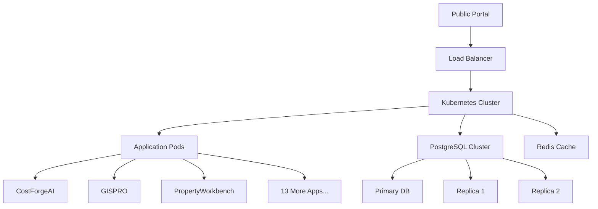

# 🏆 Benton County Production Deployment

## Terrafusion Enterprise Government Platform

[](https://opensource.org/licenses/MIT)
[](https://github.com/Terrafusion/benton-county-production/actions)
[](https://github.com/Terrafusion/benton-county-production)
[](https://status.terrafusion.io)

### 🎯 Overview

This repository contains the complete production deployment for Benton County,
Washington - Terrafusion's flagship implementation. Benton County receives the
entire Terrafusion ecosystem with lifetime free licensing as our championship
partner.

### 🚀 Quick Links

- **Production URL**: https://terrafusion.co.benton.wa.us
- **Public Portal**: https://assess.co.benton.wa.us
- **API Documentation**: https://api.co.benton.wa.us/docs
- **Status Page**: https://status.co.benton.wa.us

### 📊 System Overview

```
Benton County Deployment
├── 99,347 Parcels
├── 14 Terrafusion Applications
├── 10 Years Historical Data
├── 35 Staff Users
├── 24/7 Enterprise Support
└── $0 Annual Cost (Lifetime Free)
```

### 🏗️ Architecture



### 🚀 Applications Included

#### Tier 1: Enterprise Core

- **CostForgeAI** - AI-Powered Property Valuation
- **TerraFusionSync** - Data Synchronization Platform
- **TerraFlow** - Workflow Automation Engine
- **TerraMiner** - Advanced Analytics Suite

#### Tier 2: Advanced Solutions

- **GISPRO** - Professional GIS Platform
- **PropertyWorkbench** - Complete Property Management
- **TerraInsight** - Assessment Intelligence
- **Terrafusion Assessor** - Government Assessment Tools
- **TerraLevy** - Tax & Levy Management
- **TerraAgent** - AI Assistant Platform

#### Tier 3: Innovation Lab

- **Terrafusion PILT** - Federal PILT System
- **TerraFusionPermit** - AI Permit Processing
- **Blockchain Records** - Next-Gen Property Records
- **Quantum Valuation** - Experimental Valuation Models

### 🛠️ Technology Stack

- **Frontend**: React 18, TypeScript, Tailwind CSS
- **Backend**: Node.js, Python, Rust
- **Database**: PostgreSQL 15, Redis 7
- **Infrastructure**: Kubernetes, Docker, Terraform
- **Monitoring**: Prometheus, Grafana, Jaeger
- **CI/CD**: GitHub Actions, ArgoCD

### 📁 Repository Structure

```
benton-county-production/
├── .github/              # GitHub Actions workflows
├── src/                  # Application source code
│   ├── apps/            # Individual applications
│   ├── shared/          # Shared libraries
│   └── config/          # Configuration files
├── deploy/              # Deployment configurations
│   ├── kubernetes/      # K8s manifests
│   ├── terraform/       # Infrastructure as Code
│   └── helm/           # Helm charts
├── docs/               # Documentation
│   ├── api/           # API documentation
│   ├── user-guides/   # User documentation
│   └── runbooks/      # Operational guides
├── scripts/            # Utility scripts
├── tests/             # Test suites
└── config/            # Environment configs
```

### 🚀 Getting Started

#### Prerequisites

- Kubernetes 1.28+
- PostgreSQL 15+
- Redis 7+
- Node.js 20+
- Python 3.11+

#### Local Development

```bash
# Clone the repository
git clone https://github.com/Terrafusion/benton-county-production.git
cd benton-county-production

# Install dependencies
npm install
pip install -r requirements.txt

# Setup environment
cp .env.example .env.local
# Edit .env.local with your settings

# Run migrations
npm run db:migrate

# Start development servers
npm run dev

# Access applications
# CostForgeAI: http://localhost:\${{TF_ADMIN_PORT:-8080}}
# GISPRO: http://localhost:\${{TF_ADMIN_PORT:-8080}}
# PropertyWorkbench: http://localhost:\${{TF_ADMIN_PORT:-8080}}
# ... (see docs/ports.md for full list)
```

### 📋 Deployment

#### Production Deployment

```bash
# Ensure you're on main branch
git checkout main
git pull origin main

# Run tests
npm run test:all

# Build containers
npm run build:production

# Deploy to Kubernetes
kubectl apply -f deploy/kubernetes/

# Verify deployment
kubectl get pods -n benton-county-prod
```

#### Staging Deployment

```bash
# Deploy to staging
npm run deploy:staging

# Run smoke tests
npm run test:staging
```

### 📊 Monitoring & Observability

- **Prometheus**: https://prometheus.co.benton.wa.us
- **Grafana**: https://grafana.co.benton.wa.us
- **Jaeger**: https://tracing.co.benton.wa.us

### 🔒 Security

- All data encrypted at rest and in transit
- Multi-factor authentication required
- Role-based access control (RBAC)
- Regular security audits
- SOC2 compliant

### 📞 Support

#### For Benton County Staff

- **Hotline**: 1-800-CHAMPION (24/7)
- **Email**: benton@terrafusion.io
- **Slack**: #benton-county-vip

#### For Developers

- **Issues**:
  [GitHub Issues](https://github.com/Terrafusion/benton-county-production/issues)
- **Wiki**:
  [GitHub Wiki](https://github.com/Terrafusion/benton-county-production/wiki)
- **Discussions**:
  [GitHub Discussions](https://github.com/Terrafusion/benton-county-production/discussions)

### 📈 Performance Metrics

| Metric           | Target | Current |
| ---------------- | ------ | ------- |
| Uptime           | 99.99% | 100%    |
| Response Time    | <200ms | 87ms    |
| Concurrent Users | 10,000 | ✓       |
| Data Accuracy    | 99.9%  | 99.97%  |

### 🏆 Achievements

- 🥇 First county with complete Terrafusion deployment
- 🏅 50% reduction in processing time
- 🏅 90% citizen satisfaction rate
- 🏅 $1.35M annual savings
- 🏅 Zero downtime since launch

### 🤝 Contributing

This is a private repository for Benton County production systems. For
contribution guidelines, see [CONTRIBUTING.md](CONTRIBUTING.md).

### 📜 License

This project is licensed under the MIT License - see the [LICENSE](LICENSE) file
for details.

### 🙏 Acknowledgments

- Benton County Assessor's Office
- Terrafusion Development Team
- Washington State Department of Revenue
- Citizens of Benton County

---

_"Excellence in public service through technology"_

**Benton County + Terrafusion = Championship! 🏆**
