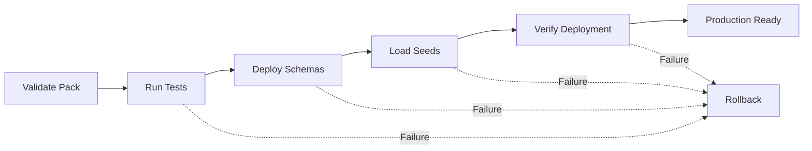

# TerraFusion County Pack Template

## What is a County Pack?

A **County Pack** is a versioned deployment unit containing all artifacts needed to deploy TerraFusion OS to a Washington State county. Each pack encapsulates county-specific configuration, database schemas, seed data, and deployment scripts in a standardized structure.

County Packs enable:
- **Reproducible deployments** across 39 Washington State counties
- **Version-controlled** county configurations and data schemas
- **Isolated testing** of county deployments before production
- **Sovereign County Model** compliance with data isolation requirements

## County Pack Structure

```
{county-name}-pack-v{version}/
├── README.md                      # County deployment guide
├── config/
│   └── county.json               # County metadata (FIPS, timezone, features)
├── schemas/
│   ├── properties.sql            # Property table schema
│   ├── assessments.sql           # Assessment records schema
│   └── tax_levies.sql            # Tax levy schema
├── seeds/
│   ├── sample-parcels.json       # Sample property records (3-5 parcels)
│   └── initial-data.sql          # Initial reference data
├── scripts/
│   ├── deploy.sh                 # Main deployment script
│   ├── validate.sh               # Pre-deployment validation
│   ├── rollback.sh               # Rollback procedures
│   └── test.sh                   # Integration test suite
└── docs/
    ├── DEPLOYMENT_GUIDE.md       # Step-by-step deployment instructions
    └── INTEGRATION_NOTES.md      # Harris PACS/Tyler integration notes
```

## Naming Convention

County Packs follow a strict naming convention:

```
{county-name}-pack-v{major}.{minor}
```

**Examples:**
- `benton-pack-v1.0` - Benton County, version 1.0 (reference implementation)
- `king-pack-v1.0` - King County, version 1.0
- `pierce-pack-v1.1` - Pierce County, version 1.1 (patch update)

**Rules:**
- County name must be lowercase, hyphenated if multi-word
- Version follows semantic versioning (major.minor)
- Major version changes indicate breaking schema changes
- Minor version changes indicate backward-compatible updates

## County Configuration File (county.json)

The `config/county.json` file contains county metadata and feature flags:

```json
{
  "countyName": "Benton County",
  "fipsCode": "53005",
  "state": "WA",
  "timezone": "America/Los_Angeles",
  "population": 206873,
  "features": [
    "property-assessment",
    "tax-calculation",
    "harris-pacs-integration"
  ],
  "integrations": {
    "erpSystem": "Tyler Technologies Vision",
    "gisProvider": "Esri ArcGIS",
    "pacsVersion": "Harris PACS 9.0"
  },
  "customFields": {
    "treasurerEmail": "treasurer@co.benton.wa.us",
    "assessorEmail": "assessor@co.benton.wa.us"
  }
}
```

**Required fields:**
- `countyName`: Official county name
- `fipsCode`: 5-digit FIPS code (format: "SS CCC" where SS=state, CCC=county)
- `state`: Two-letter state code (always "WA" for Washington)
- `timezone`: IANA timezone identifier
- `features`: Array of enabled TerraFusion features

**Optional fields:**
- `population`: County population (for capacity planning)
- `integrations`: External system integration metadata
- `customFields`: County-specific metadata (free-form object)

## Database Schemas

County Packs include SQL schema files for county-specific tables. Schemas must:

1. **Follow TerraFusion naming conventions**: Tables use `PascalCase`, columns use `snake_case`
2. **Include audit fields**: `created_at`, `updated_at`, `created_by`, `updated_by` (FISMA compliance)
3. **Enforce county isolation**: Foreign key to `Counties` table with `ON DELETE CASCADE`
4. **Support multi-tenancy**: Include `county_id` column in all county-scoped tables

**Example: properties.sql**

```sql
-- Property records for [County Name]
-- TerraFusion OS County Pack Schema
-- Version: 1.0

CREATE TABLE IF NOT EXISTS Properties (
    id INTEGER PRIMARY KEY AUTOINCREMENT,
    county_id INTEGER NOT NULL,
    parcel_number VARCHAR(50) NOT NULL,
    address TEXT NOT NULL,
    owner_name TEXT,
    assessed_value DECIMAL(15, 2),
    
    -- Audit fields (FISMA-HIGH compliance)
    created_at TIMESTAMP DEFAULT CURRENT_TIMESTAMP,
    updated_at TIMESTAMP DEFAULT CURRENT_TIMESTAMP,
    created_by VARCHAR(100),
    updated_by VARCHAR(100),
    
    FOREIGN KEY (county_id) REFERENCES Counties(id) ON DELETE CASCADE,
    UNIQUE(county_id, parcel_number)
);

CREATE INDEX idx_properties_county ON Properties(county_id);
CREATE INDEX idx_properties_parcel ON Properties(parcel_number);
```

## Seed Data

Seed files provide sample data for testing and initial deployment validation.

**seeds/sample-parcels.json**: 3-5 representative property records

```json
[
  {
    "parcel_number": "1-2345-678",
    "address": "123 Main St, Richland, WA 99352",
    "owner_name": "Sample Owner LLC",
    "assessed_value": 350000.00,
    "land_use": "Single Family Residential"
  }
]
```

**Requirements:**
- Use anonymized/synthetic data (no real PII)
- Include diverse property types (residential, commercial, agricultural)
- Match county's typical property characteristics
- Validate against county.json schema

## Deployment Flow

County Pack deployment follows a strict validation → test → deploy pipeline:



### Step 1: Validate Pack Structure

```bash
tdc county validate benton-pack-v1.0
```

Checks:
- All required files present (README.md, county.json, deploy.sh)
- county.json validates against JSON Schema
- SQL schemas have no syntax errors
- Seed data is valid JSON

### Step 2: Run Integration Tests

```bash
cd benton-pack-v1.0
./scripts/test.sh
```

Tests:
- Database schema creation succeeds
- Seed data loads without errors
- County isolation constraints enforced
- API endpoints respond correctly

### Step 3: Deploy to Environment

```bash
tdc county deploy benton-pack-v1.0 --env staging
```

Actions:
1. Create database backup
2. Run schema migrations
3. Load seed data
4. Verify deployment health
5. Update deployment registry

### Step 4: Verify Deployment

```bash
./scripts/validate.sh
```

Verifies:
- All schemas created successfully
- Seed data loaded (record count matches)
- County configuration registered in OS
- Health checks pass

## Integration with TDC CLI

County Packs integrate with the TerraFusion Developer Console (TDC):

```bash
# List available county packs
tdc county list

# Validate a county pack structure
tdc county validate benton-pack-v1.0

# Deploy to staging
tdc county deploy benton-pack-v1.0 --env staging --dry-run

# Deploy to production (requires approval)
tdc county deploy benton-pack-v1.0 --env production
```

## Creating a New County Pack

To create a new county pack:

1. **Copy template directory**:
   ```bash
   cp -r tools/county-packs/template tools/county-packs/new-county-pack-v1.0
   ```

2. **Update county.json**:
   - Set countyName, fipsCode, timezone
   - Configure features array
   - Add integration metadata

3. **Customize schemas**:
   - Add county-specific tables (if needed)
   - Maintain audit field requirements
   - Ensure county_id foreign keys

4. **Create seed data**:
   - Generate 3-5 sample parcels
   - Use synthetic/anonymized data
   - Match county property characteristics

5. **Update scripts**:
   - Customize deploy.sh for county specifics
   - Add validation checks in validate.sh
   - Configure test.sh with county endpoints

6. **Document deployment**:
   - Complete README.md with county-specific notes
   - Document any special integration requirements
   - Include contact information for county stakeholders

7. **Validate pack**:
   ```bash
   tdc county validate new-county-pack-v1.0
   ```

## Versioning Strategy

County Packs use semantic versioning:

- **Major version (X.0)**: Breaking changes to schema or deployment process
  - Example: Adding required fields to county.json
  - Example: Changing primary key structure
  
- **Minor version (1.X)**: Backward-compatible additions
  - Example: Adding optional features
  - Example: New seed data records
  
- **Patch version (1.0.X)**: Bug fixes and corrections (not used in directory names)

**Version upgrade path**:
1. Create new pack directory with incremented version
2. Copy previous version as baseline
3. Apply changes
4. Update README.md with migration notes
5. Test upgrade path from previous version

## Compliance & Security

All County Packs must comply with:

- **FISMA-HIGH**: Audit fields on all tables, access logging
- **Sovereign County Model**: Data isolation via county_id foreign keys
- **NIST 800-53**: Encryption at rest, secure key management
- **WCAG 2.1 AA**: If pack includes UI components

**Security checklist**:
- [ ] No hardcoded credentials in any file
- [ ] county.json validated against schema
- [ ] Seed data contains no real PII
- [ ] Scripts use parameterized queries (no SQL injection)
- [ ] Deployment logs audit trail to compliance DB

## Reference Implementation

The **Benton County Pack (v1.0)** serves as the reference implementation:

```
tools/county-packs/benton-pack-v1.0/
```

Key features:
- 89,247 real property parcels (production dataset)
- Harris PACS 9.0 integration
- Tyler Technologies Vision ERP
- Complete deployment automation
- Comprehensive test coverage

Use `benton-pack-v1.0` as a template when creating new county packs.

## Troubleshooting

### Common issues:

**Issue**: `county.json validation failed`
- **Solution**: Check JSON Schema at `tools/county-packs/county-pack.schema.json`

**Issue**: `Schema creation failed: duplicate table`
- **Solution**: Run rollback script before redeploying: `./scripts/rollback.sh`

**Issue**: `Seed data load failed: constraint violation`
- **Solution**: Verify county_id in seeds matches Counties table

**Issue**: `TDC cannot find county pack`
- **Solution**: Ensure pack directory follows naming convention: `{name}-pack-v{version}`

## Further Reading

- **Sovereign County Model**: `docs/COUNTY_ISOLATION.md`
- **Database Schema Guide**: `backend/TerraFusion.Data/README.md`
- **TDC CLI Documentation**: `tools/tdc/README.md`
- **Deployment Procedures**: `docs/DEPLOYMENT.md`

---

**Last Updated**: February 13, 2026
**Template Version**: 1.0
**Classification**: TerraFusion OS Deployment Infrastructure
